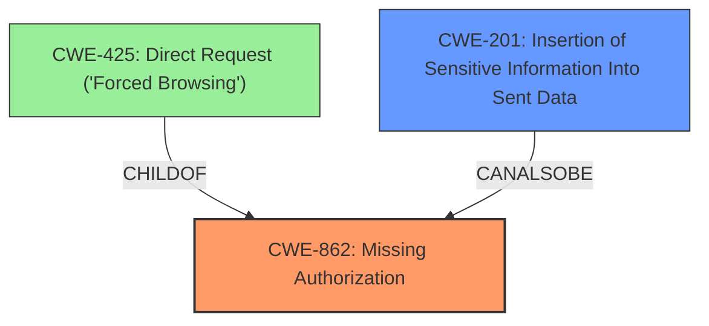

# Enhanced Analysis for CVE-2025-29924

# Summary
| CWE ID | CWE Name | Confidence | CWE Abstraction Level | CWE Vulnerability Mapping Label | CWE-Vulnerability Mapping Notes |
|---|---|---|---|---|---|
| CWE-862 | Missing Authorization | 0.9 | Class | Primary | Allowed-with-Review |
| CWE-201 | Insertion of Sensitive Information Into Sent Data | 0.7 | Base | Secondary | Allowed |

## Evidence and Confidence

*   **Confidence Score:** 0.8
*   **Evidence Strength:** HIGH

## Relationship Analysis
The primary CWE is CWE-862 (Missing Authorization), which is a class-level CWE. Several child CWEs exist such as CWE-425 (Direct Request ('Forced Browsing')) that could be considered more specific. However, the description does not provide enough information to pinpoint the exact authorization failure mechanism. CWE-201 (Insertion of Sensitive Information Into Sent Data) is a base CWE that is related to the impact of the missing authorization, where private information is exposed.



## Vulnerability Chain
The vulnerability chain starts with **Missing Authorization** (CWE-862), leading to the **impact** of being able to **get access to private information** (CWE-201). The root cause is that `DefaultAuthorizationManager` doesn't properly set the wiki reference.

## Summary of Analysis
The initial assessment pointed towards authorization-related CWEs due to the **impact** of unauthorized access to private information. The evidence from the CVE reference links and the vulnerability description explicitly mentions the authorization issues.

The primary weakness is the **missing authorization** check within the XWiki platform's REST API when accessing pages in subwikis with specific right restrictions enabled, such as "Prevent unregistered users to view pages". This allows unauthorized users to access private information, which is a direct result of the **missing authorization**.

CWE-862 (Missing Authorization) aligns with the core issue: the application **does not adequately enforce authorization**. The vulnerability description specifically mentions that users can gain access to private information through the REST API without credentials when certain restrictions are in place. This indicates a failure in the authorization mechanism.

CWE-201 (Insertion of Sensitive Information Into Sent Data) is a secondary CWE because it represents the consequence of the authorization failure. The private information is being exposed due to the lack of proper access controls.

The retriever results suggested other CWEs, such as CWE-306 (Missing Authentication for Critical Function). However, the issue is not about missing authentication, but rather a **failure in authorization** *after* a user (potentially unauthenticated) attempts to access restricted content.

The evidence from the Jira ticket and the GitHub advisory confirms that the `DefaultAuthorizationManager` doesn't properly set the wiki reference, leading to the authorization bypass. This supports the selection of CWE-862 as the primary weakness.

The chosen CWEs are at an appropriate level of specificity. While child CWEs of CWE-862 exist, such as CWE-425 (Direct Request ('Forced Browsing')), the available information doesn't provide enough detail to determine the specific type of authorization bypass.

Relevant CWE Information:
-   **CWE-862: Missing Authorization** - The product does not perform an authorization check when an actor attempts to access a resource or perform an action.
-   **CWE-201: Insertion of Sensitive Information Into Sent Data** - The code transmits data to another actor, but a portion of the data includes sensitive information that should not be accessible to that actor.


## CWE Relationship Analysis

Current CWEs represent these abstraction levels: .


### Vulnerability Chain Analysis

**Chain starting from CWE-306:**
- 306 (Missing Authentication for Critical Function) - ROOT


**Chain starting from CWE-201:**
- 201 (Insertion of Sensitive Information Into Sent Data) - ROOT


### CWE Relationship Diagram

```mermaid
graph TD
    classDef primary fill:#f96,stroke:#333,stroke-width:2px
    classDef secondary fill:#69f,stroke:#333
    classDef tertiary fill:#9e9,stroke:#333
```