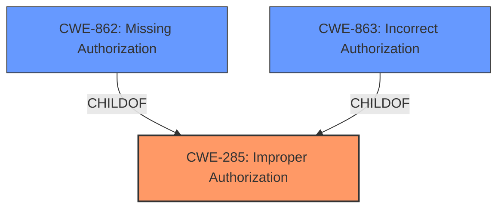

# Enhanced Analysis for CVE-2025-29927

# Summary
| CWE ID  | CWE Name | Confidence | CWE Abstraction Level | CWE Vulnerability Mapping Label | CWE-Vulnerability Mapping Notes |
|----------------|--------------------------------------------------|-------------------|--------------------------|-----------------------------------|-----------------------------------|
| CWE-285 | Improper Authorization | 0.9 | Class |  | Allowed-with-Review |
| CWE-863 | Incorrect Authorization | 0.7 | Class |  | Allowed-with-Review |
| CWE-862 | Missing Authorization | 0.6 | Class |  | Allowed-with-Review |

  - The Primary CWE should be first and noted as the Primary CWEs
  - The secondary candidate CWEs should be next and noted as secondary candidates.
  - The confidence is a confidence score 0 to 1 to rate your confidence in your assessment for that CWE.
  - The CWE Abstraction Level as one of these values: Base, Variant, Pillar, Class, Compound
  - The Mapping Notes Usage as one of these values: Allowed, Allowed-with-Review, Prohibited, Discouraged

## Evidence and Confidence

*   **Confidence Score:** 0.8
*   **Evidence Strength:** HIGH

## Relationship Analysis
The primary relationship influencing my decision is the hierarchical relationship between CWE-285 (Improper Authorization) and its more specific variants like CWE-863 (Incorrect Authorization) and CWE-862 (Missing Authorization). While CWE-285 is a broader category, the provided information suggests a problem with how authorization is handled, but not necessarily a complete lack of authorization, making CWE-862 and CWE-863 potential candidates.



## Vulnerability Chain
The vulnerability chain starts with the **improper authorization** in the Next.js middleware, leading to the ability to **bypass authorization checks**.
  - **Root Cause:** **Improper Authorization** (CWE-285).
  - **Weakness/Impact:** Ability to **bypass authorization checks**.

## Summary of Analysis
The initial assessment, based on the vulnerability description and CVE reference links, points towards an authorization issue within the Next.js middleware. The description explicitly mentions the ability to "**bypass authorization checks**," which strongly suggests a problem with how authorization is implemented. The provided evidence from the CVE reference links content summary consistently identifies "**Authorization bypass (CWE-285)**" as the weakness.

The retriever results also support this assessment, with CWE-285 (Improper Authorization) being a relevant candidate. However, the retriever results also list CWE-863 (Incorrect Authorization) and CWE-862 (Missing Authorization), which are more specific variants of CWE-285. Given that the vulnerability description states "**bypass authorization checks**," it's possible that the authorization checks are either incorrect (CWE-863) or completely missing in certain scenarios (CWE-862).

The CWE Classification Guidance further clarifies the distinction between authentication and authorization, emphasizing that if the issue involves improper or missing role checks, CWE-285 is appropriate. The guidance also advises against using CWE-284 (Improper Access Control) if a more specific child CWE like 285, 862, or 863 is applicable.

Based on the evidence and guidance, CWE-285 (Improper Authorization) is the most appropriate primary CWE, as it captures the general authorization flaw. However, CWE-863 and CWE-862 are also considered as secondary candidates, depending on the specific implementation details of the authorization checks in the Next.js middleware.

The selected CWEs are at the optimal level of specificity, as they directly address the authorization issues described in the vulnerability. More generic CWEs like CWE-284 would not provide sufficient detail, while more specific variants might not be applicable to all scenarios.

Relevant CWE Information:

# Enhanced Context (25 CWEs)
The following CWEs were identified as potentially relevant to this vulnerability:

## CWE-41: Improper Resolution of Path Equivalence
**Abstraction Level**: Base
**Similarity Score**: 0.76
**Source**: dense

**Description**:
The product is vulnerable to file system contents disclosure through path equivalence. Path equivalence involves the use of special characters in file and directory names. The associated manipulations are intended to generate multiple names for the same object.

**Mapping Guidance**:
- Usage: Allowed
- Rationale: This CWE entry is at the Base level of abstraction, which is a preferred level of abstraction for mapping to the root causes of vulnerabilities.

*   **Not Used:** This CWE is not related to authorization bypass issues.

## CWE-1390: Weak Authentication
**Abstraction Level**: Class
**Similarity Score**: 0.76
**Source**: dense

**Description**:
The product uses an authentication mechanism to restrict access to specific users or identities, but the mechanism does not sufficiently prove that the claimed identity is correct.

**Mapping Guidance**:
- Usage: Allowed-with-Review
- Rationale: This CWE entry is a Class and might have Base-level children that would be more appropriate

*   **Not Used:** While authentication and authorization are related, the primary issue described is an authorization bypass, not a failure in authentication.

## CWE-639: Authorization Bypass Through User-Controlled Key
**Abstraction Level**: Base
**Similarity Score**: 0.76
**Source**: dense

**Description**:
The system's authorization functionality does not prevent one user from gaining access to another user's data or record by modifying the key value identifying the data.

**Mapping Guidance**:
- Usage: Allowed
- Rationale: This CWE entry is at the Base level of abstraction, which is a preferred level of abstraction for mapping to the root causes of vulnerabilities.

*   **Not Used:** This is a specific type of authorization bypass related to user-controlled keys. The description does not provide sufficient evidence to confirm this specific mechanism.

## CWE-668: Exposure of Resource to Wrong Sphere
**Abstraction Level**: Class
**Similarity Score**: 0.75
**Source**: dense

**Description**:
The product exposes a resource to the wrong control sphere, providing unintended actors with inappropriate access to the resource.

**Mapping Guidance**:
- Usage: Discouraged
- Rationale: CWE-668 is high-level and is often misused as a catch-all when lower-level CWE IDs might be applicable. It is sometimes used for low-information vulnerability reports [REF-1287]. It is a level-1 Class (i.e., a child of a Pillar). It is not useful for trend analysis.

*   **Not Used:** This CWE is too general and does not provide specific information about the authorization bypass.

## CWE-212: Improper Removal of Sensitive Information Before Storage or Transfer
**Abstraction Level**: Base
**Similarity Score**: 0.75
**Source**: dense

**Description**:
The product stores, transfers, or shares a resource that contains sensitive information, but it does not properly remove that information before the product makes the resource available to unauthorized actors.

**Mapping Guidance**:
- Usage: Allowed
- Rationale: This CWE entry is at the Base level of abstraction, which is a preferred level of abstraction for mapping to the root causes of vulnerabilities.

*   **Not Used:** This CWE is not related to authorization bypass issues.

## CWE-923: Improper Restriction of Communication Channel to Intended Endpoints
**Abstraction Level**: Class
**Similarity Score**: 0.75
**Source**: dense

**Description**:
The product establishes a communication channel to (or from) an endpoint for privileged or protected operations, but it does not properly ensure that it is communicating with the correct endpoint.

**Mapping Guidance**:
- Usage: Allowed-with-Review
- Rationale: This CWE entry is a Class and might have Base-level children that would be more appropriate

*   **Not Used:** This CWE is not related to authorization bypass issues.

## CWE-74: Improper Neutralization of Special Elements in Output Used by a Downstream Component ('Injection')
**Abstraction Level**: Class
**Similarity Score**: 0.75
**Source**: dense

**Description**:
The product constructs all or part of a command, data structure, or record using externally-influenced input from an upstream component, but it does not neutralize or incorrectly neutralizes special elements that could modify how it is parsed or interpreted when it is sent to a downstream component.

**Mapping Guidance**:
- Usage: Discouraged
- Rationale: CWE-74 is high-level and often misused when lower-level weaknesses are more appropriate.

*   **Not Used:** This CWE is not related to authorization bypass issues.

## CWE-807: Reliance on Untrusted Inputs in a Security Decision
**


## CWE Relationship Analysis

Current CWEs represent these abstraction levels: .


### Vulnerability Chain Analysis

**Chain starting from CWE-1390:**
- 1390 (Weak Authentication) - ROOT


**Chain starting from CWE-863:**
- 863 (Incorrect Authorization) - ROOT


### CWE Relationship Diagram

```mermaid
graph TD
    classDef primary fill:#f96,stroke:#333,stroke-width:2px
    classDef secondary fill:#69f,stroke:#333
    classDef tertiary fill:#9e9,stroke:#333
```