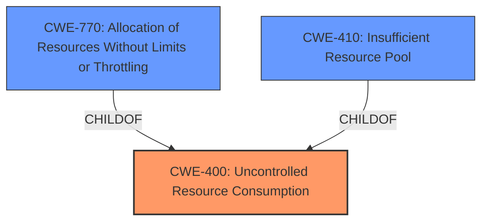

# Raw Analyzer Response for CVE-2025-29957

# Summary
| CWE ID | CWE Name | Confidence | CWE Abstraction Level | CWE Vulnerability Mapping Label | CWE-Vulnerability Mapping Notes |
|---|---|---|---|---|---|
| CWE-400 | Uncontrolled Resource Consumption | 0.9 | Class | Primary | Allowed-with-Review |

## Evidence and Confidence

*   **Confidence Score:** 0.9
*   **Evidence Strength:** MEDIUM

## Relationship Analysis
The primary relationship considered was the hierarchical structure, specifically the Class level of CWE-400. While more specific Base or Variant level CWEs exist related to resource management, the provided description lacks the granularity to pinpoint the exact resource mismanagement issue. This favors the broader Class categorization. There are also chain relationships to consider.

## Vulnerability Chain
The vulnerability chain starts with the **uncontrolled resource consumption** which directly leads to the denial of service.

## Summary of Analysis
The initial assessment strongly leans towards CWE-400 due to the explicit mention of "**Uncontrolled resource consumption**" in the vulnerability description. The retriever results also list CWE-400 as the top candidate, further solidifying this choice. While other CWEs like CWE-770 (Allocation of Resources Without Limits or Throttling) and CWE-772 (Missing Release of Resource after Effective Lifetime) address specific resource management issues, the provided description doesn't offer enough detail to justify a more specific classification. Therefore, CWE-400 at the Class level seems the most appropriate, given the available evidence.

The selection is heavily based on the provided evidence, particularly the key phrases in the vulnerability description. The hierarchical relationships support the decision to choose a Class-level CWE due to the lack of specific details.

Relevant CWE Information:

*   **CWE-400: Uncontrolled Resource Consumption**

    *   **Description:** The product does not properly control the allocation and maintenance of a limited resource, thereby enabling an actor to influence the amount of resources consumed, eventually leading to the exhaustion of available resources.
    *   **Mapping Guidance:** Usage: Discouraged. Rationale: CWE-400 is intended for incorrect behaviors in which the product is expected to track and restrict how many resources it consumes, but CWE-400 is often misused because it is conflated with the "technical impact" of vulnerabilities in which resource consumption occurs. It is sometimes used for low-information vulnerability reports. It is a level-1 Class (i.e., a child of a Pillar).
    *   **Justification:** This CWE directly matches the stated vulnerability. The product (Windows Deployment Services) allows an attacker to cause **uncontrolled resource consumption**, leading to a denial of service. Although the mapping guidance discourages it as a high-level class, it is the best fit given the limited information.

CWEs considered but not used:

*   CWE-770, CWE-772, CWE-410: These CWEs describe specific resource management issues. The vulnerability description doesn't provide enough detail to confidently map to these more specific CWEs.