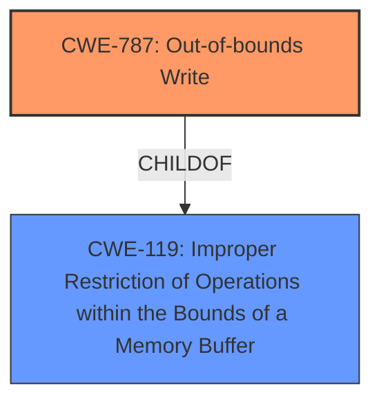

# Raw Analyzer Response for CVE-2025-3000

# Summary

| CWE ID | CWE Name | Confidence | CWE Abstraction Level | CWE Vulnerability Mapping Label | CWE-Vulnerability Mapping Notes |
|---|---|---|---|---|---|
| CWE-787 | Out-of-bounds Write | 0.9 | Base | Allowed | Primary CWE |
| CWE-119 | Improper Restriction of Operations within the Bounds of a Memory Buffer | 0.7 | Class | Allowed | Secondary Candidate |

## Evidence and Confidence

*   **Confidence Score:** 0.8
*   **Evidence Strength:** MEDIUM

## Relationship Analysis
The primary relationship that influenced the CWE selection is the parent-child relationship between CWE-119 and CWE-787. CWE-787 is a specific type of CWE-119. Given the description involves **memory corruption**, `Out-of-bounds Write` (CWE-787) is the more descriptive and specific weakness, thus it was chosen as the primary CWE.

## Vulnerability Chain
The vulnerability chain starts with the use of `@torch.jit.script` with a class containing a list attribute, leading to incorrect handling during TorchScript compilation. This **incorrect handling** results in **memory corruption** via an out-of-bounds write, eventually causing a segmentation fault and denial of service.
  - **Root Cause:** Improper handling of dynamic Python structures in TorchScript compiler
  - **Weakness:** Out-of-bounds Write (CWE-787)
  - **Impact:** Segmentation fault, Denial of Service

## Summary of Analysis
The initial assessment focused on the provided vulnerability description and the content of the CVE reference link. The description indicates a **memory corruption** vulnerability in PyTorch 2.6.0 related to the `torch.jit.script` function. The CVE reference, a GitHub issue, describes a segmentation fault when using `@torch.jit.script` with classes containing list attributes. This issue suggests the TorchScript compiler incorrectly handles dynamic Python structures, leading to **memory corruption**.

The Retriever results strongly suggest CWE-787 (Out-of-bounds Write) as a candidate, along with other related CWEs such as CWE-125 (Out-of-bounds Read) and CWE-190 (Integer Overflow or Wraparound).

Based on the evidence, the primary weakness is an **Out-of-bounds Write** (CWE-787). This is supported by the description of **memory corruption** and the GitHub issue detailing a segmentation fault due to incorrect handling of list attributes during compilation. The relationship analysis confirmed that CWE-787 is a specific type of CWE-119, making it a more precise classification.

The other CWEs were considered:
*   CWE-125 (Out-of-bounds Read): Similar to CWE-787, but the description explicitly mentions **memory corruption**, implying a write operation rather than just a read.
*   CWE-190 (Integer Overflow or Wraparound): While possible, there's no direct evidence of integer overflow in the description or the GitHub issue.
*   CWE-95 (Improper Neutralization of Directives in Dynamically Evaluated Code ('Eval Injection')): Not applicable, as the issue is related to TorchScript compilation, not dynamic evaluation of code.
*   CWE-416 (Use After Free): Not applicable, as there's no evidence suggesting the use of freed memory.
*   CWE-89 (Improper Neutralization of Special Elements used in an SQL Command ('SQL Injection')): Not applicable as the vulnerability is not related to SQL commands.
*   CWE-79 (Improper Neutralization of Input During Web Page Generation ('Cross-site Scripting')): Not applicable as the vulnerability is not related to web page generation.
*   CWE-362 (Concurrent Execution using Shared Resource with Improper Synchronization ('Race Condition')): Not applicable, as there is no evidence of concurrent execution issues.
*   CWE-123 (Write-what-where Condition): A more general form of out-of-bounds write but less descriptive than CWE-787
*   CWE-824 (Access of Uninitialized Pointer): Not applicable, as there's no evidence suggesting the use of uninitialized pointers.
*   CWE-364 (Signal Handler Race Condition): Not applicable, as there is no evidence of signal handling issues.
*   CWE-590 (Free of Memory not on the Heap): Not applicable, as there is no evidence that memory has been allocated on the stack.
*   CWE-1286: Improper Validation of Syntactic Correctness of Input: Not applicable as the vulnerability is not related to syntactic correctness of input.
*   CWE-367: Time-of-check Time-of-use (TOCTOU) Race Condition: Not applicable, as there is no evidence of a TOCTOU race condition.
*   CWE-755: Improper Handling of Exceptional Conditions: This is too generic.
*   CWE-843: Access of Resource Using Incompatible Type ('Type Confusion'): Not applicable as the vulnerability is not related to type confusion.
*   CWE-212: Improper Removal of Sensitive Information Before Storage or Transfer: Not applicable as the vulnerability is not related to sensitive information.
*   CWE-1284: Improper Validation of Specified Quantity in Input: Not applicable as the vulnerability is not related to specified quantities.
*   CWE-131: Incorrect Calculation of Buffer Size: Could be related but not directly implied.

The final decision to classify the vulnerability as CWE-787 is based on the direct evidence of **memory corruption** and the context provided by the GitHub issue, which points to an out-of-bounds write during TorchScript compilation. CWE-787 is at the optimal level of specificity (Base) and is consistent with the mapping guidance.