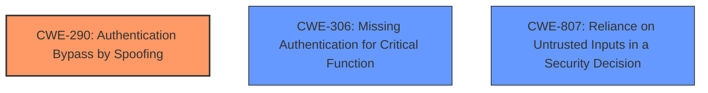

# Enhanced Analysis for CVE-2025-30114

# Summary
| CWE ID | CWE Name | Confidence | CWE Abstraction Level | CWE Vulnerability Mapping Label | CWE-Vulnerability Mapping Notes |
|---|---|---|---|---|---|
| CWE-290 | Authentication Bypass by Spoofing | 0.9 | Base | Primary CWE | Allowed |
| CWE-306 | Missing Authentication for Critical Function | 0.7 | Base | Secondary Candidate | Allowed |
| CWE-807 | Reliance on Untrusted Inputs in a Security Decision | 0.6 | Base | Secondary Candidate | Allowed |

## Evidence and Confidence

*   **Confidence Score:** 0.9
*   **Evidence Strength:** HIGH

## Relationship Analysis
The primary CWE is CWE-290, which is a Base level CWE. CWE-290 is related to authentication bypass issues. The relationship analysis focused on identifying the root cause, which is the reliance on a spoofable MAC address. CWE-306 was considered but deemed less accurate because the core issue is not a complete lack of authentication, but rather a flawed authentication mechanism vulnerable to spoofing.



## Vulnerability Chain
The vulnerability chain starts with the **pairing mechanism relying solely on the connecting devices MAC address**. This **weakness** allows an attacker to perform MAC address spoofing, leading to the **bypassing of the authentication process** and gaining full access to the dashcam's features without proper authorization. The chain is:

1.  **CWE-290**: Authentication Bypass by Spoofing (Root Cause)
2.  Impact: Full access to dashcam features

## Summary of Analysis
The initial assessment identified CWE-290 as the most appropriate CWE due to the **pairing mechanism relying solely on the connecting devices MAC address**, making it vulnerable to spoofing. This aligns with the description of CWE-290, "This attack-focused weakness is caused by incorrectly implemented authentication schemes that are subject to spoofing attacks." The evidence from the "Vulnerability Description Key Phrases" and "CVE Reference Links Content Summary" clearly supports this classification.

CWE-306, Missing Authentication for Critical Function, was considered because an attacker could effectively bypass authentication. However, the system *does* attempt authentication, albeit with a flawed method. Therefore, CWE-290 is more accurate.

CWE-807, Reliance on Untrusted Inputs in a Security Decision, was also considered, since the MAC address is an untrusted input. The root cause is not so much the reliance on untrusted input as it is the reliance on an easily spoofable identifier for authentication.

The final decision is based on the available evidence and the specific characteristics of the vulnerability. CWE-290 is selected because it accurately reflects the **root cause** of the vulnerability, which is the authentication bypass due to spoofing a MAC address. The mapping guidance also supports this choice, as CWE-290 is a Base level CWE.

# Relevant CWE Information:

# Enhanced Context (25 CWEs)
The following CWEs were identified as potentially relevant to this vulnerability:

## CWE-288: Authentication Bypass Using an Alternate Path or Channel
**Abstraction Level**: Base
**Similarity Score**: 0.75
**Source**: dense

**Description**:
The product requires authentication, but the product has an alternate path or channel that does not require authentication.

**Mapping Guidance**:
- Usage: Allowed
- Rationale: This CWE entry is at the Base level of abstraction, which is a preferred level of abstraction for mapping to the root causes of vulnerabilities.

## CWE-290: Authentication Bypass by Spoofing
**Abstraction Level**: Base
**Similarity Score**: 0.74
**Source**: dense

**Description**:
This attack-focused weakness is caused by incorrectly implemented authentication schemes that are subject to spoofing attacks.

**Mapping Guidance**:
- Usage: Allowed
- Rationale: This CWE entry is at the Base level of abstraction, which is a preferred level of abstraction for mapping to the root causes of vulnerabilities.
 - **Supporting Evidence:** The provided vulnerability description states that the **pairing mechanism relies solely on the connecting devices MAC address**. By obtaining the MAC address through network scanning and spoofing it, an attacker can bypass the authentication process and gain full access to the dashcams features without proper authorization.
 - **Explanation:** This directly aligns with the CWE-290 description as the authentication scheme (MAC address verification) is incorrectly implemented and susceptible to spoofing.
 - **Confidence:** 0.9

## CWE-1391: Use of Weak Credentials
**Abstraction Level**: Class
**Similarity Score**: 0.74
**Source**: dense

**Description**:
The product uses weak credentials (such as a default key or hard-coded password) that can be calculated, derived, reused, or guessed by an attacker.

**Mapping Guidance**:
- Usage: Allowed-with-Review
- Rationale: This CWE entry is a Class and might have Base-level children that would be more appropriate

## CWE-294: Authentication Bypass by Capture-replay
**Abstraction Level**: Base
**Similarity Score**: 0.74
**Source**: dense

**Description**:
A capture-replay flaw exists when the design of the product makes it possible for a malicious user to sniff network traffic and bypass authentication by replaying it to the server in question to the same effect as the original message (or with minor changes).

**Mapping Guidance**:
- Usage: Allowed
- Rationale: This CWE entry is at the Base level of abstraction, which is a preferred level of abstraction for mapping to the root causes of vulnerabilities.

## CWE-345: Insufficient Verification of Data Authenticity
**Abstraction Level**: Class
**Similarity Score**: 0.73
**Source**: dense

**Description**:
The product does not sufficiently verify the origin or authenticity of data, in a way that causes it to accept invalid data.

**Mapping Guidance**:
- Usage: Discouraged
- Rationale: This CWE entry is a level-1 Class (i.e., a child of a Pillar). It might have lower-level children that would be more appropriate

## CWE-41: Improper Resolution of Path Equivalence
**Abstraction Level**: Base
**Similarity Score**: 0.73
**Source**: dense

**Description**:
The product is vulnerable to file system contents disclosure through path equivalence. Path equivalence involves the use of special characters in file and directory names. The associated manipulations are intended to generate multiple names for the same object.

**Mapping Guidance**:
- Usage: Allowed
- Rationale: This CWE entry is at the Base level of abstraction, which is a preferred level of abstraction for mapping to the root causes of vulnerabilities.

## CWE-1390: Weak Authentication
**Abstraction Level**: Class
**Similarity Score**: 0.73
**Source**: dense

**Description**:
The product uses an authentication mechanism to restrict access to specific users or identities, but the mechanism does not sufficiently prove that the claimed identity is correct.

**Mapping Guidance**:
- Usage: Allowed-with-Review
- Rationale: This CWE entry is a Class and might have Base-level children that would be more appropriate

## CWE-807: Reliance on Untrusted Inputs in a Security Decision
**Abstraction Level**: Base
**Similarity Score**: 0.73
**Source**: dense

**Description**:
The product uses a protection mechanism that relies on the existence or values of an input, but the input can be modified by an untrusted actor in a way that bypasses the protection mechanism.

**Mapping Guidance**:
- Usage: Allowed
- Rationale: This CWE entry is at the Base level of abstraction, which is a preferred level of abstraction for mapping to the root causes of vulnerabilities.
- **Supporting Evidence:** The MAC address, which is the basis for authentication, is an untrusted input.
- **Explanation:** The system makes a security decision based on the MAC address, which is controllable by the attacker.
- **Confidence:** 0.6

## CWE-305: Authentication Bypass by Primary Weakness
**Abstraction Level**: Base
**Similarity Score**: 0.73
**Source**: dense

**Description**:
The authentication algorithm is sound, but the implemented mechanism can be bypassed as the result of a separate weakness that is primary to the authentication error.

**Mapping Guidance**:
- Usage: Allowed
- Rationale: This CWE entry is at the Base level of abstraction, which is a preferred level of abstraction for mapping to the root causes of vulnerabilities.

## CWE-303: Incorrect Implementation of Authentication Algorithm
**Abstraction Level**: Base
**Similarity Score**: 0.73
**Source**: dense

**Description**:
The requirements for the product dictate the use of an established authentication algorithm, but the implementation of the algorithm is incorrect.

**Mapping Guidance**:
- Usage: Allowed
- Rationale: This CWE entry is


## CWE Relationship Analysis

Current CWEs represent these abstraction levels: .


### Vulnerability Chain Analysis

**Chain starting from CWE-288:**
- 288 (Authentication Bypass Using an Alternate Path or Channel) - ROOT


**Chain starting from CWE-1390:**
- 1390 (Weak Authentication) - ROOT


### CWE Relationship Diagram

```mermaid
graph TD
    classDef primary fill:#f96,stroke:#333,stroke-width:2px
    classDef secondary fill:#69f,stroke:#333
    classDef tertiary fill:#9e9,stroke:#333
```