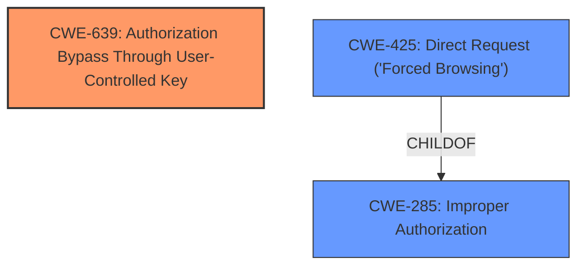

# Enhanced Analysis for CVE-2025-3013

# Summary
| CWE ID | CWE Name | Confidence | CWE Abstraction Level | CWE Vulnerability Mapping Label | CWE-Vulnerability Mapping Notes |
|---|---|---|---|---|---|
| CWE-639 | Authorization Bypass Through User-Controlled Key | 0.9 | Base | Allowed | Primary CWE. The application's authorization mechanism allows unauthorized access to resources by modifying a key controlled by the user. |
| CWE-425 | Direct Request ('Forced Browsing') | 0.7 | Base | Allowed | Secondary candidate. The application fails to enforce proper authorization, allowing direct access to restricted resources. |
| CWE-285 | Improper Authorization | 0.5 | Class | Discouraged | Secondary candidate. The application does not perform or incorrectly performs an authorization check when an actor attempts to access a resource or perform an action. |

## Evidence and Confidence

*   **Confidence Score:** 0.8
*   **Evidence Strength:** MEDIUM

## Relationship Analysis
The primary CWE selected is CWE-639, Authorization Bypass Through User-Controlled Key, which is a Base level CWE. This selection is based on the vulnerability description that an attacker can gain access by manipulating request parameters or object references, which are essentially user-controlled keys.
CWE-425, Direct Request ('Forced Browsing'), is a potential secondary CWE because it highlights the lack of proper authorization enforcement. It is a ChildOf CWE-288, Authentication Bypass.
CWE-285, Improper Authorization is a Class-level CWE and is a parent of CWE-862, Missing Authorization and CWE-863, Incorrect Authorization. I considered those CWEs, but there was not enough information to specify whether the authorization was missing or incorrect.



## Vulnerability Chain
The vulnerability chain starts with **Insecure Direct Object References**, where request parameters or object references are manipulated by an attacker. This leads to an authorization bypass, allowing the attacker to gain unauthorized access to resources.
Root Cause: **Insecure Direct Object References** (IDOR)
Weakness: Authorization Bypass
Impact: Unauthorized Access

## Summary of Analysis
The analysis is primarily based on the provided vulnerability description, which indicates an **Insecure Direct Object References** (IDOR) vulnerability. The key phrase "**manipulating request parameters or object references**" directly supports the selection of CWE-639, as it highlights the use of user-controlled keys to bypass authorization. The description also suggests a lack of proper authorization enforcement, making CWE-425 a relevant secondary consideration.
I considered alternate CWEs from the retriever results. CWE-99, Improper Control of Resource Identifiers ('Resource Injection') was considered. However, since the description specifically mentions "manipulating request parameters or object references," CWE-639 is more precise. The mapping guidance for CWE-639 (Usage: Allowed, Rationale: This CWE entry is at the Base level of abstraction, which is a preferred level of abstraction for mapping to the root causes of vulnerabilities.) confirms it to be a suitable choice.
CWE-425 was chosen as a secondary weakness because the **rootcause** is the **Insecure Direct Object References** but also could be construed as the web application does not adequately enforce appropriate authorization on all restricted URLs, scripts, or files.
CWE-285 was considered because it could be construed as the product does not perform or incorrectly performs an authorization check when an actor attempts to access a resource or perform an action.


## CWE Relationship Analysis

Current CWEs represent these abstraction levels: .


### Vulnerability Chain Analysis

**Chain starting from CWE-288:**
- 288 (Authentication Bypass Using an Alternate Path or Channel) - ROOT


**Chain starting from CWE-863:**
- 863 (Incorrect Authorization) - ROOT


### CWE Relationship Diagram

```mermaid
graph TD
    classDef primary fill:#f96,stroke:#333,stroke-width:2px
    classDef secondary fill:#69f,stroke:#333
    classDef tertiary fill:#9e9,stroke:#333
```