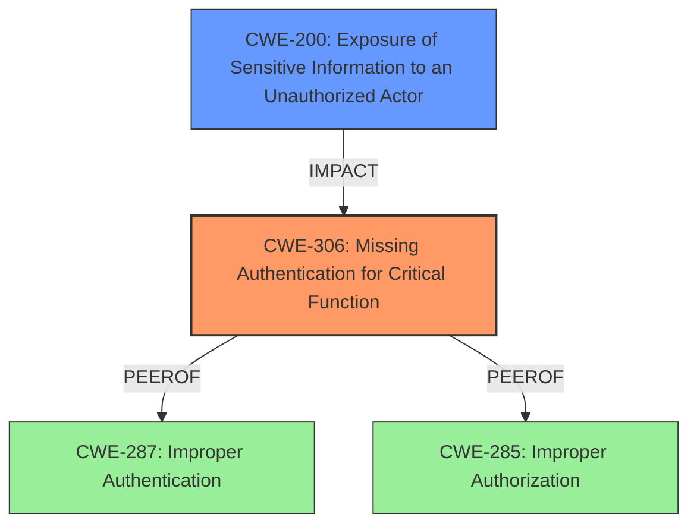

# Enhanced Analysis for CVE-2025-30138

# Summary
| CWE ID | CWE Name | Confidence | CWE Abstraction Level | CWE Vulnerability Mapping Label | CWE-Vulnerability Mapping Notes |
|---|---|---|---|---|---|
| CWE-306 | Missing Authentication for Critical Function | 0.9 | Base | Primary | Allowed |
| CWE-200 | Exposure of Sensitive Information to an Unauthorized Actor | 0.7 | Class | Secondary | Discouraged |

## Evidence and Confidence

*   **Confidence Score:** 0.8
*   **Evidence Strength:** MEDIUM

## Relationship Analysis
The primary CWE is CWE-306, which falls under the broader category of authentication issues. While CWE-287 (Improper Authentication) and CWE-285 (Improper Authorization) are related, CWE-306 is more specific as it highlights the complete absence of authentication for critical functions. CWE-200 is included as a secondary CWE as the lack of authentication leads to exposure of sensitive information.



## Vulnerability Chain
The vulnerability chain starts with the **missing authentication** (**CWE-306**) for critical functions, leading to unauthorized access and modification of settings. This, in turn, results in the exposure of sensitive information (**CWE-200**) and potential sabotage of vehicle components, such as the battery.

## Summary of Analysis
Based on the provided evidence, the primary root cause of the vulnerability is the **lack of authentication** for critical functions in the G-Net Dashcam BB GONX devices. This **missing authentication** allows unauthorized users to connect to the device's network and modify critical system settings. As a result, attackers can extract sensitive car and driver information, disable dashcam alerts, disable recording functionality, or even factory reset the device. Additionally, they can disable battery protection, causing the dashcam to drain the car battery when left on overnight.

The retriever results identified CWE-306 as a top candidate, and the analysis of the vulnerability description supports this classification. Specifically, the description states that managing settings and obtaining sensitive data can be performed by unauthorized persons, highlighting the **absence of authentication**.

CWE-200 is included as a secondary classification because the **missing authentication** leads to the exposure of sensitive information. This aligns with the vulnerability description, which states that attackers can extract sensitive car and driver information.

The selected CWEs are at the optimal level of specificity. CWE-306 is a Base-level CWE that accurately represents the **missing authentication** for critical functions. While other CWEs, such as CWE-287 (Improper Authentication) and CWE-285 (Improper Authorization), are related, CWE-306 is more specific and directly addresses the **root cause** of the vulnerability.
CWE-200 although discouraged, is added to cover the sensitive information exposure.

Relevant CWE Information:

# Enhanced Context (25 CWEs)
The following CWEs were identified as potentially relevant to this vulnerability:

## CWE-345: Insufficient Verification of Data Authenticity
**Abstraction Level**: Class
**Similarity Score**: 0.70
**Source**: dense

**Description**:
The product does not sufficiently verify the origin or authenticity of data, in a way that causes it to accept invalid data.

**Mapping Guidance**:
- Usage: Discouraged
- Rationale: This CWE entry is a level-1 Class (i.e., a child of a Pillar). It might have lower-level children that would be more appropriate

*NOT USED:* The issue is not with verifying the data, but more so the lack of authentication to manage the dashcam.

## CWE-912: Hidden Functionality
**Abstraction Level**: Class
**Similarity Score**: 0.70
**Source**: dense

**Description**:
The product contains functionality that is not documented, not part of the specification, and not accessible through an interface or command sequence that is obvious to the product's users or administrators.

**Mapping Guidance**:
- Usage: Allowed-with-Review
- Rationale: This CWE entry is a Class and might have Base-level children that would be more appropriate

*NOT USED:* This doesn't appear to be hidden functionality, but rather functions that don't have authentication.

## CWE-288: Authentication Bypass Using an Alternate Path or Channel
**Abstraction Level**: Base
**Similarity Score**: 0.70
**Source**: dense

**Description**:
The product requires authentication, but the product has an alternate path or channel that does not require authentication.

**Mapping Guidance**:
- Usage: Allowed
- Rationale: This CWE entry is at the Base level of abstraction, which is a preferred level of abstraction for mapping to the root causes of vulnerabilities.

*NOT USED:* This vulnerability description does not describe a situation where authentication is present but being bypassed.

## CWE-306: Missing Authentication for Critical Function
**Abstraction Level**: Base
**Similarity Score**: 0.70
**Source**: dense

**Description**:
The product does not perform any authentication for functionality that requires a provable user identity or consumes a significant amount of resources.

**Mapping Guidance**:
- Usage: Allowed
- Rationale: This CWE entry is at the Base level of abstraction, which is a preferred level of abstraction for mapping to the root causes of vulnerabilities.

*USED:* The vulnerability description explicitly states the ability to perform unauthorized actions due to the **missing authentication**.

## CWE-425: Direct Request ('Forced Browsing')
**Abstraction Level**: Base
**Similarity Score**: 0.69
**Source**: dense

**Description**:
The web application does not adequately enforce appropriate authorization on all restricted URLs, scripts, or files.

**Mapping Guidance**:
- Usage: Allowed
- Rationale: This CWE entry is at the Base level of abstraction, which is a preferred level of abstraction for mapping to the root causes of vulnerabilities.

*NOT USED:* While there is unauthorized access, it appears to be due to missing authentication, not a lack of authorization on URLs.

## CWE-294: Authentication Bypass by Capture-replay
**Abstraction Level**: Base
**Similarity Score**: 0.69
**Source**: dense

**Description**:
A capture-replay flaw exists when the design of the product makes it possible for a malicious user to sniff network traffic and bypass authentication by replaying it to the server in question to the same effect as the original message (or with minor changes).

**Mapping Guidance**:
- Usage: Allowed
- Rationale: This CWE entry is at the Base level of abstraction, which is a preferred level of abstraction for mapping to the root causes of vulnerabilities.

*NOT USED:* This vulnerability description does not describe capture-replay.

## CWE-200: Exposure of Sensitive Information to an Unauthorized Actor
**Abstraction Level**: Class
**Similarity Score**: 0.69
**Source**: dense

**Description**:
The product exposes sensitive information to an actor that is not explicitly authorized to have access to that information.

**Mapping Guidance**:
- Usage: Discouraged
- Rationale: CWE-200 is commonly misused to represent the loss of confidentiality in a vulnerability, but confidentiality loss is a technical impact - not a root cause error. As of CWE 4.9, over 400 CWE entries can lead to a loss of confidentiality. Other options are often available. [REF-1287].

*USED:* The **missing authentication** can lead to the exposure of sensitive information.

## CWE-472: External Control of Assumed-Immutable Web Parameter
**Abstraction Level**: Base
**Similarity Score**: 0.69
**Source**: dense

**Description**:
The web application does not sufficiently verify inputs that are assumed to be immutable but are actually externally controllable, such as hidden form fields.

**Mapping Guidance**:
- Usage: Allowed
- Rationale: This CWE entry is at the Base level of abstraction, which is a preferred level of abstraction for mapping to the root causes of vulnerabilities.

*NOT USED:* The vulnerability is not about external control of immutable parameters.

## CWE-497: Exposure of Sensitive System Information to an Unauthorized Control Sphere
**Abstraction Level**: Base
**Similarity Score**: 0.68
**Source**: dense

**Description**:
The product does not properly prevent sensitive system-level information from being accessed by unauthorized actors who do not have the same level of access to the underlying system as the product does.

**Mapping Guidance**:
- Usage: Allowed
- Rationale:


## CWE Relationship Analysis

Current CWEs represent these abstraction levels: .


### Vulnerability Chain Analysis

**Chain starting from CWE-288:**
- 288 (Authentication Bypass Using an Alternate Path or Channel) - ROOT


**Chain starting from CWE-345:**
- 345 (Insufficient Verification of Data Authenticity) - ROOT


### CWE Relationship Diagram

```mermaid
graph TD
    classDef primary fill:#f96,stroke:#333,stroke-width:2px
    classDef secondary fill:#69f,stroke:#333
    classDef tertiary fill:#9e9,stroke:#333
```