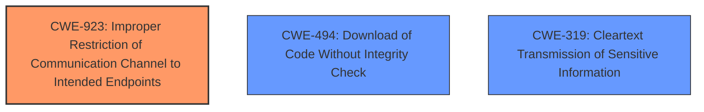

# Analysis for CVE-2025-30140

# Summary
| CWE ID | CWE Name | Confidence | CWE Abstraction Level | CWE Vulnerability Mapping Label | CWE-Vulnerability Mapping Notes |
|---|---|---|---|---|---|
| CWE-923 | Improper Restriction of Communication Channel to Intended Endpoints | 0.9 | Class | Primary | Allowed-with-Review |
| CWE-494 | Download of Code Without Integrity Check | 0.5 | Base | Secondary | Allowed |
| CWE-319 | Cleartext Transmission of Sensitive Information | 0.3 | Base | Secondary | Allowed |

## Evidence and Confidence

*   **Confidence Score:** 0.7
*   **Evidence Strength:** MEDIUM

## Relationship Analysis
The primary CWE identified is CWE-923, which is a Class-level CWE. While it's recommended to use Base or Variant level CWEs when possible, the specifics of the vulnerability description don't strongly support a more specific child CWE. CWE-923 relates to the improper restriction of a communication channel to intended endpoints, which accurately describes the core issue of using a public domain for internal communications. The other candidates like CWE-494 and CWE-319 are related to downloading code without integrity check and transmitting sensitive data in cleartext.

## Vulnerability Chain
The vulnerability chain starts with the **use of an unregistered public domain name** as an internal domain (CWE-923), which allows potential interception of sensitive device traffic. This could then lead to data exfiltration or man-in-the-middle attacks if the domain is resolved over the public internet instead of locally. Downloading code without integrity check (CWE-494) might be possible after this and leads to the transmission of sensitive information in cleartext (CWE-319).

## Summary of Analysis
Initially, the use of an unregistered public domain name for internal communications strongly points to CWE-923. The **root cause** is the **improper restriction** of the communication channel, as the internal domain could be hijacked by an attacker. The vulnerability description and CVE reference summary both highlight this as the central weakness. Further exploitation might involve downloading of code without integrity check (CWE-494) and transmitting sensitive information in cleartext (CWE-319).

The evidence is primarily based on the vulnerability description and the CVE reference links content summary. The most compelling evidence is: "A Public Domain name is Used for the Internal Domain Name" and "It uses an unregistered public domain name as an internal domain, creating a security risk."

The selection of CWE-923 is at the optimal level of specificity given the available information. While more specific vulnerabilities might arise from this, the **root cause** is the **improperly restricted communication channel**.

Relevant CWE Information:

# Enhanced Context (25 CWEs)
The following CWEs were identified as potentially relevant to this vulnerability:

## CWE-923: Improper Restriction of Communication Channel to Intended Endpoints
**Abstraction Level**: Class
**Similarity Score**: 0.74
**Source**: dense

**Description**:
The product establishes a communication channel to (or from) an endpoint for privileged or protected operations, but it does not properly ensure that it is communicating with the correct endpoint.

**Mapping Guidance**:
- Usage: Allowed-with-Review
- Rationale: This CWE entry is a Class and might have Base-level children that would be more appropriate
## CWE-494: Download of Code Without Integrity Check
**Abstraction Level**: base
**Similarity Score**: 2.21
**Source**: graph

**Description**:
CWE-494: Download of Code Without Integrity Check

**Mapping Guidance**:
- Usage: Allowed
- Rationale: This CWE entry is at the Base level of abstraction, which is a preferred level of abstraction for mapping to the root causes of vulnerabilities.
## CWE-319: Cleartext Transmission of Sensitive Information
**Abstraction Level**: Base
**Similarity Score**: 0.73
**Source**: dense

**Description**:
The product transmits sensitive or security-critical data in cleartext in a communication channel that can be sniffed by unauthorized actors.

**Mapping Guidance**:
- Usage: Allowed
- Rationale: This CWE entry is at the Base level of abstraction, which is a preferred level of abstraction for mapping to the root causes of vulnerabilities.

CWE-923 is selected as the primary because it represents the **root cause** of the vulnerability, which is the **improper restriction of the communication channel**.

CWE-494 is considered as a secondary because the attacker can potentially download code without integrity check by exploiting the weakness.

CWE-319 is considered as a secondary because the attacker can potentially transmit sensitive information in cleartext by exploiting the weakness.