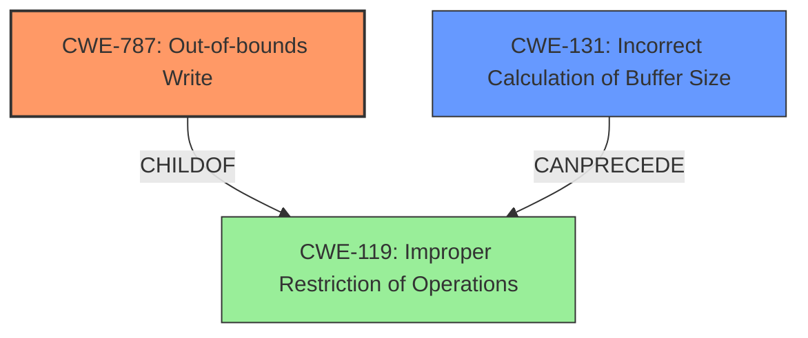

# Analysis Report for CVE-2025-3017

# Vulnerability Analysis Report: CVE-2025-3017

## Description

A vulnerability, which was classified as critical, has been found in TA-Lib up to 0.6.4. This issue affects the function setInputBuffer of the file src/tools/ta_regtest/ta_test_func/test_minmax.c of the component ta_regtest. The manipulation leads to **out-of-bounds write**. It is possible to launch the attack on the local host. The exploit has been disclosed to the public and may be used. The identifier of the patch is 5879180e9070ec35d52948f2f57519713256a0f1. It is recommended to apply a patch to fix this issue.

## Vulnerability Description Key Phrases

- **Weakness:** out-of-bounds write
- **Product:** TA-Lib
- **Version:** up to 0.6.4
- **Component:** setInputBuffer of the file src/tools/ta_regtest/ta_test_func/test_minmax.c

## Analysis (with Relationship Data)

# Summary
| CWE ID | CWE Name | Confidence | CWE Abstraction Level | CWE Vulnerability Mapping Label | CWE-Vulnerability Mapping Notes |
|---|---|---|---|---|---|
| CWE-787 | Out-of-bounds Write | 1.0 | Base | Allowed | Primary CWE. The vulnerability involves writing data outside the intended buffer boundaries. |
| CWE-131 | Incorrect Calculation of Buffer Size | 0.8 | Base | Allowed | Secondary CWE. The root cause is due to the incorrect calculation of buffer size using the `sizeof` operator. |

## Evidence and Confidence

*   **Confidence Score:** 0.9
*   **Evidence Strength:** HIGH

## Relationship Analysis
The primary CWE is CWE-787, which represents the out-of-bounds write. The root cause of this write is due to an incorrect calculation of the buffer size, represented by CWE-131. CWE-787 is a child of CWE-119 (Improper Restriction of Operations within the Bounds of a Memory Buffer), and CWE-131 can precede CWE-119. The relationship between these CWEs forms a chain where an incorrect size calculation leads to buffer overflows.



## Vulnerability Chain
The vulnerability chain starts with **incorrect calculation of buffer size** (CWE-131) using the `sizeof` operator, leading to **out-of-bounds write** (CWE-787). The impact can be application crash, information leakage, or code execution.

## Summary of Analysis
The primary weakness is an **out-of-bounds write** (CWE-787), which stems from an **incorrect calculation of the buffer size** (CWE-131).

Evidence from the vulnerability description: "**out-of-bounds write**" and the CVE Reference Links Content Summary: "The vulnerability is an out-of-bounds (OOB) write condition. Specifically, the `sizeof` operator was incorrectly used when determining the size of `testSerie9`".

The graph relationships helped define the relationship between the **root cause** and the **resulting vulnerability**. The selected CWEs are at the optimal level of specificity because they directly address the **out-of-bounds write** and the **incorrect size calculation**, respectively.

Relevant CWE Information:

# Enhanced Context (25 CWEs)
The following CWEs were identified as potentially relevant to this vulnerability:

## CWE-125: Out-of-bounds Read
**Abstraction Level**: Base
**Similarity Score**: 0.77
**Source**: dense

**Description**:
The product reads data past the end, or before the beginning, of the intended buffer.

**Mapping Guidance**:
- Usage: Allowed
- Rationale: This CWE entry is at the Base level of abstraction, which is a preferred level of abstraction for mapping to the root causes of vulnerabilities.

**Relationships**:
- CANFOLLOW -> CWE-825
- CANFOLLOW -> CWE-824
- CANFOLLOW -> CWE-823
- CANFOLLOW -> CWE-822
- PARENTOF -> CWE-127

*Not Selected:* While out-of-bounds read is possible, the description and root cause analysis specifically mentions **out-of-bounds write**.

## CWE-193: Off-by-one Error
**Abstraction Level**: Base
**Similarity Score**: 0.76
**Source**: dense

**Description**:
A product calculates or uses an incorrect maximum or minimum value that is 1 more, or 1 less, than the correct value.

**Mapping Guidance**:
- Usage: Allowed
- Rationale: This CWE entry is at the Base level of abstraction, which is a preferred level of abstraction for mapping to the root causes of vulnerabilities.

**Relationships**:
- CANPRECEDE -> CWE-119
- CANPRECEDE -> CWE-170
- CANPRECEDE -> CWE-617
- CHILDOF -> CWE-682
- CHILDOF -> CWE-682

*Not Selected:* While the **incorrect calculation** could be an off-by-one error, the root cause is explicitly stated as a problem with the `sizeof` operator, making CWE-131 a more precise fit.

## CWE-131: Incorrect Calculation of Buffer Size
**Abstraction Level**: Base
**Similarity Score**: 0.76
**Source**: dense

**Description**:
The product does not correctly calculate the size to be used when allocating a buffer, which could lead to a buffer overflow.

**Mapping Guidance**:
- Usage: Allowed
- Rationale: This CWE entry is at the Base level of abstraction, which is a preferred level of abstraction for mapping to the root causes of vulnerabilities.

**Relationships**:
- PARENTOF -> CWE-467
- CANPRECEDE -> CWE-119
- CHILDOF -> CWE-682
- CHILDOF -> CWE-682
- CHILDOF -> CWE-682

*Selected as Secondary:* This is a direct root cause of the vulnerability. The CVE Reference Links Content Summary states "Specifically, the `sizeof` operator was incorrectly used when determining the size".

## CWE-824: Access of Uninitialized Pointer
**Abstraction Level**: Base
**Similarity Score**: 0.76
**Source**: dense

**Description**:
The product accesses or uses a pointer that has not been initialized.

**Mapping Guidance**:
- Usage: Allowed
- Rationale: This CWE entry is at the Base level of abstraction, which is a preferred level of abstraction for mapping to the root causes of vulnerabilities.

**Relationships**:
- CANPRECEDE -> CWE-787
- CANPRECEDE -> CWE-125
- CHILDOF -> CWE-119
- CHILDOF -> CWE-119
- CHILDOF -> CWE-119

*Not Selected:* This CWE is not relevant as the vulnerability is due to **incorrect buffer size calculation** and **out-of-bounds write**, not due to uninitialized pointers.

## CWE-1286: Improper Validation of Syntactic Correctness of Input
**Abstraction Level**: Base
**Similarity Score**: 0.75
**Source**: dense

**Description**:
The product receives input that is expected to be well-formed - i.e., to comply with a certain syntax - but it does not validate or incorrectly validates that the input complies with the syntax.

**Mapping Guidance**:
- Usage: Allowed
- Rationale: This CWE entry is at the Base level of abstraction, which is a preferred level of abstraction for mapping to the root causes of vulnerabilities.

*Not Selected:* This CWE is not relevant as the vulnerability is not due to syntactic validation.

## CWE-129: Improper Validation of Array Index
**Abstraction Level**: Variant
**Similarity Score**: 0.74
**Source**: dense

**Description**:
The product uses untrusted input when calculating or using an array index, but the product does not validate or incorrectly validates the index to ensure the index references a valid position within the array.

**Mapping Guidance**:
- Usage: Allowed
- Rationale: This CWE entry is at the Variant level of abstraction, which is a preferred level of abstraction for mapping to the root causes of vulnerabilities.

*Not Selected:* This CWE is not relevant as the vulnerability is due to **incorrect buffer size calculation**, not due to array index validation.

## CWE-617: Reachable Assertion
**Abstraction Level**: Base
**Similarity Score**: 0.74
**Source**: dense

**Description**:
The product contains an assert() or similar statement that can be triggered by an attacker, which leads to an application exit or other behavior that is more severe than necessary.

**Mapping Guidance**:
- Usage: Allowed
- Rationale: This CWE entry is at the Base level of abstraction, which is a preferred level of abstraction for mapping to the root causes of vulnerabilities.

*Not Selected:* This CWE is not relevant as the vulnerability is not related to assertions.

## CWE-367: Time-of-check Time-of-use (TOCTOU) Race Condition
**Abstraction Level**: Base
**Similarity Score**: 0.74
**Source**: dense

**Description**:
The product checks the state of a resource before using that resource, but the resource's state can change between the check and the use in a way that invalidates the results of the check. This can cause the product to perform invalid actions when the resource is in an unexpected state.

**Mapping Guidance**:
- Usage: Allowed
- R


## CWE Relationship Analysis

Current CWEs represent these abstraction levels: .


### Vulnerability Chain Analysis

**Chain starting from CWE-823:**
- 823 (Use of Out-of-range Pointer Offset) - ROOT


**Chain starting from CWE-127:**
- 127 (Buffer Under-read) - ROOT


### CWE Relationship Diagram

```mermaid
graph TD
    classDef primary fill:#f96,stroke:#333,stroke-width:2px
    classDef secondary fill:#69f,stroke:#333
    classDef tertiary fill:#9e9,stroke:#333
```


*Report generated on 2025-07-14 17:08:59*
