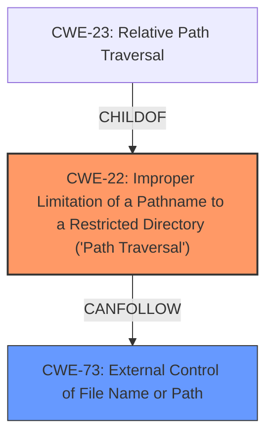

# Enhanced Analysis for CVE-2025-30208

# Summary
| CWE ID | CWE Name | Confidence | CWE Abstraction Level | CWE Vulnerability Mapping Label | CWE-Vulnerability Mapping Notes |
|---|---|---|---|---|---|
| CWE-22 | Improper Limitation of a Pathname to a Restricted Directory ('Path Traversal') | 0.9 | Base | Allowed | Primary CWE. The vulnerability allows bypassing intended restrictions on file access due to **improper limitation of pathname**. |
| CWE-73 | External Control of File Name or Path | 0.7 | Base | Allowed | Secondary CWE. The vulnerability involves user-controlled input influencing file paths, which can lead to unauthorized access. |

## Evidence and Confidence

*   **Confidence Score:** 0.8
*   **Evidence Strength:** HIGH

## Relationship Analysis
The primary CWE selected is CWE-22, which focuses on the **improper limitation of a pathname to a restricted directory**. This is the root cause as the vulnerability allows bypassing the intended restrictions. CWE-73 (External Control of File Name or Path) is a related weakness as it describes how user input can influence file paths. CWE-22 is a parent of CWE-23 (Relative Path Traversal). The relationship is that the **improper** handling leads to path traversal, where an attacker can access files outside the intended directory.



## Vulnerability Chain
The vulnerability chain starts with **improper input validation** when handling the URL, specifically the query string. This **improper** handling allows an attacker to bypass intended access restrictions and read arbitrary files on the server.

1.  **Root Cause:** **Improper input validation** (**trailing separators are removed in several places, but are not accounted for in query string regexes**)
2.  **Weakness:** CWE-22 (Improper Limitation of a Pathname to a Restricted Directory)
3.  **Impact:** Arbitrary file read, information disclosure

## Summary of Analysis
The primary weakness is CWE-22 (Improper Limitation of a Pathname to a Restricted Directory). The evidence clearly supports this, as the vulnerability description states that the `@fs` access denial is bypassed due to **improper handling of trailing separators in the URL**. Specifically, the **rootcause** is that the **trailing separators are removed in several places, but are not accounted for in query string regexes**. This aligns perfectly with CWE-22, which deals with **improper limitation of pathnames to restricted directories**. The retriever results also list CWE-22 as the top result, further supporting this classification.

CWE-73 (External Control of File Name or Path) is added as a secondary CWE because the vulnerability allows user-controlled input (the URL with `?raw??` or `?import&raw??`) to influence the file path being accessed.

Other CWEs were considered but not selected:

*   CWE-1333 (Inefficient Regular Expression Complexity): While the issue involves regular expressions, the primary problem is the **improper** handling of the input, not the complexity of the regex itself.
*   CWE-863 (Incorrect Authorization): While the vulnerability leads to unauthorized access, the root cause is the **improper limitation** of the pathname, not an authorization flaw.
*   CWE-209 (Generation of Error Message Containing Sensitive Information): This CWE is not applicable as the vulnerability leads to arbitrary file read, not the exposure of sensitive information in error messages.
*   CWE-668 (Exposure of Resource to Wrong Sphere): This is a high-level CWE and less specific than CWE-22.
*   CWE-306 (Missing Authentication for Critical Function): Not applicable because the issue is path traversal, not a missing authentication check.


## CWE Relationship Analysis

Current CWEs represent these abstraction levels: .


### Vulnerability Chain Analysis

**Chain starting from CWE-863:**
- 863 (Incorrect Authorization) - ROOT


**Chain starting from CWE-22:**
- 22 (Improper Limitation of a Pathname to a Restricted Directory ('Path Traversal')) - ROOT


### CWE Relationship Diagram

```mermaid
graph TD
    classDef primary fill:#f96,stroke:#333,stroke-width:2px
    classDef secondary fill:#69f,stroke:#333
    classDef tertiary fill:#9e9,stroke:#333
```