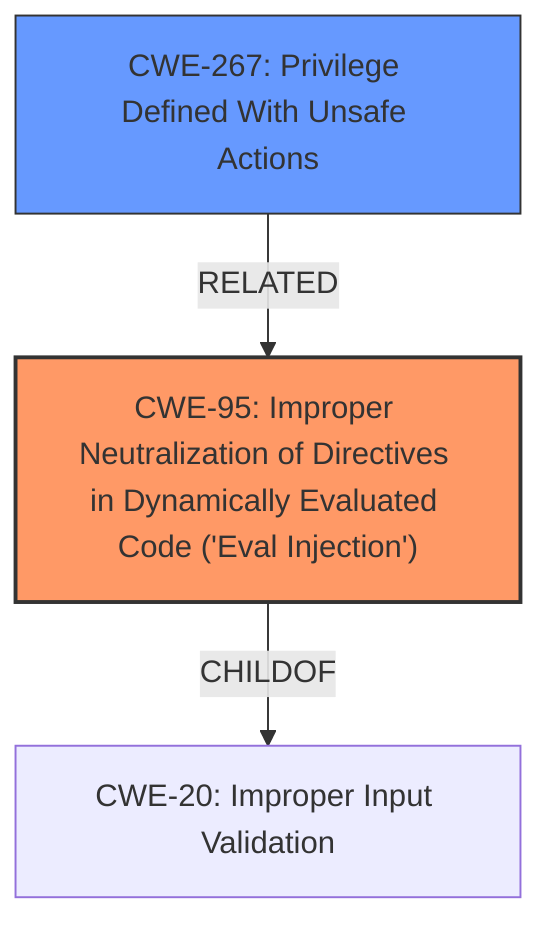

# Analysis Report for CVE-2025-30213

# Vulnerability Analysis Report: CVE-2025-30213

## Description

Frappe is a full-stack web application framework. Prior to versions 14.91.0 and 15.52.0, a system user was able to create certain documents in a specific way that could lead to remote code execution. Versions 14.9.1 and 15.52.0 contain a patch for the vulnerability. Theres no workaround an upgrade is required.

## Vulnerability Description Key Phrases

- **Impact:** remote code execution
- **Attacker:** system user
- **Product:** Frappe
- **Version:** ['Prior to versions 14.91.0', '15.52.0']

## Analysis (with Relationship Data)

# Summary
| CWE ID | CWE Name | Confidence | CWE Abstraction Level | CWE Vulnerability Mapping Label | CWE-Vulnerability Mapping Notes |
|---|---|---|---|---|---|
| CWE-95 | Improper Neutralization of Directives in Dynamically Evaluated Code ('Eval Injection') | 0.75 | Variant | Allowed | Primary CWE: The description mentions a system user can create documents in a specific way leading to RCE. This indicates code injection, and CWE-95 captures the essence of dynamic code evaluation with improperly neutralized directives. |
| CWE-267 | Privilege Defined With Unsafe Actions | 0.5 | Base | Allowed | Secondary Candidate: The vulnerability involves a system user, suggesting that the privileges associated with that user are being leveraged in an unsafe manner. |

## Evidence and Confidence

*   **Confidence Score:** 0.6
*   **Evidence Strength:** MEDIUM

## Relationship Analysis
The primary weakness is `CWE-95: Improper Neutralization of Directives in Dynamically Evaluated Code ('Eval Injection')`.
A possible secondary weakness is `CWE-267: Privilege Defined With Unsafe Actions`.



## Vulnerability Chain
The vulnerability chain starts with the **improper neutralization** of input within dynamically evaluated code, leading to remote code execution.
  - The root cause is `CWE-95: Improper Neutralization of Directives in Dynamically Evaluated Code ('Eval Injection')` where the **improper neutralization** leads to the injection.
  - The impact is Remote Code Execution (RCE).
  - A system user having the ability to create documents in a specific way suggests potential **privilege abuse**, aligning with `CWE-267: Privilege Defined With Unsafe Actions`.

## Summary of Analysis
Initially, many CWEs were considered from the retriever results, including `CWE-918: Server-Side Request Forgery (SSRF)` and `CWE-79: Improper Neutralization of Input During Web Page Generation ('Cross-site Scripting')`. However, these did not directly address the root cause described. `CWE-95` was ultimately selected as the primary CWE due to the vulnerability description mentioning a system user creating documents in a specific way leading to RCE, which points to dynamic code evaluation and injection.

The relationship graph helps to understand how `CWE-95` and `CWE-267` could be related. `CWE-95` is a child of `CWE-20: Improper Input Validation`, and `CWE-267` represents how privileges might be misused.

The evidence supporting this decision comes from the CVE Reference Links Content Summary, which states: "A system user was able to create certain documents in a specific way that could lead to RCE." This clearly points to a problem with how the system handles the creation and processing of documents, allowing for the injection of malicious code.

I am reasonably confident (0.6) in this assessment, as the description is somewhat vague and doesn't provide complete technical details.
Relevant CWE Information:

# Enhanced Context (25 CWEs)
The following CWEs were identified as potentially relevant to this vulnerability:

## CWE-918: Server-Side Request Forgery (SSRF)
**Abstraction Level**: Base
**Similarity Score**: 0.73
**Source**: dense

**Description**:
The web server receives a URL or similar request from an upstream component and retrieves the contents of this URL, but it does not sufficiently ensure that the request is being sent to the expected destination.

**Mapping Guidance**:
- Usage: Allowed
- Rationale: This CWE entry is at the Base level of abstraction, which is a preferred level of abstraction for mapping to the root causes of vulnerabilities.

**Why Not Used:** While this CWE appeared in the retriever results, the vulnerability description does not explicitly mention or imply any server-side requests or URL handling issues.

## CWE-116: Improper Encoding or Escaping of Output
**Abstraction Level**: Class
**Similarity Score**: 0.71
**Source**: dense

**Description**:
The product prepares a structured message for communication with another component, but encoding or escaping of the data is either missing or done incorrectly. As a result, the intended structure of the message is not preserved.

**Mapping Guidance**:
- Usage: Allowed-with-Review
- Rationale: This CWE entry is a Class and might have Base-level children that would be more appropriate

**Why Not Used:** Although encoding issues might be present, the description focuses on code execution via document creation, making this CWE less relevant than `CWE-95`.

## CWE-346: Origin Validation Error
**Abstraction Level**: Class
**Similarity Score**: 0.71
**Source**: dense

**Description**:
The product does not properly verify that the source of data or communication is valid.

**Mapping Guidance**:
- Usage: Allowed-with-Review
- Rationale: This CWE entry is a Class and might have Base-level children that would be more appropriate

**Why Not Used:** There is no evidence to suggest the origin of data is being validated.

## CWE-303: Incorrect Implementation of Authentication Algorithm
**Abstraction Level**: Base
**Similarity Score**: 0.71
**Source**: dense

**Description**:
The requirements for the product dictate the use of an established authentication algorithm, but the implementation of the algorithm is incorrect.

**Mapping Guidance**:
- Usage: Allowed
- Rationale: This CWE entry is at the Base level of abstraction, which is a preferred level of abstraction for mapping to the root causes of vulnerabilities.

**Why Not Used:** Authentication is not part of the vulnerability description.

## CWE-93: Improper Neutralization of CRLF Sequences ('CRLF Injection')
**Abstraction Level**: Base
**Similarity Score**: 0.70
**Source**: dense

**Description**:
The product uses CRLF (carriage return line feeds) as a special element, e.g. to separate lines or records, but it does not neutralize or incorrectly neutralizes CRLF sequences from inputs.

**Mapping Guidance**:
- Usage: Allowed
- Rationale: This CWE entry is at the Base level of abstraction, which is a preferred level of abstraction for mapping to the root causes of vulnerabilities.

**Why Not Used:** CRLF injection is not part of the vulnerability description.

## CWE-639: Authorization Bypass Through User-Controlled Key
**Abstraction Level**: Base
**Similarity Score**: 0.70
**Source**: dense

**Description**:
The system's authorization functionality does not prevent one user from gaining access to another user's data or record by modifying the key value identifying the data.

**Mapping Guidance**:
- Usage: Allowed
- Rationale: This CWE entry is at the Base level of abstraction, which is a preferred level of abstraction for mapping to the root causes of vulnerabilities.

**Why Not Used:** The vulnerability is not related to authorization bypass.

## CWE-212: Improper Removal of Sensitive Information Before Storage or Transfer
**Abstraction Level**: Base
**Similarity Score**: 0.70
**Source**: dense

**Description**:
The product stores, transfers, or shares a resource that contains sensitive information, but it does not properly remove that information before the product makes the resource available to unauthorized actors.

**Mapping Guidance**:
- Usage: Allowed
- Rationale: This CWE entry is at the Base level of abstraction, which is a preferred level of abstraction for mapping to the root causes of vulnerabilities.

**Why Not Used:** This CWE is not relevant to the vulnerability description.

## CWE-497: Exposure of Sensitive System Information to an Unauthorized Control Sphere
**Abstraction Level**: Base
**Similarity Score**: 0.70
**Source**: dense

**Description**:
The product does not properly prevent sensitive system-level information from being accessed by unauthorized actors who do not have the same level of access to the underlying system as the product does.

**Mapping Guidance**:
- Usage: Allowed
- Rationale: This CWE entry is at the Base level of abstraction, which is a preferred level of abstraction for mapping to the root causes of vulnerabilities.

**Why Not Used:** This CWE is not relevant to the vulnerability description.


## CWE Relationship Analysis

Current CWEs represent these abstraction levels: .


### Vulnerability Chain Analysis

**Chain starting from CWE-116:**
- 116 (Improper Encoding or Escaping of Output) - ROOT


**Chain starting from CWE-93:**
- 93 (Improper Neutralization of CRLF Sequences ('CRLF Injection')) - ROOT


### CWE Relationship Diagram

```mermaid
graph TD
    classDef primary fill:#f96,stroke:#333,stroke-width:2px
    classDef secondary fill:#69f,stroke:#333
    classDef tertiary fill:#9e9,stroke:#333
```


*Report generated on 2025-07-14 17:10:28*
