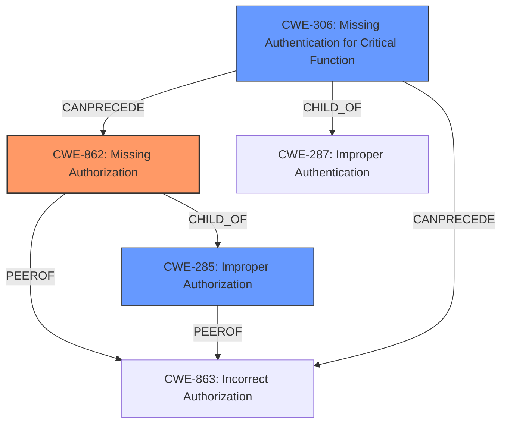

# Analysis Report for CVE-2025-30215

# Vulnerability Analysis Report: CVE-2025-30215

## Description

NATS-Server is a High-Performance server for NATS.io, the cloud and edge native messaging system. In versions starting from 2.2.0 but prior to 2.10.27 and 2.11.1, the management of JetStream assets happens with messages in the $JS. subject namespace in the system account this is partially exposed into regular accounts to allow account holders to manage their assets. Some of the JS API requests were **missing access controls**, allowing any user with JS management permissions in any account to perform certain administrative actions on any JS asset in any other account. At least one of the unprotected APIs allows for data destruction. None of the affected APIs allow disclosing stream contents. This vulnerability is fixed in v2.11.1 or v2.10.27.

## Vulnerability Description Key Phrases

- **Rootcause:** missing access controls
- **Product:** NATS-Server
- **Impact:** data destruction, disclosing stream contents
- **Attacker:** any user with JS management permissions in any account
- **Version:** 2.2.0 to 2.10.27 and 2.11.1

## Analysis (with Relationship Data)

# Summary
| CWE ID | CWE Name | Confidence | CWE Abstraction Level | CWE Vulnerability Mapping Label | CWE-Vulnerability Mapping Notes |
|---|---|---|---|---|---|
| CWE-862 | Missing Authorization | 0.9 | Class | Primary | Allowed-with-Review |
| CWE-285 | Improper Authorization | 0.7 | Class | Secondary | Discouraged |
| CWE-306 | Missing Authentication for Critical Function | 0.6 | Base | Secondary | Allowed |

## Evidence and Confidence

*   **Confidence Score:** 0.8
*   **Evidence Strength:** HIGH

## Relationship Analysis
The primary relationship that influenced my decision was the hierarchical relationship between CWE-862 Missing Authorization and CWE-285 Improper Authorization. While both could apply, CWE-862 is more fitting because the vulnerability description explicitly states "**missing access controls**," implying a complete absence of authorization, rather than a flawed implementation which would be CWE-285. The relationship to CWE-306 also plays a part, where authentication is missing, leading to authorization issues. The class level of CWE-862 is appropriate given the high-level description of the missing controls.



## Vulnerability Chain
The vulnerability chain begins with the **missing access controls** (CWE-862), which allows attackers with JS management permissions to perform administrative actions. This leads to impacts like data destruction.

CWE-862 (Missing Authorization) -> Data Destruction (Impact)

## Summary of Analysis
The initial analysis focused on identifying the root cause of the vulnerability, which is the **missing access controls**. The description clearly states that "Some of the JS API requests were **missing access controls**," providing strong evidence for CWE-862.

The relationship between CWE-862 and CWE-285 was carefully considered. While CWE-285 (Improper Authorization) could also apply if the authorization checks were present but flawed, the explicit mention of "**missing access controls**" points more directly to a complete lack of authorization, making CWE-862 the more appropriate choice.

The high retriever score of CWE-863 (Incorrect Authorization) further supports the assessment that authorization is the core issue. However, given the explicit **missing** aspect, CWE-862 is favored over CWE-863.

The selected CWEs are at an optimal level of specificity, as CWE-862 is a class-level CWE that accurately captures the high-level nature of the **missing access controls**.

Relevant CWE Information:

*   CWE-862 (Missing Authorization): The product does not perform any authorization checks when an actor attempts to access a resource or perform an action.
*   CWE-285 (Improper Authorization): The product does not perform or incorrectly performs an authorization check when an actor attempts to access a resource or perform an action.
*   CWE-306 (Missing Authentication for Critical Function): The product does not perform any authentication for functionality that requires a provable user identity or consumes a significant amount of resources.

I considered CWE-863 (Incorrect Authorization), but it was rejected because the description highlights the absence of authorization rather than an incorrect implementation. I also considered CWE-269 (Improper Privilege Management) and CWE-732 (Incorrect Permission Assignment for Critical Resource), but these were deemed less relevant as the core issue is the **missing access controls**, not the assignment or management of privileges or permissions.


## CWE Relationship Analysis

Current CWEs represent these abstraction levels: .


### Vulnerability Chain Analysis

**Chain starting from CWE-863:**
- 863 (Incorrect Authorization) - ROOT


**Chain starting from CWE-732:**
- 732 (Incorrect Permission Assignment for Critical Resource) - ROOT


### CWE Relationship Diagram

```mermaid
graph TD
    classDef primary fill:#f96,stroke:#333,stroke-width:2px
    classDef secondary fill:#69f,stroke:#333
    classDef tertiary fill:#9e9,stroke:#333
```


*Report generated on 2025-07-14 17:11:12*
