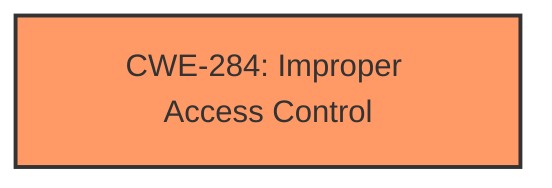

# Analysis Report for CVE-2025-30288

# Vulnerability Analysis Report: CVE-2025-30288

## Description

ColdFusion versions 2023.12, 2021.18, 2025.0 and earlier are affected by an **Improper Access Control** vulnerability that could result in a Security feature bypass. A low privileged attacker with local access could leverage this vulnerability to bypass security protections and execute code. Exploitation of this issue requires user interaction in that a victim must be coerced into performing actions within the application and scope is changed.

## Vulnerability Description Key Phrases

- **Rootcause:** Improper Access Control
- **Impact:** ['bypass security protections', 'Security feature bypass', 'execute code']
- **Attacker:** low privileged attacker with local access
- **Product:** ColdFusion
- **Version:** ['2025.0 and earlier', '2021.18', '2023.12']

## Analysis (with Relationship Data)

# Summary
| CWE ID    | CWE Name                                                                 | Confidence | CWE Abstraction Level | CWE Vulnerability Mapping Label | CWE-Vulnerability Mapping Notes |
| :-------- | :----------------------------------------------------------------------- | :--------- | :-------------------- | :------------------------------ | :------------------------------ |
| CWE-284   | Improper Access Control                                                  | 1          | Pillar                | Primary                         | Discouraged                   |

## Evidence and Confidence

*   **Confidence Score:** 1
*   **Evidence Strength:** HIGH

## Relationship Analysis

The primary CWE, CWE-284, is a high-level category. While it is generally discouraged to use high-level CWEs, the provided information does not allow for a more specific classification. CWE-284 serves as a starting point, but further analysis could reveal a more specific weakness. The retriever results suggested several possible related CWEs, but they were not specific enough to replace CWE-284.



## Vulnerability Chain

The vulnerability chain consists of an **Improper Access Control** (**ROOTCAUSE**) that leads to a security feature bypass and code execution. The vulnerability requires user interaction.

## Summary of Analysis

The initial analysis identified CWE-284 as the most appropriate CWE based on the vulnerability description and CVE reference. The vulnerability description explicitly states "**Improper Access Control**" as the root cause. The CVE reference confirms this. The retriever results offered alternative CWEs, especially CWE-863 Incorrect Authorization and CWE-306 Missing Authentication, but the information provided does not explicitly point to a problem with authorization or authentication. The vulnerability description mentions a security feature bypass as a consequence of the access control issue.

Relevant CWE Information:

# Enhanced Context (25 CWEs)
The following CWEs were identified as potentially relevant to this vulnerability:

## CWE-284: Improper Access Control
**CWE-284**: *Improper Access Control* – top-level category used when access control failure exists but root cause is unclear. This is appropriate because the root cause is explicitly **Improper Access Control**. The guidance also states that this CWE should be avoided **if** a more specific child CWE like 285, 862, 863, or 306 is appropriate. But none of those are clearly supported by the evidence provided.

CWE-284 is at the optimal level of specificity because the vulnerability description clearly indicates **Improper Access Control** as the root cause, and there is not enough information to narrow it down to a more specific type of access control issue. The evidence is strong.


## CWE Relationship Analysis

Current CWEs represent these abstraction levels: .


### Vulnerability Chain Analysis

**Chain starting from CWE-284:**
- 284 (Improper Access Control) - ROOT


**Chain starting from CWE-863:**
- 863 (Incorrect Authorization) - ROOT


### CWE Relationship Diagram

```mermaid
graph TD
    classDef primary fill:#f96,stroke:#333,stroke-width:2px
    classDef secondary fill:#69f,stroke:#333
    classDef tertiary fill:#9e9,stroke:#333
```


*Report generated on 2025-07-14 17:14:16*
