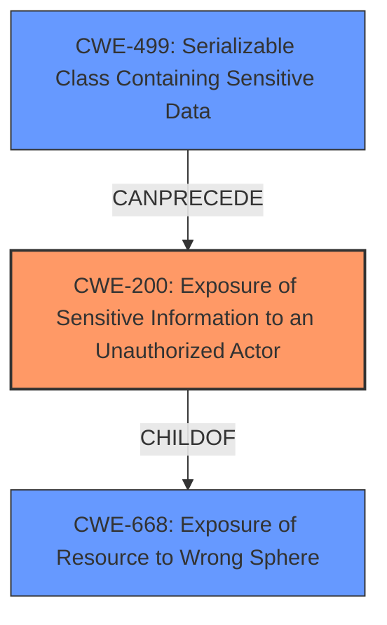

# Raw Analyzer Response for CVE-2025-30291

# Summary
| CWE ID | CWE Name | Confidence | CWE Abstraction Level | CWE Vulnerability Mapping Label | CWE-Vulnerability Mapping Notes |
|---|---|---|---|---|---|
| CWE-200 | Exposure of Sensitive Information to an Unauthorized Actor | 0.9 | Class | Primary | Discouraged, but chosen due to the explicit mention of "Information Exposure vulnerability" and the lack of a more specific Base or Variant level CWE. |
| CWE-497 | Exposure of Sensitive System Information to an Unauthorized Control Sphere | 0.7 | Base | Secondary | Allowed, considered as a potential candidate because the vulnerability description mentions access to sensitive information that could further compromise the system. |

## Evidence and Confidence

*   **Confidence Score:** 0.8
*   **Evidence Strength:** MEDIUM

## Relationship Analysis
The primary relationship considered was the parent-child relationship between CWE-668 (Exposure of Resource to Wrong Sphere) and CWE-200 (Exposure of Sensitive Information to an Unauthorized Actor), with CWE-200 being a child of CWE-668. While CWE-668 is broader, CWE-200 aligns directly with the vulnerability's description. Another important relationship is the CANPRECEDE relationship between CWE-499 (Serializable Class Containing Sensitive Data) and CWE-200, suggesting that exposure of sensitive information could be a consequence of serializing sensitive data. The abstraction levels were also considered, with preference given to Base and Variant level CWEs, but in this case, the explicit mention of "Information Exposure vulnerability" led to the selection of the Class level CWE-200.

## Vulnerability Chain
The vulnerability chain begins with a **weakness** that results in **Information Exposure vulnerability**. This leads to a low-privileged attacker gaining access to sensitive information, which then allows them to bypass security mechanisms. The root cause isn't explicitly defined, but the chain progresses to information exposure and subsequent security bypass.

## Summary of Analysis
The initial analysis focused on identifying a CWE that directly matched the "Information Exposure vulnerability" as described. The Retriever Results pointed to several candidates, including CWE-200, CWE-497, and CWE-668.

CWE-200 was selected as the primary CWE due to its direct relevance to the vulnerability description and the CVE Reference Links Content Summary which identifies **Information Exposure** ([CWE-200](https://cwe.mitre.org/data/definitions/200.html)) as the weakness. While CWE-200 is a Class level CWE and the guidance discourages its use when more specific CWEs are available, its direct alignment with the described vulnerability and the explicit mention of "Information Exposure" in both the vulnerability description and CVE summary justifies its selection.

CWE-497 was considered as a secondary CWE because it is a Base level CWE, which is preferable, and relates to the exposure of sensitive system information. The vulnerability description notes "access to sensitive information which could be used to further compromise the system," supporting its inclusion.

The selection of CWE-200 is primarily based on the explicit mention of "Information Exposure vulnerability" in the vulnerability description. The CVE Reference Links Content Summary reinforces this selection by also identifying **Information Exposure** as the root cause and **weakness**, and mapping it to CWE-200. The decision to include it despite the discouraged usage is due to the clear and direct alignment with the described vulnerability and the absence of a more specific, better-fitting CWE.
Relevant CWE Information:

# Enhanced Context (25 CWEs)
The following CWEs were identified as potentially relevant to this vulnerability:

## CWE-497: Exposure of Sensitive System Information to an Unauthorized Control Sphere
**Abstraction Level**: Base
**Similarity Score**: 0.78
**Source**: dense

**Description**:
The product does not properly prevent sensitive system-level information from being accessed by unauthorized actors who do not have the same level of access to the underlying system as the product does.

**Mapping Guidance**:
- Usage: Allowed
- Rationale: This CWE entry is at the Base level of abstraction, which is a preferred level of abstraction for mapping to the root causes of vulnerabilities.

**Technical Explanation:** The vulnerability allows a low-privileged attacker with local access to gain access to sensitive information, which aligns with the description of CWE-497. This suggests that the system is not adequately protecting sensitive system-level information from unauthorized access.
**Security Implications:** Exposure of sensitive system information can lead to further compromise of the system, such as bypassing security mechanisms or gaining unauthorized access to other resources.
**Relationship Analysis:** CWE-497 is a Base level CWE, which is preferable for mapping to root causes. It is related to CWE-200 (Exposure of Sensitive Information to an Unauthorized Actor) as a more specific type of information exposure.
**Mapping Guidance Analysis:** The mapping guidance for CWE-497 allows its usage, as it is at the Base level of abstraction.
**Mitigation Analysis:** Mitigation would involve implementing proper access controls and security measures to prevent unauthorized access to sensitive system information.

## CWE-807: Reliance on Untrusted Inputs in a Security Decision
**Abstraction Level**: Base
**Similarity Score**: 0.74
**Source**: dense

**Description**:
The product uses a protection mechanism that relies on the existence or values of an input, but the input can be modified by an untrusted actor in a way that bypasses the protection mechanism.

**Mapping Guidance**:
- Usage: Allowed
- Rationale: This CWE entry is at the Base level of abstraction, which is a preferred level of abstraction for mapping to the root causes of vulnerabilities.

**Technical Explanation:** This CWE is not the best fit, as the description focuses on information exposure rather than a bypassed protection mechanism relying on untrusted inputs.
**Security Implications:** N/A
**Relationship Analysis:** N/A
**Mapping Guidance Analysis:** N/A
**Mitigation Analysis:** N/A

## CWE-538: Insertion of Sensitive Information into Externally-Accessible File or Directory
**Abstraction Level**: Base
**Similarity Score**: 0.73
**Source**: dense

**Description**:
The product places sensitive information into files or directories that are accessible to actors who are allowed to have access to the files, but not to the sensitive information.

**Mapping Guidance**:
- Usage: Allowed
- Rationale: This CWE entry is at the Base level of abstraction, which is a preferred level of abstraction for mapping to the root causes of vulnerabilities.

**Technical Explanation:** While this is a possibility, there's no evidence in the description indicating that the sensitive information is being placed into externally-accessible files or directories.
**Security Implications:** N/A
**Relationship Analysis:** N/A
**Mapping Guidance Analysis:** N/A
**Mitigation Analysis:** N/A

## CWE-610: Externally Controlled Reference to a Resource in Another Sphere
**Abstraction Level**: Class
**Similarity Score**: 0.73
**Source**: dense

**Description**:
The product uses an externally controlled name or reference that resolves to a resource that is outside of the intended control sphere.

**Mapping Guidance**:
- Usage: Discouraged
- Rationale: This CWE entry is a level-1 Class (i.e., a child of a Pillar). It might have lower-level children that would be more appropriate

**Technical Explanation:** This doesn't seem to be the case from the description.
**Security Implications:** N/A
**Relationship Analysis:** N/A
**Mapping Guidance Analysis:** N/A
**Mitigation Analysis:** N/A

## CWE-200: Exposure of Sensitive Information to an Unauthorized Actor
**Abstraction Level**: Class
**Similarity Score**: 0.73
**Source**: dense

**Description**:
The product exposes sensitive information to an actor that is not explicitly authorized to have access to that information.

**Mapping Guidance**:
- Usage: Discouraged
- Rationale: CWE-200 is commonly misused to represent the loss of confidentiality in a vulnerability, but confidentiality loss is a technical impact - not a root cause error. As of CWE 4.9, over 400 CWE entries can lead to a loss of confidentiality. Other options are often available. [REF-1287].

**Technical Explanation:** This aligns directly with the vulnerability description which states there is an Information Exposure vulnerability where a low privileged attacker can gain access to sensitive information.
**Security Implications:** The attacker can use this information to further compromise the system or bypass security mechanisms.
**Relationship Analysis:** CWE-200 is a Class level CWE, and is a child of CWE-668.