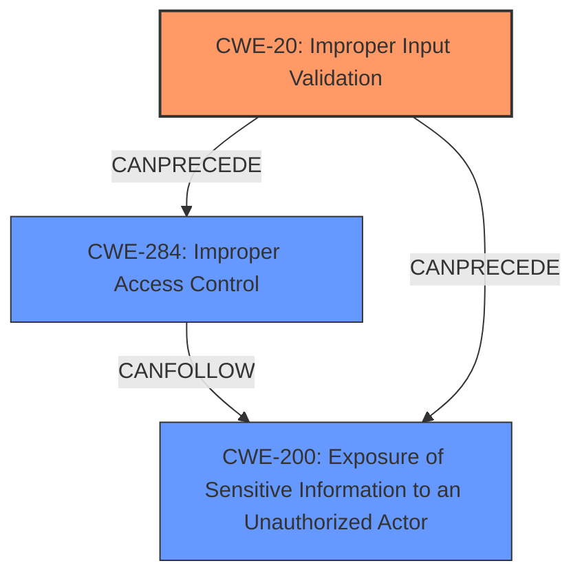

# Analysis Report for CVE-2025-30294

# Vulnerability Analysis Report: CVE-2025-30294

## Description

ColdFusion versions 2023.12, 2021.18, 2025.0 and earlier are affected by an Improper **Input Validation vulnerability** that could result in a security feature bypass. A high-privileged attacker could leverage this vulnerability to bypass security protections and gain unauthorized read access. Exploitation of this issue does not require user interaction and scope is changed.

## Vulnerability Description Key Phrases

- **Rootcause:** ['Input Validation vulnerability', 'Improper Input Validation']
- **Impact:** ["'bypass security protections and gain unauthorized read access']", "['security feature bypass'"]
- **Attacker:** high-privileged attacker
- **Product:** ColdFusion
- **Version:** ["'2025.0 and earlier']", "['versions 2023.12'", "'2021.18'"]

## Analysis (with Relationship Data)

# Summary
| CWE ID  | CWE Name                                                               | Confidence | CWE Abstraction Level | CWE Vulnerability Mapping Label | CWE-Vulnerability Mapping Notes |
| :-------- | :--------------------------------------------------------------------- | :--------- | :---------------------- | :------------------------------ | :------------------------------ |
| CWE-20   | Improper Input Validation                                             | 1.0        | Base                    | Primary CWE                     | Allowed                       |
| CWE-284  | Improper Access Control                                               | 0.7        | Base                    | Secondary Candidate             | Allowed                       |
| CWE-200  | Exposure of Sensitive Information to an Unauthorized Actor            | 0.7        | Base                    | Secondary Candidate             | Allowed                       |

## Evidence and Confidence

*   **Confidence Score:** 0.8
*   **Evidence Strength:** HIGH

## Relationship Analysis

The primary weakness is **CWE-20: Improper Input Validation**, which is a base-level CWE. This can lead to **CWE-284: Improper Access Control** and **CWE-200: Exposure of Sensitive Information to an Unauthorized Actor**. **CWE-284** and **CWE-200** represent impacts of the initial **improper input validation**.



## Vulnerability Chain

The vulnerability chain starts with **CWE-20: Improper Input Validation**. Due to this weakness, a high-privileged attacker can bypass security protections (**security feature bypass**). This leads to **CWE-284: Improper Access Control**, as the attacker gains unauthorized access. Finally, this results in **CWE-200: Exposure of Sensitive Information to an Unauthorized Actor** as the attacker can read sensitive data.

## Summary of Analysis

The analysis is primarily based on the provided vulnerability description and keyphrase breakdowns. The description clearly states the root cause is an **"Improper Input Validation vulnerability"** leading to a **"security feature bypass"** and **"unauthorized read access"**.

**CWE-20: Improper Input Validation** is the most appropriate primary CWE because it directly addresses the **root cause** described in the vulnerability description. The key phrase "Improper Input Validation vulnerability" explicitly points to this weakness. The description of CWE-20 aligns perfectly with the **root cause**: "The product receives input or data, but it does not validate or incorrectly validates that the input has the properties that are required to process the data safely and correctly."

The impact of bypassing security features and gaining unauthorized read access suggests secondary weaknesses related to access control and information exposure. **CWE-284: Improper Access Control** and **CWE-200: Exposure of Sensitive Information to an Unauthorized Actor** are considered as secondary CWEs to describe impact.

The retriever results consistently highlight **CWE-20** as the top candidate for the given keyphrases related to input validation. This further strengthens the selection of **CWE-20** as the primary CWE.
The relationships show **CWE-20** as the root cause which leads to **CWE-284** and **CWE-200** in a chain.
The selected CWEs are at the optimal level of specificity, as they are base-level CWEs that accurately represent the identified weaknesses and impacts.


## CWE Relationship Analysis

Current CWEs represent these abstraction levels: .


### Vulnerability Chain Analysis

**Chain starting from CWE-284:**
- 284 (Improper Access Control) - ROOT


**Chain starting from CWE-200:**
- 200 (Exposure of Sensitive Information to an Unauthorized Actor) - ROOT


### CWE Relationship Diagram

```mermaid
graph TD
    classDef primary fill:#f96,stroke:#333,stroke-width:2px
    classDef secondary fill:#69f,stroke:#333
    classDef tertiary fill:#9e9,stroke:#333
```


*Report generated on 2025-07-14 17:15:17*
