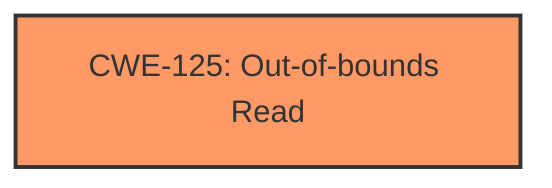

# Analysis Report for CVE-2025-3031

# Vulnerability Analysis Report: CVE-2025-3031

## Description

An attacker could read 32 bits of values spilled onto the stack in a JIT compiled function. This vulnerability affects Firefox < 137 and Thunderbird < 137.

## Vulnerability Description Key Phrases

- **Component:** JIT compiled function
- **Product:** Firefox, Thunderbird
- **Impact:** read 32 bits of values spilled onto the stack
- **Version:** < 137

## Analysis (with Relationship Data)

# Summary
| CWE ID | CWE Name | Confidence | CWE Abstraction Level | CWE Vulnerability Mapping Label | CWE-Vulnerability Mapping Notes |
|---|---|---|---|---|---|
| CWE-125 | Out-of-bounds Read | 0.9 | Base | Allowed | Primary CWE. The vulnerability allows an attacker to read data past the end of the intended buffer due to stack spilling in a JIT compiled function. |

## Evidence and Confidence

*   **Confidence Score:** 0.9
*   **Evidence Strength:** HIGH

## Relationship Analysis
The primary CWE selected is CWE-125 (Out-of-bounds Read), which is a base-level CWE. While other CWEs like CWE-704 (Incorrect Type Conversion or Cast) and CWE-787 (Out-of-bounds Write) were considered, they did not directly address the root cause of the vulnerability. CWE-125 accurately reflects the vulnerability where an attacker can read data beyond the intended buffer.



## Vulnerability Chain
The vulnerability chain involves a **stack spilling** issue in a JIT compiled function, which leads to an **Out-of-bounds Read (CWE-125)**. The initial flaw is the way the JIT compiler manages stack operations, which results in data being accessible outside the intended buffer, ultimately allowing an attacker to read sensitive information.

## Summary of Analysis
The analysis is primarily based on the provided evidence, specifically the vulnerability description and the CVE reference links content summary. The description clearly states that an attacker can "read 32 bits of values spilled onto the stack in a JIT compiled function." This directly aligns with the characteristics of CWE-125 (Out-of-bounds Read).

The Retriever Results also support this conclusion, listing CWE-125 as a relevant candidate with a high score. The relationship analysis further solidifies this selection, as CWE-125 is a base-level CWE that directly addresses the root cause of the vulnerability.

The selection of CWE-125 is at the optimal level of specificity, as it accurately reflects the vulnerability's root cause and impact. Other CWEs were considered, but they did not provide the same level of precision in describing the vulnerability.

Relevant CWE Information:

# Enhanced Context (25 CWEs)
The following CWEs were identified as potentially relevant to this vulnerability:

## CWE-125: Out-of-bounds Read
**Abstraction Level**: Base
**Similarity Score**: 0.72
**Source**: dense

**Description**:
The product reads data past the end, or before the beginning, of the intended buffer.

**Mapping Guidance**:
- Usage: Allowed
- Rationale: This CWE entry is at the Base level of abstraction, which is a preferred level of abstraction for mapping to the root causes of vulnerabilities.


## CWE Relationship Analysis

Current CWEs represent these abstraction levels: .


### Vulnerability Chain Analysis

**Chain starting from CWE-704:**
- 704 (Incorrect Type Conversion or Cast) - ROOT


**Chain starting from CWE-787:**
- 787 (Out-of-bounds Write) - ROOT


### CWE Relationship Diagram

```mermaid
graph TD
    classDef primary fill:#f96,stroke:#333,stroke-width:2px
    classDef secondary fill:#69f,stroke:#333
    classDef tertiary fill:#9e9,stroke:#333
```


*Report generated on 2025-07-14 17:15:36*
