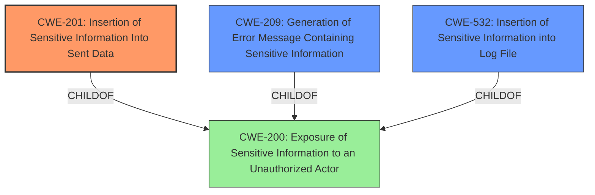

# Analysis for CVE-2025-30353

# Summary
| CWE ID | CWE Name | Confidence | CWE Abstraction Level | CWE Vulnerability Mapping Label | CWE-Vulnerability Mapping Notes |
|---|---|---|---|---|---|
| CWE-201 | Insertion of Sensitive Information Into Sent Data | 1.0 | Base | Allowed | Primary CWE |
| CWE-209 | Generation of Error Message Containing Sensitive Information | 0.7 | Base | Allowed | Secondary Candidate |
| CWE-532 | Insertion of Sensitive Information into Log File | 0.6 | Base | Allowed | Secondary Candidate |
| CWE-200 | Exposure of Sensitive Information to an Unauthorized Actor | 0.5 | Class | Discouraged | Secondary Candidate |

## Evidence and Confidence

*   **Confidence Score:** 0.8
*   **Evidence Strength:** HIGH

## Relationship Analysis
The primary relationship impacting the decision is the parent-child relationship. CWE-201, CWE-209 and CWE-532 are children of CWE-200, which is a more general case. The vulnerability specifically involves the insertion of sensitive information into sent data, error messages and log files, making CWE-201, CWE-209 and CWE-532 more appropriate. The CANFOLLOW relationship between CWE-201, CWE-209 and CWE-532 and other information exposure CWEs supports the idea of a potential chain of weaknesses related to data handling. Because CWE-201 most closely matches the vulnerability, it is chosen as the primary.

## Vulnerability Chain
The vulnerability chain starts with a **misconfiguration** or **improper handling** of error messages within the Directus application. When a ValidationError occurs in a Flow with a Webhook trigger and the "Data of Last Operation" response body, sensitive information is inadvertently included in the API response. This leads to the **exposure of sensitive data** such as environmental variables, API keys, user accountability information, and operational data. The chain can be summarized as:

1.  **Improper Handling of Error Messages** (Implicit, not a direct CWE match in the description but inferred)
2.  **CWE-201: Insertion of Sensitive Information Into Sent Data** - Sensitive data is included in the API response.
3.  **CWE-209: Generation of Error Message Containing Sensitive Information** - Sensitive data is included in the error message.
4.  **CWE-532: Insertion of Sensitive Information into Log File** - The sensitive data could also be logged.
5.  **Impact:** Potential misuse, unauthorized access, data breaches, and compromise of user accounts.

## Summary of Analysis
The analysis is based on the provided vulnerability description and the CVE Reference Links Content Summary, which offer sufficient evidence for CWE classification. The primary weakness is the **exposure of sensitive data** due to the inclusion of environmental variables, API keys, user accountability information, and operational data in API responses when a ValidationError occurs. The retriever results and relationship analysis support the selection of CWE-201 as the primary CWE, as it directly addresses the insertion of sensitive information into sent data. The selection of CWE-201 is at the optimal level of specificity, as it accurately represents the vulnerability's root cause and impact.
The CVE Reference Links Content Summary explicitly mentions: "A Flow in Directus, configured with a Webhook trigger and "Data of Last Operation" response body, exposes sensitive data when a ValidationError is thrown by a failed condition operation."

The evidence specifically states, "the API response includes sensitive data. This includes environmental variables, sensitive API keys, user accountability information, and operational data." This aligns directly with CWE-201, "Insertion of Sensitive Information Into Sent Data".

The analysis considered CWE-200, "Exposure of Sensitive Information to an Unauthorized Actor", but it was deemed too general. While the vulnerability does result in the exposure of sensitive information, the more specific CWE-201, CWE-209 and CWE-532 capture the mechanism by which this exposure occurs (i.e., insertion into sent data, error messages and log files).
Other CWEs considered but not selected:

*   CWE-306: Missing Authentication for Critical Function - Authentication is not the primary issue. The vulnerability occurs after authentication (if any) when an error occurs.
*   CWE-918: Server-Side Request Forgery (SSRF) - There's no indication of SSRF in the vulnerability description.
*   CWE-540: Inclusion of Sensitive Information in Source Code - The issue is not about sensitive information in source code itself.
*   CWE-184: Incomplete List of Disallowed Inputs - This is not related to input validation.