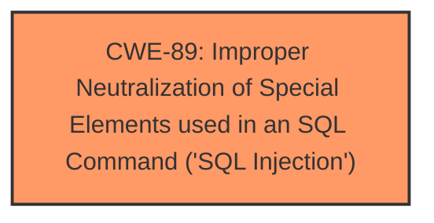

# Enhanced Analysis for CVE-2025-3039

# Summary
| CWE ID | CWE Name | Confidence | CWE Abstraction Level | CWE Vulnerability Mapping Label | CWE-Vulnerability Mapping Notes |
|---|---|---|---|---|---|
| CWE-89 | Improper Neutralization of Special Elements used in an SQL Command ('SQL Injection') | 1.0 | Base | Allowed | Primary CWE |

## Evidence and Confidence

*   **Confidence Score:** 1.0
*   **Evidence Strength:** HIGH

## Relationship Analysis
The primary relationship that influenced the decision was the direct match of the vulnerability description to the CWE-89 description. No other relationships (Parent-child, Chain, or Peer) were crucial in this case, as the evidence directly points to SQL Injection. The abstraction level is Base, which is the preferred level.



## Vulnerability Chain
The vulnerability chain starts with the **improper neutralization** of special elements used in an SQL command, leading directly to **SQL Injection**.

## Summary of Analysis
The assessment is strongly based on the provided vulnerability description, which explicitly states that the manipulation of the `lname/fname` argument leads to **SQL injection**. The evidence is clear and direct, as quoted: "The manipulation of the argument lname/fname leads to **sql injection**." The graph relationships confirm the directness of the vulnerability, without needing to consider other potential relationships.

The selected CWE is at the optimal level of specificity because CWE-89 directly addresses the root cause of the vulnerability, which is the **improper neutralization** of special elements in an SQL command, leading to **SQL Injection**. Other CWEs were considered but not used because they did not directly address the root cause as explicitly stated in the vulnerability description.

Relevant CWE Information:

# Enhanced Context (25 CWEs)
The following CWEs were identified as potentially relevant to this vulnerability:

## CWE-89: Improper Neutralization of Special Elements used in an SQL Command ('SQL Injection')
**Abstraction Level**: Base
**Similarity Score**: 1.0
**Source**: alternate_terms

**Description**:
The product constructs all or part of an SQL command using externally-influenced input from an upstream component, but it does not neutralize or incorrectly neutralizes special elements that could modify the intended SQL command when it is sent to a downstream component. Without sufficient removal or quoting of SQL syntax in user-controllable inputs, the generated SQL query can cause those inputs to be interpreted as SQL instead of ordinary user data.

**Mapping Guidance**:
- Usage: Allowed
- Rationale: This CWE entry is at the Base level of abstraction, which is a preferred level of abstraction for mapping to the root causes of vulnerabilities.


## CWE Relationship Analysis

Current CWEs represent these abstraction levels: .


### Vulnerability Chain Analysis

**Chain starting from CWE-89:**
- 89 (Improper Neutralization of Special Elements used in an SQL Command ('SQL Injection')) - ROOT


### CWE Relationship Diagram

```mermaid
graph TD
    classDef primary fill:#f96,stroke:#333,stroke-width:2px
    classDef secondary fill:#69f,stroke:#333
    classDef tertiary fill:#9e9,stroke:#333
```