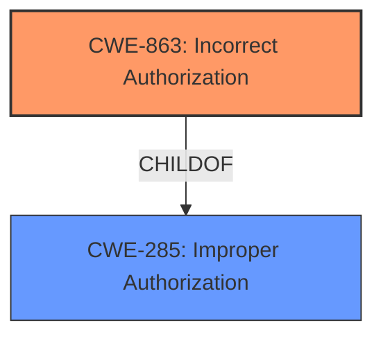

# Enhanced Analysis for CVE-2025-30392

# Summary
| CWE ID | CWE Name | Confidence | CWE Abstraction Level | CWE Vulnerability Mapping Label | CWE-Vulnerability Mapping Notes |
|---|---|---|---|---|---|
| CWE-863 | Incorrect Authorization | 0.8 | Class | Allowed-with-Review | Primary CWE |
| CWE-285 | Improper Authorization | 0.6 | Class | Discouraged | Secondary Candidate |

## Evidence and Confidence

*   **Confidence Score:** 0.7
*   **Evidence Strength:** MEDIUM

## Relationship Analysis
The primary relationship that influenced the decision was the hierarchical structure. CWE-863 is a child of CWE-285, but the description suggests an **incorrect authorization** implementation rather than simply an **improper authorization**. Therefore, CWE-863 is the more specific and appropriate choice.



## Vulnerability Chain
The vulnerability chain consists of a single point: the **improper authorization**, which leads to privilege elevation.

Improper Authorization --> Privilege Elevation

## Summary of Analysis
The initial analysis focused on the provided vulnerability description, which explicitly states "**Improper authorization** in Azure Bot Framework SDK allows an unauthorized attacker to elevate privileges over a network." The key phrase "**Improper authorization**" directly indicates an authorization issue.

Based on the CWE Classification Guidance, CWE-863 (Incorrect Authorization) and CWE-285 (Improper Authorization) were the most relevant candidates. The guidance distinguishes between these, suggesting CWE-863 when the authorization check is present but flawed, and CWE-285 for a general or ambiguous authorization failure. Since the description uses the term "**Improper authorization**", it implies that an authorization mechanism exists but is not functioning correctly. The guidance suggests that if there is a role check present but flawed, then CWE-863 is the best choice.

The evidence is somewhat limited as there is no CVE reference link content summary. However, the direct statement of "**Improper authorization**" is strong enough evidence to proceed.

Therefore, CWE-863 (Incorrect Authorization) is selected as the primary CWE. CWE-285 (Improper Authorization) is considered a secondary candidate due to its more general nature.

CWEs considered but not used:

*   CWE-284 (Improper Access Control): Too general. The description clearly points to an authorization problem, not a general access control issue.
*   CWE-862 (Missing Authorization): The description implies that there is some form of authorization, but it is not functioning correctly. Therefore, CWE-862 is not appropriate.
*   CWE-306 (Missing Authentication for Critical Function): This is for missing authentication, but the description does not indicate an authentication issue.
*   CWE-266 (Incorrect Privilege Assignment), CWE-250 (Execution with Unnecessary Privileges): These are more specific privilege-related CWEs. The description focuses on the authorization process rather than privilege assignment or execution.

Relevant CWE Information:

**CWE-863: Incorrect Authorization**

*   **Technical Explanation:** The product performs an authorization check, but it is implemented incorrectly. This could be due to flawed logic, incorrect configuration, or other errors in the authorization mechanism.
*   **Security Implications:** An attacker can bypass the authorization check and gain unauthorized access to resources or perform unauthorized actions. This can lead to privilege escalation, data breaches, or other security compromises.
*   **Relationship Analysis:** ChildOf CWE-285 (Improper Authorization).
*   **Mapping Guidance Influence:** Allowed-with-Review. The CWE entry is a Class and might have Base-level children that would be more appropriate, but there is no information to pick a more specific CWE.
*   **Why it is primary:** The vulnerability description clearly states that there is "**Improper authorization**", suggesting a flawed authorization mechanism, which aligns with the definition of CWE-863.

**CWE-285: Improper Authorization**

*   **Technical Explanation:** The product does not perform or incorrectly performs an authorization check when an actor attempts to access a resource or perform an action.
*   **Security Implications:** An attacker can bypass the authorization check and gain unauthorized access to resources or perform unauthorized actions. This can lead to privilege escalation, data breaches, or other security compromises.
*   **Relationship Analysis:** ParentOf CWE-863 (Incorrect Authorization).
*   **Mapping Guidance Influence:** Discouraged. CWE-285 is high-level and lower-level CWEs can frequently be used instead.
*   **Why it is secondary:** The vulnerability description points towards a general authorization issue, but the term "**Improper authorization**" is a better fit to CWE-863, so this is secondary.


## CWE Relationship Analysis

Current CWEs represent these abstraction levels: .


### Vulnerability Chain Analysis

**Chain starting from CWE-863:**
- 863 (Incorrect Authorization) - ROOT


**Chain starting from CWE-862:**
- 862 (Missing Authorization) - ROOT


### CWE Relationship Diagram

```mermaid
graph TD
    classDef primary fill:#f96,stroke:#333,stroke-width:2px
    classDef secondary fill:#69f,stroke:#333
    classDef tertiary fill:#9e9,stroke:#333
```