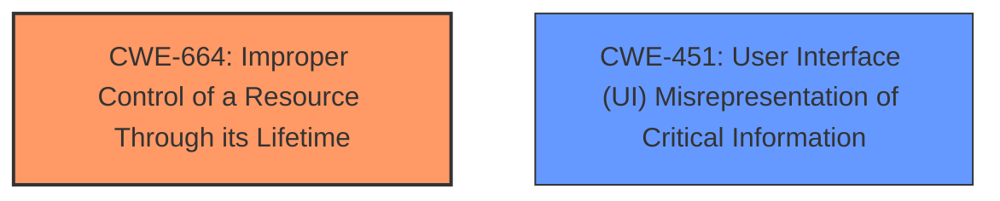

# Analysis Report for CVE-2025-30425

# Vulnerability Analysis Report: CVE-2025-30425

## Description

This issue was addressed through improved state management. This issue is fixed in tvOS 18.4, Safari 18.4, iPadOS 17.7.6, iOS 18.4 and iPadOS 18.4, macOS Sequoia 15.4. A malicious website may be able to track users in Safari private browsing mode.

## Vulnerability Description Key Phrases

- **Product:** tvOS, Safari, iPadOS, iOS, macOS Sequoia
- **Impact:** track users in Safari private browsing mode
- **Attacker:** malicious website
- **Version:** 18.4, 18.4, 17.7.6, 18.4, 18.4, 15.4

## Analysis (with Relationship Data)

# Summary
| CWE ID | CWE Name | Confidence | CWE Abstraction Level | CWE Vulnerability Mapping Label | CWE-Vulnerability Mapping Notes |
|---|---|---|---|---|---|
| **CWE-664** | **Improper Control of a Resource Through its Lifetime** | 0.7 | Class | Allowed | Primary CWE. This is the most appropriate CWE because the vulnerability involves **improper state management**, which falls under the broader category of improper resource control. |
| CWE-451 | User Interface (UI) Misrepresentation of Critical Information | 0.5 | Class | Allowed-with-Review | Secondary candidate. While the vulnerability allows a malicious website to track users in private browsing mode, the underlying cause is not necessarily a UI misrepresentation. |

## Evidence and Confidence

*   **Confidence Score:** 0.7
*   **Evidence Strength:** MEDIUM

## Relationship Analysis
The primary CWE is CWE-664, which is a Class-level CWE. CWE-451 is another Class-level CWE. There are no direct parent-child relationships involved here. The selection of CWE-664 is based on the root cause identified in the vulnerability description, whereas CWE-451 is based on the potential impact.



## Vulnerability Chain
The vulnerability chain starts with **improper state management** (CWE-664), which leads to the impact of allowing a malicious website to track users in Safari private browsing mode.

## Summary of Analysis
The primary focus of this analysis is to identify the root cause of the vulnerability, which is identified as **improper state management**. This directly aligns with CWE-664 (Improper Control of a Resource Through its Lifetime). The vulnerability description and the CVE reference links content summary both explicitly mention **improved state management** as the fix, reinforcing this mapping.

The retriever results list several CWEs, with CWE-787 (Out-of-bounds Write) and CWE-843 (Access of Resource Using Incompatible Type ('Type Confusion')) having the highest scores. However, these CWEs do not accurately reflect the **improper state management** aspect of the vulnerability. CWE-451 (User Interface (UI) Misrepresentation of Critical Information) is considered as a secondary candidate due to the potential impact of tracking users, which might involve some form of misrepresentation. However, the root cause is more directly related to **improper state management** than UI misrepresentation.

The selection of CWE-664 is at the Class level. While more specific Base or Variant level CWEs could potentially exist, the available information does not provide enough detail to narrow down the mapping further.

Relevant CWE Information:

# Enhanced Context (25 CWEs)
The following CWEs were identified as potentially relevant to this vulnerability:

## CWE-451: User Interface (UI) Misrepresentation of Critical Information
**Abstraction Level**: Class
**Similarity Score**: 0.77
**Source**: dense

**Description**:
The user interface (UI) does not properly represent critical information to the user, allowing the information - or its source - to be obscured or spoofed. This is often a component in phishing attacks.

**Mapping Guidance**:
- Usage: Allowed-with-Review
- Rationale: This CWE entry is a Class and might have Base-level children that would be more appropriate

## CWE-664: Improper Control of a Resource Through its Lifetime
**Abstraction Level**: Class
**Description**:
The software does not properly control the creation, initialization, access, modification, release, or lifetime of a resource.
**Mapping Guidance**:
- Usage: Allowed-with-Review
- Rationale: This CWE entry is a Class and might have Base-level children that would be more appropriate


## CWE Relationship Analysis

Current CWEs represent these abstraction levels: .


### Vulnerability Chain Analysis

**Chain starting from CWE-664:**
- 664 (Improper Control of a Resource Through its Lifetime) - ROOT


**Chain starting from CWE-843:**
- 843 (Access of Resource Using Incompatible Type ('Type Confusion')) - ROOT


### CWE Relationship Diagram

```mermaid
graph TD
    classDef primary fill:#f96,stroke:#333,stroke-width:2px
    classDef secondary fill:#69f,stroke:#333
    classDef tertiary fill:#9e9,stroke:#333
```


*Report generated on 2025-07-14 17:22:58*
