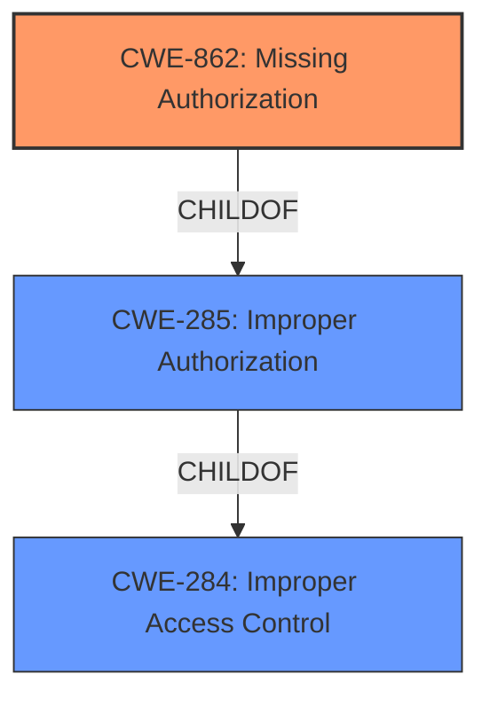

# Raw Analyzer Response for CVE-2025-30426

# Summary

| CWE ID  | CWE Name                                                                           | Confidence | CWE Abstraction Level | CWE Vulnerability Mapping Label | CWE-Vulnerability Mapping Notes |
| ------- | ---------------------------------------------------------------------------------- | ---------- | --------------------- | ------------------------------- | ------------------------------- |
| CWE-862 | Missing Authorization [CWE-862: Missing Authorization]                              | 0.9        | Class                 | Primary                         | Allowed-with-Review             |

## Evidence and Confidence

*   **Confidence Score:** 0.9
*   **Evidence Strength:** HIGH

## Relationship Analysis

The primary CWE selected is CWE-862 [CWE-862: Missing Authorization]. The analysis considered the guidance on Authentication vs. Authorization vs. Access Control. The vulnerability description clearly points to a **missing authorization** check, which aligns with the characteristics of CWE-862 [CWE-862: Missing Authorization]. The text mentions that the issue was addressed with "additional entitlement checks", indicating that the application was **enumerating installed apps without proper authorization** .

## Vulnerability Chain

The vulnerability chain consists of a **missing authorization** check (CWE-862 [CWE-862: Missing Authorization]) leading to the impact of an app being able to enumerate a user's installed apps.

## Summary of Analysis

The analysis is based on the provided vulnerability description and CVE reference links. The description clearly states that the issue was addressed with additional entitlement checks, indicating a **missing authorization** check. The key phrase "*enumerating installed apps without proper authorization*" directly supports the selection of CWE-862 [CWE-862: Missing Authorization]. The retriever results also list CWE-862 [CWE-862: Missing Authorization] as a strong candidate. CWE-862 [CWE-862: Missing Authorization] is at the Class level of abstraction. This is the most specific that can be determined from the provided evidence.

Relevant CWE Information:

# Enhanced Context (25 CWEs)
The following CWEs were identified as potentially relevant to this vulnerability:

## CWE-203: Observable Discrepancy
**Abstraction Level**: Base
**Similarity Score**: 0.74
**Source**: dense

**Description**:
The product behaves differently or sends different responses under different circumstances in a way that is observable to an unauthorized actor, which exposes security-relevant information about the state of the product, such as whether a particular operation was successful or not.

**Mapping Guidance**:
- Usage: Allowed
- Rationale: This CWE entry is at the Base level of abstraction, which is a preferred level of abstraction for mapping to the root causes of vulnerabilities.

**CWE-203 [CWE-203: Observable Discrepancy] was not selected** because the vulnerability is not directly related to observable discrepancies, but rather the **lack of authorization** checks when enumerating installed apps.

## CWE-754: Improper Check for Unusual or Exceptional Conditions
**Abstraction Level**: Class
**Similarity Score**: 0.74
**Source**: dense

**Description**:
The product does not check or incorrectly checks for unusual or exceptional conditions that are not expected to occur frequently during day to day operation of the product.

**Mapping Guidance**:
- Usage: Allowed-with-Review
- Rationale: This CWE entry is a Class and might have Base-level children that would be more appropriate

**CWE-754 [CWE-754: Improper Check for Unusual or Exceptional Conditions] was not selected** because the primary issue is not about handling exceptional conditions, but about the **lack of proper authorization** when accessing sensitive information (installed apps).

## CWE-345: Insufficient Verification of Data Authenticity
**Abstraction Level**: Class
**Similarity Score**: 0.74
**Source**: dense

**Description**:
The product does not sufficiently verify the origin or authenticity of data, in a way that causes it to accept invalid data.

**Mapping Guidance**:
- Usage: Discouraged
- Rationale: This CWE entry is a level-1 Class (i.e., a child of a Pillar). It might have lower-level children that would be more appropriate

**CWE-345 [CWE-345: Insufficient Verification of Data Authenticity] was not selected** because the vulnerability is not about verifying data authenticity but about controlling access to sensitive information based on proper authorization.

## CWE-41: Improper Resolution of Path Equivalence
**Abstraction Level**: Base
**Similarity Score**: 0.74
**Source**: dense

**Description**:
The product is vulnerable to file system contents disclosure through path equivalence. Path equivalence involves the use of special characters in file and directory names. The associated manipulations are intended to generate multiple names for the same object.

**Mapping Guidance**:
- Usage: Allowed
- Rationale: This CWE entry is at the Base level of abstraction, which is a preferred level of abstraction for mapping to the root causes of vulnerabilities.

**CWE-41 [CWE-41: Improper Resolution of Path Equivalence] was not selected** because the issue is not related to path equivalence but rather to **missing authorization** checks when enumerating installed apps.

## CWE-668: Exposure of Resource to Wrong Sphere
**Abstraction Level**: Class
**Similarity Score**: 0.74
**Source**: dense

**Description**:
The product exposes a resource to the wrong control sphere, providing unintended actors with inappropriate access to the resource.

**Mapping Guidance**:
- Usage: Discouraged
- Rationale: CWE-668 is high-level and is often misused as a catch-all when lower-level CWE IDs might be applicable. It is sometimes used for low-information vulnerability reports [REF-1287]. It is a level-1 Class (i.e., a child of a Pillar). It is not useful for trend analysis.

**CWE-668 [CWE-668: Exposure of Resource to Wrong Sphere] was not selected** because while it is related to exposing a resource, it is too general. The specific issue is the **lack of authorization** when enumerating installed apps.

## CWE-451: User Interface (UI) Misrepresentation of Critical Information
**Abstraction Level**: Class
**Similarity Score**: 0.74
**Source**: dense

**Description**:
The user interface (UI) does not properly represent critical information to the user, allowing the information - or its source - to be obscured or spoofed. This is often a component in phishing attacks.

**Mapping Guidance**:
- Usage: Allowed-with-Review
- Rationale: This CWE entry is a Class and might have Base-level children that would be more appropriate

**CWE-451 [CWE-451: User Interface (UI) Misrepresentation of Critical Information] was not selected** because it is related to UI misrepresentation, which is not relevant to the described vulnerability.

## CWE-497: Exposure of Sensitive System Information to an Unauthorized Control Sphere
**Abstraction Level**: Base
**Similarity Score**: 0.73
**Source**: dense

**Description**:
The product does not properly prevent sensitive system-level information from being accessed by unauthorized actors who do not have the same level of access to the underlying system as the product does.

**Mapping Guidance**:
- Usage: Allowed
- Rationale: This CWE entry is at the Base level of abstraction, which is a preferred level of abstraction for mapping to the root causes of vulnerabilities.

**CWE-497 [CWE-497: Exposure of Sensitive System Information to an Unauthorized Control Sphere] was not selected** because while it is relevant to exposing sensitive system information, the more specific issue is the **lack of authorization** when enumerating installed apps, making CWE-862 [CWE-862: Missing Authorization] a better fit.

## CWE-267: Privilege Defined With Unsafe Actions
**Abstraction Level**: Base
**Similarity Score**: 0.73
**Source**: dense

**Description**:
A particular privilege, role, capability, or right can be used to perform unsafe actions that were not intended, even when it is assigned to the correct entity.

**Mapping Guidance**:
- Usage: Allowed
- Rationale: This CWE entry is at the Base level of abstraction, which is a preferred level of abstraction for mapping to the root causes of vulnerabilities.

**CWE-267 [CWE-267: Privilege Defined With Unsafe Actions] was not selected** because the issue is not about a privilege being defined with unsafe actions, but about the **lack of authorization** checks