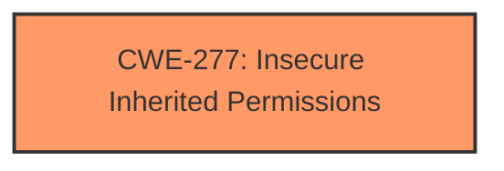

# Analysis Report for CVE-2025-30455

# Vulnerability Analysis Report: CVE-2025-30455

## Description

The issue was addressed with improved checks. This issue is fixed in macOS Sequoia 15.4, macOS Sonoma 14.7.5. A malicious app may be able to access private information.

## Vulnerability Description Key Phrases

- **Impact:** access private information
- **Attacker:** malicious app
- **Product:** macOS Sequoia, macOS Sonoma
- **Version:** 15.4, 14.7.5

## Analysis (with Relationship Data)

# Summary

| CWE ID | CWE Name | Confidence | CWE Abstraction Level | CWE Vulnerability Mapping Label | CWE-Vulnerability Mapping Notes |
|---|---|---|---|---|---|
| **CWE-277** | Insecure Inherited Permissions | 0.7 | Variant | Primary | Allowed |

## Evidence and Confidence

*   **Confidence Score:** 0.7
*   **Evidence Strength:** MEDIUM

## Relationship Analysis
The primary candidate is CWE-277, which is a Variant. The description of CWE-277 aligns with the vulnerability description, implying an issue related to insecure permissions being inherited. Other CWEs like CWE-285 (Improper Authorization) and CWE-20 (Improper Input Validation) were considered but are less specific to the given information.



## Vulnerability Chain
The vulnerability chain starts with **Insecure Inherited Permissions** (CWE-277), which leads to a malicious app gaining unauthorized access to private information.

## Summary of Analysis
The primary assessment is based on the description that "a malicious app may be able to access private information" and that "the issue was addressed with improved checks." Given the information provided, the most relevant CWE appears to be CWE-277: Insecure Inherited Permissions. This is because the core of the vulnerability seems to revolve around how permissions are handled and inherited, allowing a malicious application to bypass security measures and access sensitive data. Other CWEs were considered, but this one fits best based on the evidence. The choice of CWE-277 as the primary weakness is influenced by the vulnerability description, emphasizing issues related to permission management. The level of specificity is appropriate as it is a Variant-level CWE.

Relevant CWE Information:

# Enhanced Context (25 CWEs)
The following CWEs were identified as potentially relevant to this vulnerability:

## CWE-277: Insecure Inherited Permissions
**Abstraction Level**: Variant
**Similarity Score**: 0.72
**Source**: dense

**Description**:
A product defines a set of insecure permissions that are inherited by objects that are created by the program.

**Mapping Guidance**:
- Usage: Allowed
- Rationale: This CWE entry is at the Variant level of abstraction, which is a preferred level of abstraction for mapping to the root causes of vulnerabilities.


## CWE Relationship Analysis

Current CWEs represent these abstraction levels: .


### Vulnerability Chain Analysis

**Chain starting from CWE-277:**
- 277 (Insecure Inherited Permissions) - ROOT


**Chain starting from CWE-285:**
- 285 (Improper Authorization) - ROOT


### CWE Relationship Diagram

```mermaid
graph TD
    classDef primary fill:#f96,stroke:#333,stroke-width:2px
    classDef secondary fill:#69f,stroke:#333
    classDef tertiary fill:#9e9,stroke:#333
```


*Report generated on 2025-07-14 17:29:35*
