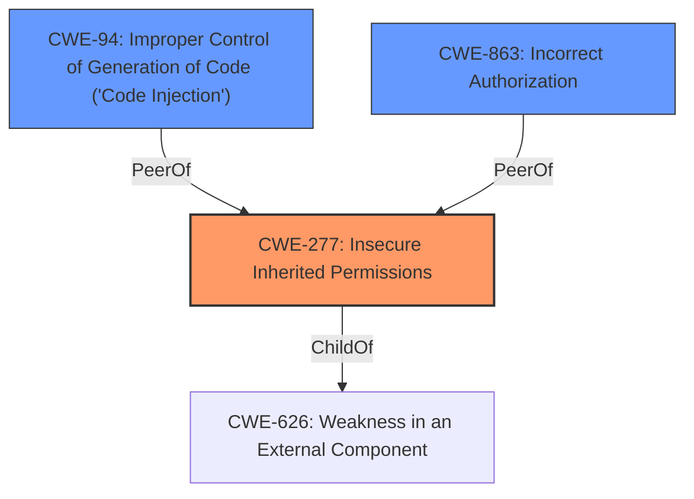

# Analysis for CVE-2025-30462

# Summary
| CWE ID | CWE Name | Confidence | CWE Abstraction Level | CWE Vulnerability Mapping Label | CWE-Vulnerability Mapping Notes |
|---|---|---|---|---|---|
| CWE-277 | Insecure Inherited Permissions | 0.75 | Variant | Allowed | Primary CWE. The core issue is that applications are launching without the intended sandbox restrictions due to a library injection issue. This suggests that the applications are inheriting insecure permissions, which leads to the bypass of the sandbox. Additional restrictions were implemented to remediate this. |
| CWE-94 | Improper Control of Generation of Code ('Code Injection') | 0.5 | Base | Allowed-with-Review | Secondary Candidate. This is related to the "library injection" aspect of the vulnerability. The library injection could be seen as a form of code injection, but the root cause is more related to permissions and restrictions, not necessarily directly injecting malicious code. |
| CWE-863 | Incorrect Authorization | 0.4 | Class | Allowed-with-Review | Secondary Candidate. Since apps "may be able to launch without restrictions", it's possible there's an authorization issue at play, but it is less directly supported by the evidence compared to the insecure inherited permissions. |

## Evidence and Confidence

*   **Confidence Score:** 0.7
*   **Evidence Strength:** MEDIUM

## Relationship Analysis
The analysis focuses on identifying the root cause of the vulnerability and mapping it to the most appropriate CWE.

-   **Parent-child hierarchical relationships:** CWE-277 is a variant of a broader class.
-   **Chain relationships:** Library injection leads to the bypass of intended app sandbox restrictions.
-   **Peer relationships:** Alternatives like code injection and incorrect authorization were considered but found to be less directly supported by the evidence.
-   **Abstraction levels:** A variant-level CWE was chosen to provide a specific classification of the weakness.

## Vulnerability Chain
The vulnerability chain starts with **library injection**, which then leads to the **bypassing of app sandbox restrictions**. The **root cause** of this issue is that the applications are inheriting **insecure permissions** (CWE-277), which allows them to launch without the intended restrictions.
  - **Root Cause:** CWE-277: Insecure Inherited Permissions
  - **Mechanism:** Library Injection
  - **Impact:** Apps launch without restrictions

## Summary of Analysis
The initial assessment identified that applications may be able to launch without restrictions. The **root cause** is that a library injection issue was present.

The primary decision is based on the fact that the applications are launching without the intended sandbox restrictions. This suggests an underlying issue with how permissions are inherited or assigned, leading to the bypass of the security mechanism.

The selection of CWE-277 is at the optimal level of specificity because it directly addresses the **insecure permissions** aspect, whereas other CWEs are either too broad or focus on related but distinct issues like code injection or authorization failures.

Relevant CWE Information:

# Enhanced Context (25 CWEs)
The following CWEs were identified as potentially relevant to this vulnerability:

## CWE-277: Insecure Inherited Permissions
**Abstraction Level**: Variant
**Similarity Score**: 0.73
**Source**: dense

**Description**:
A product defines a set of **insecure permissions** that are inherited by objects that are created by the program.

**Mapping Guidance**:
- Usage: Allowed
- Rationale: This CWE entry is at the Variant level of abstraction, which is a preferred level of abstraction for mapping to the root causes of vulnerabilities.

## CWE-94: Improper Control of Generation of Code ('Code Injection')
**Abstraction Level**: base
**Similarity Score**: 2.40
**Source**: graph

**Description**:
CWE-94: Improper Control of Generation of Code ('Code Injection')

**Mapping Guidance**:
- Usage: Allowed-with-Review
- Rationale: This entry is frequently misused for vulnerabilities with a technical impact of "code execution," which does not by itself indicate a **root cause weakness**, since dozens of weaknesses can enable code execution.

## CWE-863: Incorrect Authorization
**Abstraction Level**: Class
**Similarity Score**: 559.90
**Source**: sparse

**Description**:
The product performs an authorization check when an actor attempts to access a resource or perform an action, but it does not correctly perform the check.

**Mapping Guidance**:
- Usage: Allowed-with-Review
- Rationale: This CWE entry is a Class and might have Base-level children that would be more appropriate