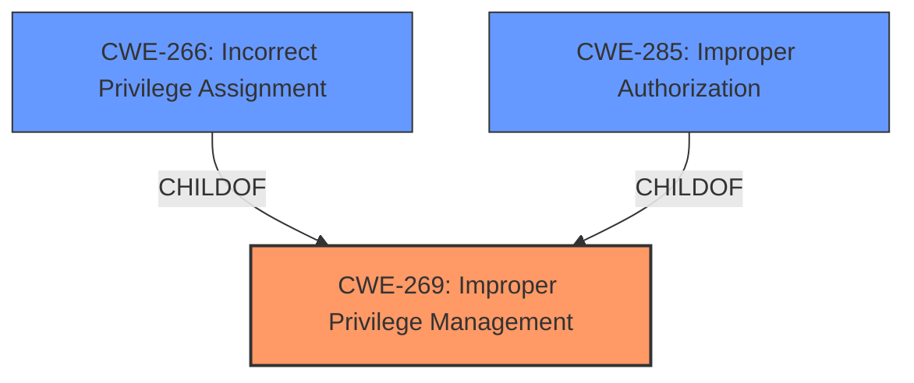

# Analysis for CVE-2025-30475

# Summary
| CWE ID | CWE Name | Confidence | CWE Abstraction Level | CWE Vulnerability Mapping Label | CWE-Vulnerability Mapping Notes |
|---|---|---|---|---|---|
| CWE-269 | Improper Privilege Management | 0.75 | Class | Primary | Discouraged |
| CWE-266 | Incorrect Privilege Assignment | 0.65 | Base | Secondary | Allowed |
| CWE-285 | Improper Authorization | 0.60 | Class | Secondary | Discouraged |

## Evidence and Confidence

*   **Confidence Score:** 0.70
*   **Evidence Strength:** MEDIUM

## Relationship Analysis
The analysis focused on the hierarchical relationships between CWEs related to privilege and access control, especially between CWE-269, CWE-266, and CWE-285. The primary selection, CWE-269, is a class-level CWE, and while discouraged, it aligns with the provided description. The alternative suggestions, CWE-266 and CWE-285, represent more specific aspects of privilege management and authorization. However, without detailed information, the higher-level CWE-269 is most appropriate.

## Vulnerability Chain
The vulnerability chain starts with **improper privilege management** (CWE-269), leading to an elevation of privileges. The unauthenticated attacker exploits the **weakness** to gain higher privileges.

## Summary of Analysis
The initial assessment focused on the **rootcause**: **improper privilege management**, which directly matches CWE-269. The Dell Security Advisory (DSA) confirms this. The description states that an unauthenticated attacker can exploit this **vulnerability**, leading to elevation of privileges, reinforcing the choice of privilege-related CWEs.

The selection of CWE-269 is based on the vulnerability description explicitly mentioning "**improper privilege management**". The retriever results also list CWE-269 as a possible match. While CWE-269 is a class-level CWE and discouraged, the available information does not allow for a more specific base-level CWE selection.

The decision to include CWE-266 and CWE-285 as secondary candidates is due to their relevance to privilege and authorization issues, but the lack of specific details in the description prevents their use as primary CWEs. The provided guidance also discourages the use of CWE-269. However, since the vulnerability description explicitly mentions "**improper privilege management**", it is the most appropriate choice based on the available evidence.

Relevant CWE Information:

# Enhanced Context (25 CWEs)
The following CWEs were identified as potentially relevant to this vulnerability:

## CWE-269: Improper Privilege Management
**Abstraction Level**: Class
**Similarity Score**: 0.74
**Source**: dense

**Description**:
The product does not properly assign, modify, track, or check privileges for an actor, creating an unintended sphere of control for that actor.

**Mapping Guidance**:
- Usage: Discouraged
- Rationale: CWE-269 is commonly misused. It can be conflated with "privilege escalation," which is a technical impact that is listed in many low-information vulnerability reports [REF-1287]. It is not useful for trend analysis.

## CWE-269: Improper Privilege Management
**Abstraction Level**: Class
**Similarity Score**: 1628.86
**Source**: sparse

**Description**:
The product does not properly assign, modify, track, or check privileges for an actor, creating an unintended sphere of control for that actor.

**Mapping Guidance**:
- Usage: Discouraged
- Rationale: CWE-269 is commonly misused. It can be conflated with "privilege escalation," which is a technical impact that is listed in many low-information vulnerability reports [REF-1287]. It is not useful for trend analysis.

### Detailed Analysis of Selected CWEs:

*   **CWE-269: Improper Privilege Management**
    *   **Technical Explanation:** The product does not properly assign, modify, track, or check privileges for an actor, creating an unintended sphere of control for that actor.
    *   **Match:** The vulnerability description explicitly mentions "**improper privilege management**".
    *   **Security Implications:** An attacker can gain higher privileges than intended, leading to unauthorized access and control.
    *   **Relationships:** It is a class-level CWE with potential child CWEs like CWE-266 and CWE-285.
    *   **Guidance:** Discouraged because it's often misused and can be conflated with privilege escalation. However, due to the direct mention in the vulnerability description, it's the most appropriate choice based on available evidence.
*   **CWE-266: Incorrect Privilege Assignment**
    *   **Technical Explanation:** A product incorrectly assigns a privilege to a particular actor, creating an unintended sphere of control for that actor.
    *   **Match:** This could be a more specific case of CWE-269 if the **improper privilege management** involves incorrect assignment.
    *   **Security Implications:** An attacker or user may be granted more privileges than intended, leading to unauthorized actions.
    *   **Relationships:** Child of CWE-269.
    *   **Guidance:** Allowed.
*   **CWE-285: Improper Authorization**
    *   **Technical Explanation:** The product does not perform or incorrectly performs an authorization check when an actor attempts to access a resource or perform an action.
    *   **Match:** This could be another specific case of CWE-269 if the **improper privilege management** involves failing to properly check authorization.
    *   **Security Implications:** An attacker may bypass authorization checks and gain unauthorized access.
    *   **Relationships:** Child of CWE-284, which is a parent of CWE-269.
    *   **Guidance:** Discouraged because lower-level CWEs can frequently be used instead.

### CWEs Considered but Not Used as Primary:

*   **CWE-284: Improper Access Control:** Too high-level and generic. The vulnerability description specifies privilege management, making CWE-269 more relevant.
*   **CWE-250: Execution with Unnecessary Privileges:** Not directly indicated in the description, which focuses on **improper management** rather than unnecessary privileges.
*   **CWE-863: Incorrect Authorization, CWE-732: Incorrect Permission Assignment for Critical Resource, CWE-274: Improper Handling of Insufficient Privileges:** While potentially related, the description doesn't provide enough information to definitively choose these over CWE-269.