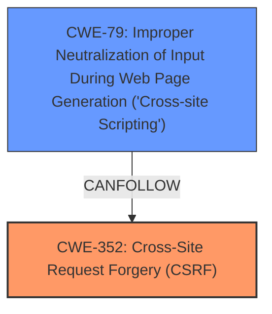

# Analysis Report for CVE-2025-30560

# Vulnerability Analysis Report: CVE-2025-30560

## Description

Cross-Site Request Forgery (CSRF) vulnerability in Sana Ullah jQuery Dropdown Menu allows Stored **XSS**. This issue affects jQuery Dropdown Menu from n/a through 3.0.

## Vulnerability Description Key Phrases

- **Rootcause:** cross-site request forgery
- **Weakness:** XSS
- **Product:** jQuery Dropdown Menu
- **Version:** n/a through 3.0

## Analysis (with Relationship Data)

# Summary
| CWE ID | CWE Name | Confidence | CWE Abstraction Level | CWE Vulnerability Mapping Label | CWE-Vulnerability Mapping Notes |
|---|---|---|---|---|---|
| CWE-352 | Cross-Site Request Forgery (CSRF) | 0.9 | Compound | Allowed | Primary CWE. The vulnerability description and CVE reference clearly state CSRF as the root cause. |
| CWE-79 | Improper Neutralization of Input During Web Page Generation ('Cross-site Scripting') | 0.9 | Base | Allowed | Secondary CWE. The vulnerability description mentions Stored XSS. |

## Evidence and Confidence

*   **Confidence Score:** 0.9
*   **Evidence Strength:** HIGH

## Relationship Analysis
The primary weakness is Cross-Site Request Forgery (CSRF), which can lead to other vulnerabilities such as Cross-Site Scripting (XSS). CSRF allows an attacker to induce a user to perform actions they did not intend to. In this case, the CSRF vulnerability leads to Stored XSS.



## Vulnerability Chain
1.  The application is vulnerable to **CWE-352 Cross-Site Request Forgery (CSRF)**.
2.  Due to the **CSRF** vulnerability, an attacker can trick a user into performing actions they did not intend to.
3.  This leads to **CWE-79 Improper Neutralization of Input During Web Page Generation ('Cross-site Scripting')**, where the application fails to properly neutralize user input, resulting in stored XSS.

## Summary of Analysis
The vulnerability description clearly indicates that a **cross-site request forgery** vulnerability exists, which allows for stored **XSS**. The CVE reference confirms the **CSRF** vulnerability in the WordPress jQuery Dropdown Menu Plugin. The description states that a malicious actor can force higher privileged users to execute unwanted actions under their current authentication. This action results in Stored XSS.

Based on the retriever results, CWE-79 and CWE-352 are highly relevant. CWE-79 is selected because the vulnerability description mentions "Stored XSS". CWE-352 is selected because the root cause is **Cross-Site Request Forgery**. The mapping guidance for both CWEs allows their use.

CWE-89, CWE-116, CWE-918, CWE-1004, CWE-601, CWE-1275, CWE-80, and CWE-184 were considered but not selected as they do not directly relate to the described vulnerability.

Relevant CWE Information:

# Enhanced Context (25 CWEs)
The following CWEs were identified as potentially relevant to this vulnerability:

## CWE-352: Cross-Site Request Forgery (CSRF)
**Abstraction Level**: Compound
**Similarity Score**: 0.75
**Source**: dense

**Description**:
The web application does not, or can not, sufficiently verify whether a well-formed, valid, consistent request was intentionally provided by the user who submitted the request.

**Mapping Guidance**:
- Usage: Allowed
- Rationale: This is a well-known Composite of multiple weaknesses that must all occur simultaneously, although it is attack-oriented in nature.

## CWE-79: Improper Neutralization of Input During Web Page Generation ('Cross-site Scripting')
**Abstraction Level**: Base
**Similarity Score**: 0.71
**Source**: dense

**Description**:
The product does not neutralize or incorrectly neutralizes user-controllable input before it is placed in output that is used as a web page that is served to other users.

**Mapping Guidance**:
- Usage: Allowed
- Rationale: This CWE entry is at the Base level of abstraction, which is a preferred level of abstraction for mapping to the root causes of vulnerabilities.

## CWE-79: Improper Neutralization of Input During Web Page Generation ('Cross-site Scripting')
**Abstraction Level**: Base
**Similarity Score**: 698.07
**Source**: sparse

**Description**:
The product does not neutralize or incorrectly neutralizes user-controllable input before it is placed in output that is used as a web page that is served to other users.

**Mapping Guidance**:
- Usage: Allowed
- Rationale: This CWE entry is at the Base level of abstraction, which is a preferred level of abstraction for mapping to the root causes of vulnerabilities.

## CWE-352: Cross-Site Request Forgery (CSRF)
**Abstraction Level**: Compound
**Similarity Score**: 679.52
**Source**: sparse

**Description**:
The web application does not, or can not, sufficiently verify whether a well-formed, valid, consistent request was intentionally provided by the user who submitted the request.

**Mapping Guidance**:
- Usage: Allowed
- Rationale: This is a well-known Composite of multiple weaknesses that must all occur simultaneously, although it is attack-oriented in nature.

## CWE-79: Improper Neutralization of Input During Web Page Generation ('Cross-site Scripting')
**Abstraction Level**: Base
**Similarity Score**: 3.30
**Source**: graph

**Description**:
The product does not neutralize or incorrectly neutralizes user-controllable input before it is placed in output that is used as a web page that is served to other users.

**Mapping Guidance**:
- Usage: Allowed
- Rationale: This CWE entry is at the Base level of abstraction, which is a preferred level of abstraction for mapping to the root causes of vulnerabilities.


## CWE Relationship Analysis

Current CWEs represent these abstraction levels: .


### Vulnerability Chain Analysis

**Chain starting from CWE-89:**
- 89 (Improper Neutralization of Special Elements used in an SQL Command ('SQL Injection')) - ROOT


**Chain starting from CWE-116:**
- 116 (Improper Encoding or Escaping of Output) - ROOT


### CWE Relationship Diagram

```mermaid
graph TD
    classDef primary fill:#f96,stroke:#333,stroke-width:2px
    classDef secondary fill:#69f,stroke:#333
    classDef tertiary fill:#9e9,stroke:#333
```


*Report generated on 2025-07-14 17:36:03*
