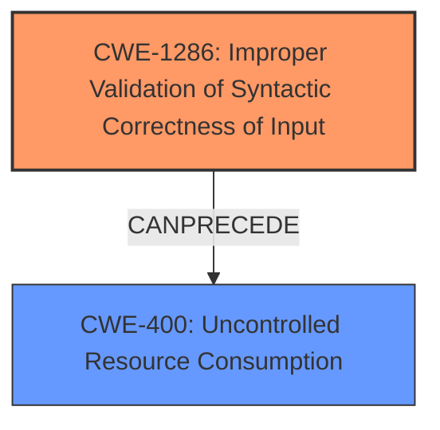

# Analysis Report for CVE-2025-30648

# Vulnerability Analysis Report: CVE-2025-30648

## Description

An Improper **Input Validation vulnerability** in the Juniper DHCP Daemon (jdhcpd) of Juniper Networks Junos OS and Junos OS Evolved allows an unauthenticated, adjacent attacker to cause the jdhcpd process to crash resulting in a Denial of Service (DoS). When a specifically malformed DHCP packet is received from a DHCP client, the jdhcpd process crashes, which will lead to the unavailability of the DHCP service and thereby resulting in a sustained DoS. The DHCP process will restart automatically to recover the service. This issue will occur when dhcp-security is enabled. This issue affects Junos OS * All versions before 21.2R3-S9, * from 21.4 before 21.4R3-S10, * from 22.2 before 22.2R3-S6, * from 22.4 before 22.4R3-S6, * from 23.2 before 23.2R2-S3, * from 23.4 before 23.4R2-S4, * from 24.2 before 24.2R2 Junos OS Evolved * from 22.4 before 22.4R3-S6-EVO, * from 23.2 before 23.2R2-S3-EVO, * from 23.4 before 23.4R2-S4-EVO, * from 24.2 before 24.2R2-EVO. .

## Vulnerability Description Key Phrases

- **Rootcause:** ['Input Validation vulnerability', 'Improper Input Validation']
- **Impact:** ['Denial of Service (DoS)', 'crash']
- **Vector:** specifically malformed DHCP packet
- **Attacker:** unauthenticated adjacent attacker
- **Product:** Junos OS Evolved
- **Version:** ["'from 22.4 before 22.4R3-S6-EVO'", "'from 23.2 before 23.2R2-S3-EVO'", "'from 23.4 before 23.4R2-S4-EVO'", "['All versions before 21.2R3-S9'", "'from 24.2 before 24.2R2-EVO']", "'from 21.4 before 21.4R3-S10'", "'from 22.2 before 22.2R3-S6'", "'from 22.4 before 22.4R3-S6'", "'from 23.2 before 23.2R2-S3'", "'from 23.4 before 23.4R2-S4'", "'from 24.2 before 24.2R2'"]
- **Component:** Juniper DHCP Daemon (jdhcpd)

## Analysis (with Relationship Data)

# Summary
| CWE ID  | CWE Name                                                        | Confidence | CWE Abstraction Level | CWE Vulnerability Mapping Label | CWE-Vulnerability Mapping Notes |
| :-------- | :-------------------------------------------------------------- | :--------- | :---------------------- | :------------------------------ | :------------------------------ |
| CWE-1286 | Improper Validation of Syntactic Correctness of Input         | 0.9        | Base                    | Primary CWE                   | Allowed                       |
| CWE-400  | Uncontrolled Resource Consumption                               | 0.7        | Base                    | Secondary Candidate             | Allowed                       |

## Evidence and Confidence

*   **Confidence Score:** 0.8
*   **Evidence Strength:** HIGH

## Relationship Analysis
The primary weakness is **Improper Input Validation**, specifically **Improper Validation of Syntactic Correctness of Input (CWE-1286)**. This leads to a malformed DHCP packet being processed, causing a crash. The crash leads to resource exhaustion i.e. **Uncontrolled Resource Consumption (CWE-400)**. The relationship is that **CWE-1286** can precede **CWE-400**, because if you don't validate input, you might consume resources without limit.



## Vulnerability Chain
The vulnerability chain starts with **Improper Input Validation (CWE-1286)** of the DHCP packet, leading to a crash and subsequent **Denial of Service**.

## Summary of Analysis
The primary issue is the **improper input validation** of the DHCP packet. This allows a **specifically malformed DHCP packet** to crash the jdhcpd process, leading to a denial-of-service condition. The **Improper Input Validation (CWE-1286)** is a direct result of the **lack of validation** of the packet's syntax.

The retriever results show that **CWE-1286** is the top candidate for the **'Input Validation vulnerability'** and **'Improper Input Validation'** keyphrases.

CWE-400 is considered because the crash leads to unavailability of the DHCP service, which can be viewed as a form of resource consumption.

The description explicitly states that a **malformed DHCP packet** leads to a crash, which indicates an issue with the packet's syntactic correctness and leads to service unavailability.

Relevant CWE Information:

# Enhanced Context (25 CWEs)
The following CWEs were identified as potentially relevant to this vulnerability:

## CWE-1286: Improper Validation of Syntactic Correctness of Input
**Abstraction Level**: Base
**Similarity Score**: 0.72
**Source**: dense

**Description**:
The product receives input that is expected to be well-formed - i.e., to comply with a certain syntax - but it does not validate or incorrectly validates that the input complies with the syntax.

**Mapping Guidance**:
- Usage: Allowed
- Rationale: This CWE entry is at the Base level of abstraction, which is a preferred level of abstraction for mapping to the root causes of vulnerabilities.

## CWE-400: Uncontrolled Resource Consumption
**Abstraction Level**: Base
**Similarity Score**: 1169.41
**Source**: Keyphrase-Specific CWE Analysis

**Description**:
The product does not properly control the allocation and maintenance of a limited resource, thereby enabling an actor to influence the amount of resources consumed, eventually leading to the exhaustion of available resources....

**Mapping Guidance**:
- Usage: Allowed
- Rationale: This CWE entry is at the Base level of abstraction, which is a preferred level of abstraction for mapping to the root causes of vulnerabilities.

---

**CWE-1286: Improper Validation of Syntactic Correctness of Input**

*   **Technical Explanation:** The jdhcpd process does not properly validate the syntax of incoming DHCP packets. When a **specifically malformed DHCP packet** is received, it is not rejected or handled correctly, leading to a crash. This indicates that the product receives input that is expected to be well-formed (i.e., comply with DHCP syntax), but it **does not validate** that the input complies with the syntax.
*   **Security Implications:** An unauthenticated, adjacent attacker can send a crafted DHCP packet to trigger the vulnerability, causing the jdhcpd process to crash.
*   **Relationship:** This is the root cause of the vulnerability.
*   **Mapping Guidance Influence:** The description matches the Base level of abstraction, and its usage is ALLOWED.
*   **Confidence:** 0.9

**CWE-400: Uncontrolled Resource Consumption**

*   **Technical Explanation:** The crash of the jdhcpd process leads to unavailability of the DHCP service, resulting in a denial-of-service condition.
*   **Security Implications:** The attacker can repeatedly send malformed DHCP packets to keep the DHCP service unavailable.
*   **Relationship:** This is a consequence of the primary weakness.
*   **Mapping Guidance Influence:** The description matches the Base level of abstraction, and its usage is ALLOWED.
*   **Confidence:** 0.7

**CWEs Considered but Not Used:**

*   CWE-1285: Improper Validation of Specified Index, Position, or Offset in Input: While input validation is the core issue, the problem is not specifically related to index, position, or offset. Instead, it's about the overall syntactic correctness of the DHCP packet.
*   CWE-755: Improper Handling of Exceptional Conditions: This is too general. **Improper Input Validation** is more specific to the described vulnerability.
*   CWE-775: Missing Release of File Descriptor or Handle after Effective Lifetime: This is not relevant to the described vulnerability, as the issue is not related to file descriptors or handles.
*   CWE-269: Improper Privilege Management: This is not relevant, as the issue is exploitable by an unauthenticated attacker.


## CWE Relationship Analysis

Current CWEs represent these abstraction levels: .


### Vulnerability Chain Analysis

**Chain starting from CWE-400:**
- 400 (Uncontrolled Resource Consumption) - ROOT


**Chain starting from CWE-775:**
- 775 (Missing Release of File Descriptor or Handle after Effective Lifetime) - ROOT


### CWE Relationship Diagram

```mermaid
graph TD
    classDef primary fill:#f96,stroke:#333,stroke-width:2px
    classDef secondary fill:#69f,stroke:#333
    classDef tertiary fill:#9e9,stroke:#333
```


*Report generated on 2025-07-14 17:43:21*
