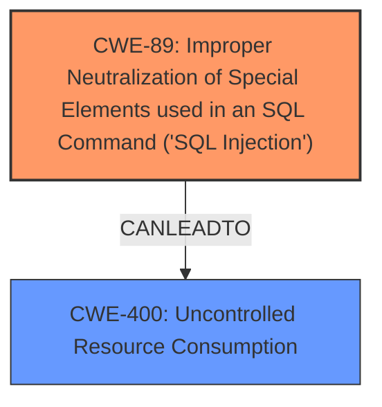

# Analysis Report for CVE-2025-30699

# Vulnerability Analysis Report: CVE-2025-30699

## Description

Vulnerability in the MySQL Server product of Oracle MySQL (component Server Stored Procedure). Supported versions that are affected are 8.0.0-8.0.41, 8.4.0-8.4.4 and 9.0.0-9.2.0. Easily exploitable vulnerability allows high privileged attacker with network access via multiple protocols to compromise MySQL Server. Successful attacks of this vulnerability can result in unauthorized ability to cause a hang or frequently repeatable crash (complete DOS) of MySQL Server. CVSS 3.1 Base Score 4.9 (Availability impacts). CVSS Vector (CVSS3.1/AVN/ACL/PRH/UIN/SU/CN/IN/AH).

## Vulnerability Description Key Phrases

- **Weakness:** SQL injection
- **Impact:** ['hang or frequently repeatable crash (complete DOS) of MySQL Server', 'cause a hang or frequently repeatable crash']
- **Vector:** multiple protocols
- **Attacker:** high privileged attacker with network access
- **Product:** MySQL Server
- **Version:** ['["[\'8.0.0-8.0.41\'"', '"\'9.0.0-9.2.0\']"]', '"\'8.4.0-8.4.4\'"']
- **Component:** Server Stored Procedure

## Analysis (with Relationship Data)

# Summary
| CWE ID | CWE Name | Confidence | CWE Abstraction Level | CWE Vulnerability Mapping Label | CWE-Vulnerability Mapping Notes |
|---|---|---|---|---|---|
| CWE-89 | Improper Neutralization of Special Elements used in an SQL Command ('SQL Injection') | 1.0 | Base | Allowed | Primary CWE: The vulnerability description explicitly mentions "SQL injection" as the weakness. |
| CWE-400 |Uncontrolled Resource Consumption| 0.7 | Class | Allowed | Secondary CWE: The vulnerability can lead to a denial of service (DoS) by causing a hang or crash of the MySQL server. |

## Evidence and Confidence

*   **Confidence Score:** 0.9
*   **Evidence Strength:** HIGH

## Relationship Analysis
The primary relationship that influenced the decision was the direct match of "SQL injection" to CWE-89. Additionally, the resulting impact of the vulnerability (DoS) was considered, leading to the inclusion of CWE-400 as a secondary weakness.



## Vulnerability Chain
The vulnerability chain starts with **SQL injection** (CWE-89), which then leads to a denial-of-service condition (CWE-400) by crashing the MySQL server. The initial flaw is the improper neutralization of special elements in SQL commands, allowing attackers to manipulate the query and cause a server crash.

## Summary of Analysis
The analysis is primarily based on the explicit mention of "**SQL injection**" in the "Vulnerability Description Key Phrases". This direct evidence strongly supports the selection of CWE-89 as the primary CWE. The resulting impact of a hang or repeatable crash further justifies the inclusion of CWE-400.

The graph relationships highlight the connection between the initial vulnerability (CWE-89) and its potential impact (CWE-400). The selected CWEs are at the optimal level of specificity, with CWE-89 being a Base CWE and CWE-400 a Class CWE.

Relevant CWE Information:

# Enhanced Context (25 CWEs)
The following CWEs were identified as potentially relevant to this vulnerability:

## CWE-89: Improper Neutralization of Special Elements used in an SQL Command ('SQL Injection')
**Abstraction Level**: Base
**Similarity Score**: 0.70
**Source**: dense

**Description**:
The product constructs all or part of an SQL command using externally-influenced input from an upstream component, but it does not neutralize or incorrectly neutralizes special elements that could modify the intended SQL command when it is sent to a downstream component. Without sufficient removal or quoting of SQL syntax in user-controllable inputs, the generated SQL query can cause those inputs to be interpreted as SQL instead of ordinary user data.

**Mapping Guidance**:
- Usage: Allowed
- Rationale: This CWE entry is at the Base level of abstraction, which is a preferred level of abstraction for mapping to the root causes of vulnerabilities.

## CWE-400: Uncontrolled Resource Consumption
**Abstraction Level**: Class
**Similarity Score**: N/A
**Source**: Manual Analysis

**Description**:
The software does not properly control the allocation, release, or management of system resources, which can lead to consumption of an excessive amount of resources.

**Mapping Guidance**:
- Usage: Allowed
- Rationale: This CWE entry describes the impact of the **vulnerability**, where a successful attack can result in a denial-of-service (DoS) condition by causing the MySQL server to crash.

### CWE Considered But Not Used:

*   **CWE-173: Improper Handling of Alternate Encoding:** While this CWE has a similarity score, the vulnerability description doesn't provide enough detail to confirm this is the root cause.
*   **CWE-129: Improper Validation of Array Index:** This is not relevant as the vulnerability is not related to array indexing.
*   **CWE-611: Improper Restriction of XML External Entity Reference:** This is not relevant as the vulnerability is not related to XML processing.
*   **CWE-790: Improper Filtering of Special Elements:** While related to input validation, CWE-89 is a more specific match for SQL Injection.
*   **CWE-502: Deserialization of Untrusted Data:** This is not relevant as the vulnerability is not related to deserialization.
*   **CWE-20: Improper Input Validation:** This is too general. CWE-89 is more specific.
*   **CWE-306: Missing Authentication for Critical Function:** The vulnerability description indicates a successful attack requires a high privileged attacker which suggests authentication is present, but not sufficient to prevent the SQL injection.
*   **CWE-200: Exposure of Sensitive Information to an Unauthorized Actor:** The vulnerability description does not specify information exposure.
*   **CWE-289: Authentication Bypass by Alternate Name:** Not relevant as the vulnerability description doesn't suggest an authentication bypass.


## CWE Relationship Analysis

Current CWEs represent these abstraction levels: .


### Vulnerability Chain Analysis

**Chain starting from CWE-89:**
- 89 (Improper Neutralization of Special Elements used in an SQL Command ('SQL Injection')) - ROOT


**Chain starting from CWE-502:**
- 502 (Deserialization of Untrusted Data) - ROOT


### CWE Relationship Diagram

```mermaid
graph TD
    classDef primary fill:#f96,stroke:#333,stroke-width:2px
    classDef secondary fill:#69f,stroke:#333
    classDef tertiary fill:#9e9,stroke:#333
```


*Report generated on 2025-07-14 17:50:53*
