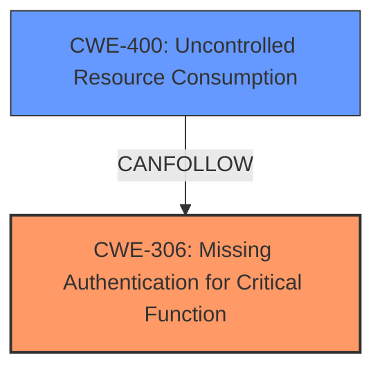

# Analysis for CVE-2025-30730

# Summary
| CWE ID | CWE Name | Confidence | CWE Abstraction Level | CWE Vulnerability Mapping Label | CWE-Vulnerability Mapping Notes |
|---|---|---|---|---|---|
| CWE-306 | Missing Authentication for Critical Function | 0.8 | Base | Allowed | Primary CWE. The application **lacks authentication** for a critical function, allowing unauthenticated attackers to compromise the application. |
| CWE-400 | Uncontrolled Resource Consumption | 0.6 | Base | Allowed | An attacker can cause a hang or crash of the Oracle Application Object Library, leading to a denial of service. |

## Evidence and Confidence

*   **Confidence Score:** 0.7
*   **Evidence Strength:** MEDIUM

## Relationship Analysis
The primary weakness is CWE-306 [CWE-306: Missing Authentication for Critical Function], which is the root cause that allows the unauthenticated attacker to access the Oracle Application Object Library. CWE-400 [CWE-400: Uncontrolled Resource Consumption] results from the lack of authentication because the attacker can cause a denial of service.

## Vulnerability Chain
1.  **Missing Authentication (CWE-306):** The application does not require authentication for a critical function.
2.  **Uncontrolled Resource Consumption (CWE-400):** An unauthenticated attacker can exploit this **missing authentication** to consume resources, leading to a denial of service.

## Summary of Analysis
The vulnerability description clearly states that an **unauthenticated attacker** can compromise the Oracle Application Object Library, leading to a hang or crash. This directly points to CWE-306 [CWE-306: Missing Authentication for Critical Function] as the primary weakness. The resulting denial of service is best described by CWE-400 [CWE-400: Uncontrolled Resource Consumption].

The retriever results listed CWE-306 [CWE-306: Missing Authentication for Critical Function] as the 5th highest result.

*   CWE-173 [CWE-173: Improper Handling of Alternate Encoding], CWE-611 [CWE-611: Improper Restriction of XML External Entity Reference], CWE-502 [CWE-502: Deserialization of Untrusted Data], CWE-749 [CWE-749: Exposed Dangerous Method or Function], CWE-289 [CWE-289: Authentication Bypass by Alternate Name] were considered, but these do not closely align with the vulnerability description. The vulnerability description doesn't mention encoding issues, XML external entities, deserialization of untrusted data or alternate names.

Relevant CWE Information: