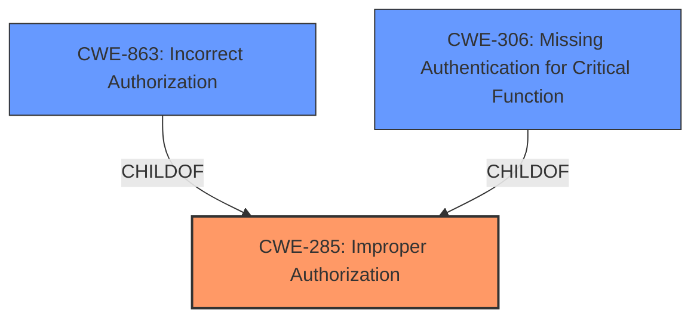

# Analysis for CVE-2025-30735

# Summary
| CWE ID | CWE Name | Confidence | CWE Abstraction Level | CWE Vulnerability Mapping Label | CWE-Vulnerability Mapping Notes |
|---|---|---|---|---|---|
| CWE-285 | Improper Authorization | 0.75 | Class | Primary | Allowed-with-Review |
| CWE-863 | Incorrect Authorization | 0.60 | Class | Secondary | Allowed-with-Review |
| CWE-306 | Missing Authentication for Critical Function | 0.50 | Base | Secondary | Allowed |

## Evidence and Confidence

*   **Confidence Score:** 0.70
*   **Evidence Strength:** MEDIUM

## Relationship Analysis
The primary relationship impacting the decision is the parent-child relationship between CWE-285 (Improper Authorization) and its potential children, including CWE-863 (Incorrect Authorization) and CWE-306 (Missing Authentication for Critical Function). Although CWE-285 is a Class, it's the most appropriate high-level categorization given the information provided. CWE-863 and CWE-306 are considered as secondary options because the description indicates a potential **improper authorization** issue without specifying whether it is due to an incorrect check or a missing check.

## Vulnerability Chain
The vulnerability chain starts with **improper authorization** (CWE-285), potentially due to an **incorrect authorization** (CWE-863) or **missing authentication** (CWE-306). This leads to unauthorized access and modification of critical data. The description focuses on the authorization aspect as the root cause.

## Summary of Analysis
The primary assessment is based on the provided vulnerability description, which highlights "unauthorized creation, deletion or modification access to critical data." This strongly suggests an authorization issue. The description lacks specific details to pinpoint a more precise Base CWE. Therefore, the Class-level CWE-285 (Improper Authorization) is chosen as the primary CWE, with secondary consideration given to CWE-863 (Incorrect Authorization) and CWE-306 (Missing Authentication for Critical Function) as potential underlying causes.

The evidence supporting this includes:
- "easily exploitable vulnerability allows low privileged attacker with network access via HTTP to compromise PeopleSoft Enterprise CC Common Application Objects"
- "Successful attacks of this vulnerability can result in unauthorized creation, deletion or modification access to critical data or all PeopleSoft Enterprise CC Common Application Objects accessible data as well as unauthorized access to critical data or complete access to all PeopleSoft Enterprise CC Common Application Objects accessible data."

The graph relationships influenced the selection by showing the hierarchical relationship between CWE-285 and its children, suggesting potential refinement if more information were available. The chosen CWEs are at a reasonable level of specificity, given the information available.

Relevant CWE Information:

*   **CWE-285: Improper Authorization**
    *   **Technical Explanation:** The product fails to properly authorize actions, allowing a low-privileged attacker to gain unauthorized access to critical data and functionality.
    *   **Security Implications:** Unauthorized data modification, deletion, or access.
    *   **Relationship:** Class-level CWE with potential child CWEs like CWE-863 and CWE-306.
    *   **Mapping Guidance:** Allowed-with-Review (as it's a Class CWE).
*   **CWE-863: Incorrect Authorization**
    *   **Technical Explanation:** The product performs an authorization check, but the logic is flawed, allowing unauthorized actions.
    *   **Security Implications:** Similar to CWE-285.
    *   **Relationship:** Child of CWE-285.
    *   **Mapping Guidance:** Allowed-with-Review (as it's a Class CWE).
*   **CWE-306: Missing Authentication for Critical Function**
    *   **Technical Explanation:** The product lacks authentication for critical functions, allowing unauthorized access.
    *   **Security Implications:** Similar to CWE-285.
    *   **Relationship:** Child of CWE-287, which is a child of CWE-285.
    *   **Mapping Guidance:** Allowed.

CWEs considered but not used:

*   CWE-732: Incorrect Permission Assignment for Critical Resource - While related to authorization, the description doesn't explicitly mention incorrect permission assignments, making CWE-285 a better fit.
*   CWE-502: Deserialization of Untrusted Data - There's no mention of deserialization in the vulnerability description.
*   CWE-611: Improper Restriction of XML External Entity Reference - There's no mention of XML or external entities in the vulnerability description.
*   CWE-807: Reliance on Untrusted Inputs in a Security Decision - This could be related, but the core issue appears to be a failure in authorization, making CWE-285 more directly relevant.
*   CWE-311: Missing Encryption of Sensitive Data - This is about encryption, which is not mentioned in the description.
*   CWE-497: Exposure of Sensitive System Information to an Unauthorized Control Sphere - While the impact includes unauthorized access to sensitive data, the root cause seems to be **improper authorization**, not necessarily direct exposure of system information.
*   CWE-274: Improper Handling of Insufficient Privileges - Not the primary issue; the problem is with authorization logic.
*   CWE-668: Exposure of Resource to Wrong Sphere - Too general; CWE-285 is more specific.
*   CWE-280: Improper Handling of Insufficient Permissions or Privileges - Similar to CWE-274, authorization is the core issue.
*   CWE-642: External Control of Critical State Data - The description doesn't suggest external control of state data.
*   CWE-173: Improper Handling of Alternate Encoding - Encoding issues aren't mentioned.
*   CWE-289: Authentication Bypass by Alternate Name - Authentication bypass isn't explicitly described.