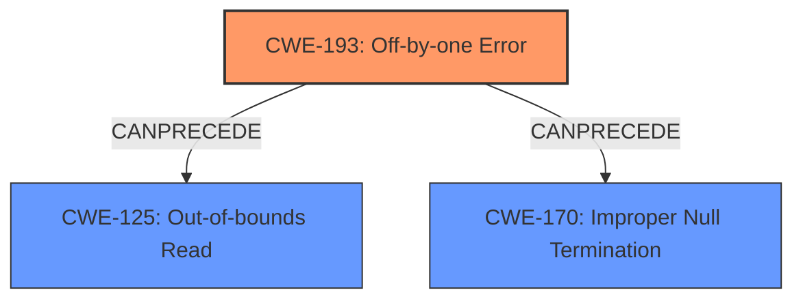

# Raw Analyzer Response for CVE-2025-30742

# Summary

| CWE ID  | CWE Name                                                                 | Confidence | CWE Abstraction Level | CWE Vulnerability Mapping Label | CWE-Vulnerability Mapping Notes |
| ------- | ------------------------------------------------------------------------ | ---------- | --------------------- | ------------------------------- | ------------------------------- |
| CWE-193 | Off-by-one Error                                                         | 0.9        | Base                  | Primary                         | Allowed                         |
| CWE-125 | Out-of-bounds Read                                                       | 0.9        | Base                  | Secondary                       | Allowed                         |
| CWE-170 | Improper Null Termination                                                | 0.6        | Base                  | Secondary                       | Allowed                         |

## Evidence and Confidence

*   **Confidence Score:** 0.9
*   **Evidence Strength:** HIGH

## Relationship Analysis

The primary relationship that influenced the CWE selection is the CANPRECEDE relationship. CWE-193 **Off-by-one Error** can precede CWE-125 **Out-of-bounds Read** and CWE-170 **Improper Null Termination**, reflecting the vulnerability's progression. CWE-193 is the root cause, leading to either CWE-125 or CWE-170. The abstraction levels are all Base, which is optimal for direct mapping.

## Vulnerability Chain

The vulnerability chain starts with a **CWE-193 Off-by-one Error**, where the calculation of the buffer's boundary is off by one. This leads to a potential **CWE-125 Out-of-bounds Read**, as the program attempts to read one byte beyond the allocated buffer. It could also result in **CWE-170 Improper Null Termination** if the intended null terminator is written outside of the allocated space.

## Summary of Analysis

The initial analysis identified CWE-193 as the primary root cause due to the **off-by-one error**, which directly leads to the **out-of-bounds read** (CWE-125). The vulnerability description explicitly mentions the **off-by-one error** and resultant **out-of-bounds read**.

The graph relationships influenced the decision, particularly the CANPRECEDE relationships of CWE-193 leading to CWE-125 and CWE-170. This confirms that the **off-by-one error** is the root cause, directly enabling the **out-of-bounds read**.

The selected CWEs are at the optimal level of specificity (Base). The evidence from the vulnerability description is strong, focusing on the root cause and its direct consequence.

Relevant CWE Information:

# Enhanced Context (25 CWEs)
The following CWEs were identified as potentially relevant to this vulnerability:

## CWE-193: Off-by-one Error
**Abstraction Level**: Base

**Description**:
A product calculates or uses an incorrect maximum or minimum value that is 1 more, or 1 less, than the correct value.

**Mapping Guidance**:
- Usage: Allowed

## CWE-125: Out-of-bounds Read
**Abstraction Level**: Base

**Description**:
The product reads data past the end, or before the beginning, of the intended buffer.

**Mapping Guidance**:
- Usage: Allowed

## CWE-170: Improper Null Termination
**Abstraction Level**: Base

**Description**:
The product does not terminate or incorrectly terminates a string or array with a null character or equivalent terminator.

**Mapping Guidance**:
- Usage: Allowed

### CWE Details and Justification:

1.  **CWE-193 Off-by-one Error (Primary)**
    *   **Technical Explanation:** The vulnerability stems from an **off-by-one error** when handling a 1024-character string. This means the code incorrectly calculates the boundary of the buffer by one byte.
    *   **Security Implications:** This error can lead to subsequent memory access violations, such as reading or writing beyond the intended buffer.
    *   **Relationship:** This is the root cause that leads to other weaknesses.
    *   **Mapping Guidance:** The usage is ALLOWED, and it's a Base level CWE, which is appropriate.
    *   **Supporting Evidence:** "httpd.c in atophttpd 2.8.0 has an **off-by-one error** and resultant **out-of-bounds read** because a certain 1024-character req string would not have a final \\0 character."
    *   **Confidence:** 0.9

2.  **CWE-125 Out-of-bounds Read (Secondary)**
    *   **Technical Explanation:** As a direct consequence of the **off-by-one error**, the code attempts to read data beyond the allocated buffer.
    *   **Security Implications:** This can lead to information disclosure, denial of service, or potentially arbitrary code execution.
    *   **Relationship:** This is a direct result of the **off-by-one error** (CWE-193).
    *   **Mapping Guidance:** The usage is ALLOWED, and it's a Base level CWE, which is appropriate.
    *   **Supporting Evidence:** "httpd.c in atophttpd 2.8.0 has an **off-by-one error** and resultant **out-of-bounds read** because a certain 1024-character req string would not have a final \\0 character."
    *   **Confidence:** 0.9

3. **CWE-170 Improper Null Termination (Secondary)**
    *   **Technical Explanation:** The 1024-character string does not have a final null terminator.
    *   **Security Implications:** This can lead to other functions reading beyond the buffer when the string is passed to them, as they may rely on the null terminator to determine the string's length.
    *   **Relationship:** This is a potential consequence of the **off-by-one error** (CWE-193).
    *   **Mapping Guidance:** The usage is ALLOWED, and it's a Base level CWE, which is appropriate.
    *   **Supporting Evidence:** "httpd.c in atophttpd 2.8.0 has an **off-by-one error** and resultant **out-of-bounds read** because a certain 1024-character req string would not have a final \\0 character."
    *   **Confidence:** 0.6

### CWEs Considered but Not Used:

*   **CWE-120 Buffer Copy without Checking Size of Input ('Classic Buffer Overflow'):** This CWE was not selected because the description focuses on the **off-by-one error** and **out-of-bounds read**, not a buffer copy operation. The vulnerability is more specific than a general buffer overflow. Also, the usage is "Allowed-with-Review" meaning it needs more scrutiny.
*   **CWE-130 Improper Handling of Length Parameter Inconsistency:** This CWE was not selected because the vulnerability description does not explicitly mention inconsistencies in length parameters.
*   **CWE-131 Incorrect Calculation of Buffer Size:** This CWE is similar to CWE-193, but CWE-193 is more specific to the **off-by-one error**.
*   **CWE-617 Reachable Assertion:** This CWE was not selected because there is no evidence that an assertion is triggered.
*   **CWE-124 Buffer Underwrite ('Buffer Underflow'):** The description mentions an **out-of-bounds read**, not an underwrite.
*   **CWE-147 Improper Neutralization of Input Terminators:** While related to string handling, the core issue is the **off-by-one error**, not the improper neutralization of terminators.
*   **CWE-682 Incorrect Calculation:** This is a broader category, and CWE-193 is a more specific instance of an incorrect calculation.
*   **CWE-170 Improper Null Termination:** Although relevant, the primary issue is the **off-by-one error** leading to the missing null terminator, making CWE-193 more appropriate as the root cause.
*   **CWE-41 Improper Resolution of Path Equivalence** and **CWE-918 Server-Side Request Forgery (SSRF)**, **CWE-346 Origin Validation Error**, **CWE-178 Improper Handling of Case Sensitivity**, **CWE-191 Integer Underflow (Wrap or Wraparound)**, **CWE-126 Buffer Over-read