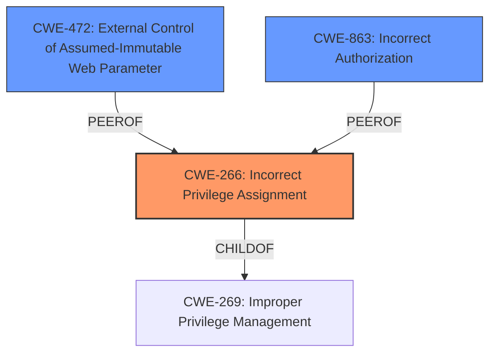

# Raw Analyzer Response for CVE-2025-3101

# Summary
| CWE ID | CWE Name | Confidence | CWE Abstraction Level | CWE Vulnerability Mapping Label | CWE-Vulnerability Mapping Notes |
|---|---|---|---|---|---|
| CWE-266 | Incorrect Privilege Assignment | 0.9 | Base | Primary CWE | Allowed |
| CWE-472 | External Control of Assumed-Immutable Web Parameter | 0.7 | Base | Secondary Candidate | Allowed |
| CWE-863 | Incorrect Authorization | 0.6 | Class | Secondary Candidate | Allowed-with-Review |

## Evidence and Confidence

*   **Confidence Score:** 0.8
*   **Evidence Strength:** HIGH

## Relationship Analysis
The primary relationship that influenced my decision was the parent-child relationship between CWE-269 (Improper Privilege Management) and CWE-266 (Incorrect Privilege Assignment). While CWE-269 is a broader class, CWE-266 offers a more specific description of the **root cause**, which is the **incorrect assignment of privileges**. CWE-863 (Incorrect Authorization) was considered as a possible alternative, however, the **incorrect assignment** implies a configuration issue rather than a flawed authorization check. CWE-472 (External Control of Assumed-Immutable Web Parameter) was also considered since user meta fields were **not properly validated**, implying they were treated as immutable.

## Vulnerability Chain
The vulnerability chain begins with the **improper validation of user meta fields** (CWE-266) leading to the ability for authenticated users to escalate their privileges.

## Summary of Analysis
Based on the provided evidence, the primary **root cause** is the **incorrect assignment of privileges** due to the **lack of proper validation of user meta fields**. This allows attackers to escalate their privileges.

The vulnerability description clearly states that the plugin does **not properly validate user meta fields prior to updating them in the database**. This directly aligns with CWE-266, which describes a scenario where a product incorrectly assigns a privilege to a particular actor. The "Privileges vs Permissions Guidance" also reinforces this by stating that CWE-266 is the best fit when a user gets a higher privilege role by mistake due to role misassignment.

CWE-472 was considered because the vulnerability arises from **not properly validating user meta fields**, implying they were treated as immutable, which aligns with the description of CWE-472, "The web application does not sufficiently verify inputs that are assumed to be immutable but are actually externally controllable". Since the **root cause** focuses more on the privilege assignment than the lack of input validation on assumed immutable data, it is a secondary candidate.

CWE-863 was considered because the authorization check is implicitly flawed, as the attackers could change escalate their privileges to Administrator, but CWE-266 more accurately describes the **root cause** of the issue.

I am confident in this assessment because the evidence directly supports the chosen CWE, and the relationship analysis helps to refine the selection to the most specific and accurate representation of the vulnerability.

Relevant CWE Information:

# Enhanced Context (25 CWEs)
The following CWEs were identified as potentially relevant to this vulnerability:

## CWE-266: Incorrect Privilege Assignment
**Abstraction Level**: Base
**Similarity Score**: 0.80
**Source**: dense

**Description**:
A product incorrectly assigns a privilege to a particular actor, creating an unintended sphere of control for that actor.

**Mapping Guidance**:
- Usage: Allowed
- Rationale: This CWE entry is at the Base level of abstraction, which is a preferred level of abstraction for mapping to the root causes of vulnerabilities.

**Technical Explanation**: The vulnerability allows authenticated attackers to escalate their privileges to Administrator due to the plugin **not properly validating user meta fields**. This aligns with the description of CWE-266, where a product incorrectly assigns a privilege (Administrator) to an actor (authenticated user).
**Security Implications**: Attackers can gain complete control over the WordPress site.
**Relationship Analysis**: CWE-266 is a child of CWE-269 (Improper Privilege Management), providing a more specific classification.
**Mapping Guidance Influence**: The "Privileges vs Permissions Guidance" recommends CWE-266 when a user gets a higher privilege role by mistake due to role misassignment.
**Selected as Primary CWE**

## CWE-472: External Control of Assumed-Immutable Web Parameter
**Abstraction Level**: Base
**Similarity Score**: 0.79
**Source**: dense

**Description**:
The web application does not sufficiently verify inputs that are assumed to be immutable but are actually externally controllable, such as hidden form fields.

**Mapping Guidance**:
- Usage: Allowed
- Rationale: This CWE entry is at the Base level of abstraction, which is a preferred level of abstraction for mapping to the root causes of vulnerabilities.

**Technical Explanation**: The plugin does **not properly validate user meta fields prior to updating them in the database**. The user meta fields are assumed to be immutable but are actually externally controllable.
**Security Implications**: Attackers can gain control of the system.
**Relationship Analysis**: CWE-472 is a child of CWE-471 (Modification of Assumed-Immutable Data).
**Mapping Guidance Influence**: The mapping guidance indicates that this is an Allowed mapping.
**Selected as Secondary Candidate**

## CWE-863: Incorrect Authorization
**Abstraction Level**: Class
**Similarity Score**: 1372.09
**Source**: sparse

**Description**:
The product performs an authorization check when an actor attempts to access a resource or perform an action, but it does not correctly perform the check.

**Mapping Guidance**:
- Usage: Allowed-with-Review
- Rationale: This CWE entry is a Class and might have Base-level children that would be more appropriate

**Technical Explanation**: The plugin has some authorization in place (users are authenticated), but the authorization is **incorrect** because it allows users to escalate privileges.
**Security Implications**: Attackers can bypass authorization controls and gain unauthorized access.
**Relationship Analysis**: CWE-863 is a class-level CWE, and it is related to other authorization-related CWEs.
**Mapping Guidance Influence**: The mapping guidance indicates that this is an Allowed-with-Review mapping.

## CWE-285: Improper Authorization
**Abstraction Level**: Class
**Similarity Score**: 1322.03
**Source**: sparse

**Description**:
The product does not perform or incorrectly performs an authorization check when an actor attempts to access a resource or perform an action.

**Mapping Guidance**:
- Usage: Discouraged
- Rationale: CWE-285 is high-level and lower-level CWEs can frequently be used instead. It is a level-1 Class (i.e., a child of a Pillar).

**Technical Explanation**: Similar to CWE-863, but potentially covers cases where the authorization is entirely missing, or performed incorrectly.
**Security Implications**: Attackers can bypass authorization controls and gain unauthorized access.
**Relationship Analysis**: CWE-285 is a class-level CWE, and it is related to other authorization-related CWEs.
**Mapping Guidance Influence**: The mapping guidance indicates that this is a Discouraged mapping.

## CWE-306: Missing Authentication for Critical Function
**Abstraction Level**: Base
**Similarity Score**: 2.40
**Source**: graph

**Description**:
CWE-306: Missing Authentication for Critical Function

**Mapping Guidance**:
- Usage: Allowed
- Rationale: This CWE entry is at the Base level of abstraction, which is a preferred level of abstraction for mapping to the root causes of vulnerabilities.

**Technical Explanation**: While authentication is present, the **root cause** isn't a missing authentication, it's an **incorrect privilege assignment**.
**Security Implications**: Attackers can bypass authorization controls and gain unauthorized access.
**Relationship Analysis**: CWE-306 is a class-level CWE, and it is related to other authorization-related CWEs.
**Mapping Guidance Influence**: The mapping guidance indicates that this is an Allowed mapping.

## CWE-862: Missing Authorization
**Abstraction Level**: Class
**Similarity Score**: 0.454
**Source**: sparse

**Description**:
The product does not perform authorization before an actor attempts to access a resource or perform an action.

**Technical Explanation**: The plugin does not perform authorization before updating the user meta fields
**Security Implications**: Attackers can bypass authorization controls and gain unauthorized access.
**Relationship Analysis**: CWE