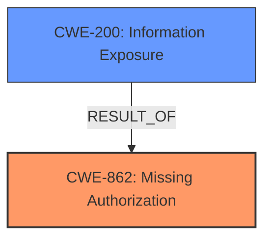

# Analysis Report for CVE-2025-3104

# Vulnerability Analysis Report: CVE-2025-3104

## Description

The WP STAGING Pro WordPress Backup Plugin for WordPress is vulnerable to **Information Exposure** in all versions up to and including 6.1.2 due to **missing capability checks** on the getOutdatedPluginsRequest() function. This makes it possible for unauthenticated attackers to reveal outdated installed active or inactive plugins.

## Vulnerability Description Key Phrases

- **Rootcause:** missing capability checks
- **Weakness:** Information Exposure
- **Impact:** reveal outdated installed active or inactive plugins
- **Attacker:** unauthenticated attackers
- **Product:** WP STAGING Pro WordPress Backup Plugin for WordPress
- **Version:** up to and including 6.1.2
- **Component:** getOutdatedPluginsRequest() function

## Analysis (with Relationship Data)

# Summary
| CWE ID | CWE Name | Confidence | CWE Abstraction Level | CWE Vulnerability Mapping Label | CWE-Vulnerability Mapping Notes |
|---|---|---|---|---|---|
| CWE-862 | Missing Authorization | 1.0 | Class | Primary | Allowed-with-Review |
| CWE-200 | Information Exposure | 0.8 | Base | Secondary | Allowed |

## Evidence and Confidence

*   **Confidence Score:** 0.9
*   **Evidence Strength:** HIGH

## Relationship Analysis
The primary relationship that influenced the decision was the parent-child relationship between CWE-862 (Missing Authorization) and various potential child CWEs that describe more specific authorization failures. While CWE-862 is a Class-level CWE, it directly reflects the **missing capability checks**, which is the root cause. CWE-200 (Information Exposure) is a consequence of the **missing authorization**.



## Vulnerability Chain
The vulnerability chain starts with **missing capability checks** (CWE-862), which leads to **information exposure** (CWE-200) by allowing unauthenticated attackers to reveal outdated plugins.

## Summary of Analysis
The initial analysis strongly pointed towards CWE-862 (Missing Authorization) as the primary weakness, supported by the vulnerability description highlighting **missing capability checks**. The "Retriever Results" also listed CWE-862 as a strong candidate. The evidence provided indicates the **missing authorization** on the `getOutdatedPluginsRequest()` function allows unauthenticated users to access sensitive information, aligning perfectly with the description of CWE-862. The consequence of this **missing authorization** is **information exposure** (CWE-200), which serves as the secondary weakness.

Relevant CWE Information:

# Enhanced Context (25 CWEs)
The following CWEs were identified as potentially relevant to this vulnerability:

## CWE-352: Cross-Site Request Forgery (CSRF)
**Abstraction Level**: Compound
**Similarity Score**: 0.75
**Source**: dense

**Description**:
The web application does not, or can not, sufficiently verify whether a well-formed, valid, consistent request was intentionally provided by the user who submitted the request.

**Mapping Guidance**:
- Usage: Allowed
- Rationale: This is a well-known Composite of multiple weaknesses that must all occur simultaneously, although it is attack-oriented in nature.

*   **Why not used:** CSRF requires a valid, consistent request, but the vulnerability is available to unauthenticated users.

## CWE-425: Direct Request ('Forced Browsing')
**Abstraction Level**: Base
**Similarity Score**: 0.74
**Source**: dense

**Description**:
The web application does not adequately enforce appropriate authorization on all restricted URLs, scripts, or files.

**Mapping Guidance**:
- Usage: Allowed
- Rationale: This CWE entry is at the Base level of abstraction, which is a preferred level of abstraction for mapping to the root causes of vulnerabilities.

*   **Why not used:** Although related, CWE-862 is a more direct description of the weakness.

## CWE-472: External Control of Assumed-Immutable Web Parameter
**Abstraction Level**: Base
**Similarity Score**: 0.72
**Source**: dense

**Description**:
The web application does not sufficiently verify inputs that are assumed to be immutable but are actually externally controllable, such as hidden form fields.

**Mapping Guidance**:
- Usage: Allowed
- Rationale: This CWE entry is at the Base level of abstraction, which is a preferred level of abstraction for mapping to the root causes of vulnerabilities.

*   **Why not used:** Not applicable because the vulnerability is due to missing authorization, not external control of parameters.

## CWE-862: Missing Authorization
**Abstraction Level**: Class
**Similarity Score**: 0.71
**Source**: dense

**Description**:
The product does not perform an authorization check when an actor attempts to access a resource or perform an action.

**Mapping Guidance**:
- Usage: Allowed-with-Review
- Rationale: This CWE entry is a Class and might have Base-level children that would be more appropriate

*   **Why used:** This is the primary weakness, as explicitly stated in the description as **missing capability checks**.

## CWE-639: Authorization Bypass Through User-Controlled Key
**Abstraction Level**: Base
**Similarity Score**: 0.71
**Source**: dense

**Description**:
The system's authorization functionality does not prevent one user from gaining access to another user's data or record by modifying the key value identifying the data.

**Mapping Guidance**:
- Usage: Allowed
- Rationale: This CWE entry is at the Base level of abstraction, which is a preferred level of abstraction for mapping to the root causes of vulnerabilities.

*   **Why not used:** Not applicable because the vulnerability is due to completely missing authorization, not a bypass.

## CWE-116: Improper Encoding or Escaping of Output
**Abstraction Level**: Class
**Similarity Score**: 0.71
**Source**: dense

**Description**:
The product prepares a structured message for communication with another component, but encoding or escaping of the data is either missing or done incorrectly. As a result, the intended structure of the message is not preserved.

**Mapping Guidance**:
- Usage: Allowed-with-Review
- Rationale: This CWE entry is a Class and might have Base-level children that would be more appropriate

*   **Why not used:** Not applicable because the vulnerability is not related to encoding or escaping of output.

## CWE-434: Unrestricted Upload of File with Dangerous Type
**Abstraction Level**: Base
**Similarity Score**: 0.71
**Source**: dense

**Description**:
The product allows the upload or transfer of dangerous file types that are automatically processed within its environment.

**Mapping Guidance**:
- Usage: Allowed
- Rationale: This CWE entry is at the Base level of abstraction, which is a preferred level of abstraction for mapping to the root causes of vulnerabilities.

*   **Why not used:** Not applicable because the vulnerability is not related to file uploads.

## CWE-201: Insertion of Sensitive Information Into Sent Data
**Abstraction Level**: Base
**Similarity Score**: 0.71
**Source**: dense

**Description**:
The code transmits data to another actor, but a portion of the data includes sensitive information that should not be accessible to that actor.

**Mapping Guidance**:
- Usage: Allowed
- Rationale: This CWE entry is at the Base level of abstraction, which is a preferred level of abstraction for mapping to the root causes of vulnerabilities.

*   **Why not used:** While related to Information Exposure, this CWE is about *insertion*, while the vulnerability here is about *exposure due to missing authorization*.

## CWE-538: Insertion of Sensitive Information into Externally-Accessible File or Directory
**Abstraction Level**: Base
**Similarity Score**: 0.70
**Source**: dense

**Description**:
The product places sensitive information into files or directories that are accessible to actors who are allowed to have access to the files, but not to the sensitive information.

**Mapping Guidance**:
- Usage: Allowed
- Rationale: This CWE entry is at the Base level of abstraction, which is a preferred level of abstraction for mapping to the root causes of vulnerabilities.

*   **Why not used:** Not applicable because the vulnerability is not related to placing sensitive information into files or directories.

## CWE-212: Improper Removal of Sensitive Information Before Storage or Transfer
**Abstraction Level**: Base
**Similarity Score**: 0.70
**Source**: dense

**Description**:
The product stores, transfers, or shares a resource that contains sensitive information, but it does not properly remove that information before the product makes the resource available to unauthorized actors.

**Mapping Guidance**:
- Usage: Allowed
- Rationale: This CWE entry is at the Base level of abstraction, which is a preferred level of abstraction for mapping to the root causes of vulnerabilities.

*   **Why not used:** Not applicable because the vulnerability is not related to the removal of sensitive information.

## CWE-200: Information Exposure
**Abstraction Level**: Base
**Similarity Score**: N/A

**Description**: The product exposes sensitive information to an actor that is not explicitly authorized to have access to that information.

**Mapping Guidance**:
- Usage: Allowed

*   **Why used:** This is the impact of the primary weakness (CWE-862). Unauthenticated attackers can reveal outdated plugins.


## CWE Relationship Analysis

Current CWEs represent these abstraction levels: .


### Vulnerability Chain Analysis

**Chain starting from CWE-116:**
- 116 (Improper Encoding or Escaping of Output) - ROOT


**Chain starting from CWE-862:**
- 862 (Missing Authorization) - ROOT


### CWE Relationship Diagram

```mermaid
graph TD
    classDef primary fill:#f96,stroke:#333,stroke-width:2px
    classDef secondary fill:#69f,stroke:#333
    classDef tertiary fill:#9e9,stroke:#333
```


*Report generated on 2025-07-14 18:06:33*
