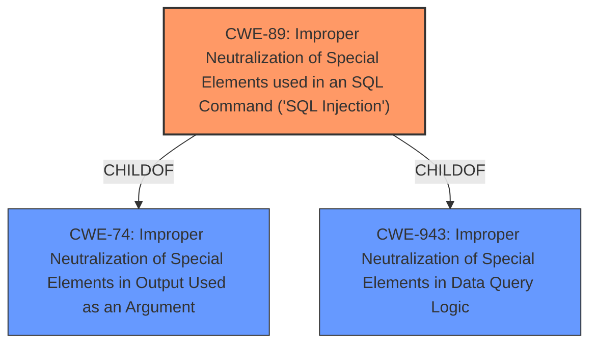

# Analysis Report for CVE-2025-3107

# Vulnerability Analysis Report: CVE-2025-3107

## Description

The Newsletters plugin for WordPress is vulnerable to **time-based SQL Injection** via the orderby parameter in all versions up to, and including, 4.9.9.8 due to **insufficient escaping on the user supplied parameter and lack of sufficient preparation on the existing SQL query**. This makes it possible for authenticated attackers, with Contributor-level access and above, to append additional SQL queries into already existing queries that can be used to extract sensitive information from the database.

## Vulnerability Description Key Phrases

- **Rootcause:** insufficient escaping on the user supplied parameter and lack of sufficient preparation on the existing SQL query
- **Weakness:** time-based SQL Injection
- **Impact:** extract sensitive information from the database
- **Vector:** orderby parameter
- **Attacker:** authenticated attackers with Contributor-level access and above
- **Product:** Newsletters plugin for WordPress
- **Version:** all versions up to and including 4.9.9.8

## Analysis (with Relationship Data)

# Summary
| CWE ID | CWE Name | Confidence | CWE Abstraction Level | CWE Vulnerability Mapping Label | CWE-Vulnerability Mapping Notes |
|---|---|---|---|---|---|
| CWE-89 | Improper Neutralization of Special Elements used in an SQL Command ('SQL Injection') | 1.0 | Base | Primary | Allowed |

## Evidence and Confidence

*   **Confidence Score:** 1.0
*   **Evidence Strength:** HIGH

## Relationship Analysis
The primary CWE, CWE-89, is a base-level CWE, which is the preferred level of abstraction. CWE-89 is a child of CWE-74 (Improper Neutralization of Special Elements in Output Used as an Argument) and CWE-943 (Improper Neutralization of Special Elements in Data Query Logic). This hierarchical relationship confirms that the chosen CWE is appropriately specific for this vulnerability, as it directly addresses the SQL injection issue rather than a more general neutralization problem.



## Vulnerability Chain
The vulnerability chain starts with **insufficient escaping on the user supplied parameter and lack of sufficient preparation on the existing SQL query**, leading to **time-based SQL Injection**, which allows attackers to extract sensitive information from the database. The root cause is clearly the **improper neutralization** of SQL special elements, making CWE-89 the appropriate primary weakness.

## Summary of Analysis
The analysis is strongly based on the vulnerability description, which explicitly mentions the presence of **time-based SQL Injection** due to **insufficient escaping** and **lack of preparation** in the SQL query.

The evidence is: "The Newsletters plugin for WordPress is vulnerable to **time-based SQL Injection** via the orderby parameter in all versions up to, and including, 4.9.9.8 due to **insufficient escaping on the user supplied parameter and lack of sufficient preparation on the existing SQL query**."

CWE-89 directly addresses this issue. The retriever results also strongly suggest CWE-89 as the primary weakness. The hierarchical relationships of CWE-89 confirm that it is the most specific and appropriate choice.

Other CWEs Considered:

*   CWE-79 (Improper Neutralization of Input During Web Page Generation ('Cross-site Scripting')): This was considered but rejected because the vulnerability is specifically related to SQL injection, not cross-site scripting.
*   CWE-116 (Improper Encoding or Escaping of Output): While encoding/escaping issues are related, CWE-89 is more specific to SQL injection.
*   CWE-90 (Improper Neutralization of Special Elements used in an LDAP Query ('LDAP Injection')): This is specific to LDAP, not SQL.
*   CWE-434 (Unrestricted Upload of File with Dangerous Type): This is unrelated to the described vulnerability.
*   CWE-352 (Cross-Site Request Forgery (CSRF)): CSRF is a different type of vulnerability.
*   CWE-502 (Deserialization of Untrusted Data): Deserialization issues are not relevant here.
*   CWE-943 (Improper Neutralization of Special Elements in Data Query Logic): This is a parent of CWE-89, so CWE-89 is more specific.

Based on the above analysis, CWE-89 is the optimal choice because it directly addresses the root cause of the SQL injection vulnerability.


## CWE Relationship Analysis

Current CWEs represent these abstraction levels: .


### Vulnerability Chain Analysis

**Chain starting from CWE-90:**
- 90 (Improper Neutralization of Special Elements used in an LDAP Query ('LDAP Injection')) - ROOT


**Chain starting from CWE-89:**
- 89 (Improper Neutralization of Special Elements used in an SQL Command ('SQL Injection')) - ROOT


### CWE Relationship Diagram

```mermaid
graph TD
    classDef primary fill:#f96,stroke:#333,stroke-width:2px
    classDef secondary fill:#69f,stroke:#333
    classDef tertiary fill:#9e9,stroke:#333
```


*Report generated on 2025-07-14 18:07:07*
