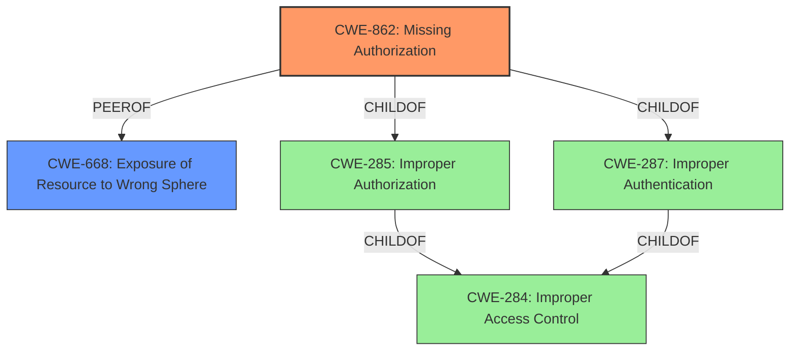

# Analysis Report for CVE-2025-3113

# Vulnerability Analysis Report: CVE-2025-3113

## Description

A valid, authenticated user with sufficient privileges and who is aware of Continuous Compliances internal database configurations can leverage the applications built-in Connector functionality to access Continuous Compliances internal database. This allows the user to explore the internal database schema and export its data, including the properties of Connecters and Rule Sets.

## Vulnerability Description Key Phrases

- **Impact:** access Continuous Compliances internal database
- **Attacker:** valid authenticated user with sufficient privileges and who is aware of Continuous Compliances internal database configurations

## Analysis (with Relationship Data)

# Summary
| CWE ID | CWE Name | Confidence | CWE Abstraction Level | CWE Vulnerability Mapping Label | CWE-Vulnerability Mapping Notes |
|---|---|---|---|---|---|
| CWE-862 | Missing Authorization | 0.8 | Class | Primary | Allowed-with-Review |
| CWE-668 | Exposure of Resource to Wrong Sphere | 0.6 | Class | Secondary | Discouraged |

## Evidence and Confidence

*   **Confidence Score:** 0.7
*   **Evidence Strength:** MEDIUM

## Relationship Analysis
The primary relationship influencing my decision is the parent-child relationship. CWE-862 (Missing Authorization) is a child of CWE-287 (Improper Authentication) and CWE-285 (Improper Authorization). While the vulnerability description mentions a valid, authenticated user, the core issue is that authorization is **missing** for the Connector functionality, allowing access to the internal database. CWE-668 (Exposure of Resource to Wrong Sphere) is considered as a secondary CWE since the root cause is a missing authorization check leading to exposure. The chosen CWEs are at the Class level due to the limited information. A more specific Base CWE might be possible with additional details.



## Vulnerability Chain
The vulnerability chain starts with the **missing authorization** check (CWE-862) for the Connector functionality. This leads to a valid, authenticated user being able to access the internal database, resulting in the **exposure of the resource to the wrong sphere** (CWE-668).

Missing Authorization (CWE-862) -> Exposure of Resource to Wrong Sphere (CWE-668)

## Summary of Analysis
My assessment is primarily based on the provided evidence, specifically the vulnerability description stating that a valid, authenticated user with sufficient privileges can access the internal database due to the Connector functionality. The key phrase "**impact:** access Continuous Compliances internal database" and "**attacker:** valid authenticated user with sufficient privileges and who is aware of Continuous Compliances internal database configurations" point to a missing authorization check rather than an incorrect one.

The graph relationships influenced my decision by highlighting the hierarchical structure of access control related CWEs. While CWE-285 (Improper Authorization) was considered, the evidence strongly suggests that authorization is missing altogether, making CWE-862 the more appropriate choice. CWE-668 is a possible secondary weakness.

The selected CWEs are at the optimal level of specificity given the available information. While a more specific Base CWE might be possible, the current evidence supports the selection of CWE-862 as the primary weakness due to the **missing authorization** and CWE-668 as a secondary weakness of **exposure of resource to the wrong sphere**.

Relevant CWE Information:

# Enhanced Context (25 CWEs)
The following CWEs were identified as potentially relevant to this vulnerability:

## CWE-862: Missing Authorization
**Abstraction Level**: Class
**Similarity Score**: 1335.55
**Source**: sparse

**Description**:
The product does not perform an authorization check when an actor attempts to access a resource or perform an action.

**Mapping Guidance**:
- Usage: Allowed-with-Review
- Rationale: This CWE entry is a Class and might have Base-level children that would be more appropriate

## CWE-668: Exposure of Resource to Wrong Sphere
**Abstraction Level**: Class
**Similarity Score**: 0.77
**Source**: dense

**Description**:
The product exposes a resource to the wrong control sphere, providing unintended actors with inappropriate access to the resource.

**Mapping Guidance**:
- Usage: Discouraged
- Rationale: CWE-668 is high-level and is often misused as a catch-all when lower-level CWE IDs might be applicable. It is sometimes used for low-information vulnerability reports [REF-1287]. It is a level-1 Class (i.e., a child of a Pillar). It is not useful for trend analysis.

CWE-918, CWE-923, CWE-306, CWE-285, CWE-532, CWE-916, CWE-642 and CWE-322 are not selected because they do not fit with the description as well as CWE-862 and CWE-668.


## CWE Relationship Analysis

Current CWEs represent these abstraction levels: .


### Vulnerability Chain Analysis

**Chain starting from CWE-862:**
- 862 (Missing Authorization) - ROOT


**Chain starting from CWE-916:**
- 916 (Use of Password Hash With Insufficient Computational Effort) - ROOT


### CWE Relationship Diagram

```mermaid
graph TD
    classDef primary fill:#f96,stroke:#333,stroke-width:2px
    classDef secondary fill:#69f,stroke:#333
    classDef tertiary fill:#9e9,stroke:#333
```


*Report generated on 2025-07-14 18:09:42*
