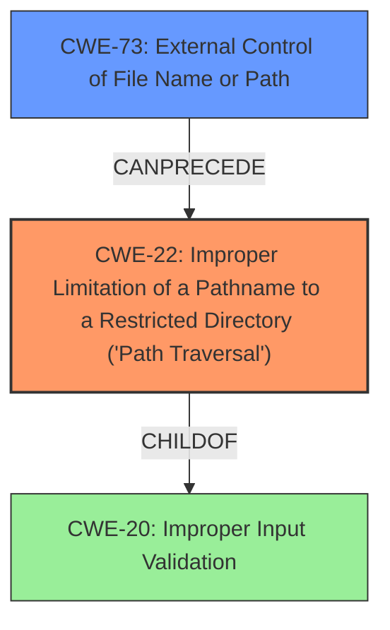

# Raw Analyzer Response for CVE-2025-31174

# Summary
| CWE ID | CWE Name | Confidence | CWE Abstraction Level | CWE Vulnerability Mapping Label | CWE-Vulnerability Mapping Notes |
|---|---|---|---|---|---|
| CWE-22 | Improper Limitation of a Pathname to a Restricted Directory ('Path Traversal') | 1.0 | Base | Allowed | Primary CWE. Matches the description of a path traversal vulnerability. |
| CWE-73 | External Control of File Name or Path | 0.7 | Base | Allowed | Secondary. The DFS module uses external input to control file names or paths. |

## Evidence and Confidence

*   **Confidence Score:** 0.9
*   **Evidence Strength:** HIGH

## Relationship Analysis
The primary weakness is CWE-22, which describes a path traversal vulnerability. CWE-73 is a related weakness where user input controls file names or paths, which can lead to path traversal. CWE-22 is a more specific case of **improper** input validation, while CWE-73 describes how external input is used to influence paths or filenames, a prerequisite for path traversal.

## Vulnerability Chain
The vulnerability chain starts with external control of a file name or path (CWE-73). This leads to **improper** limitation of a pathname to a restricted directory, resulting in a path traversal vulnerability (CWE-22). The **impact** is a potential compromise of service confidentiality.

## Summary of Analysis
The vulnerability description clearly states a "**path traversal vulnerability**" in the DFS module. The CVE Reference Links Content Summary reinforces this by stating "**Root cause of vulnerability: Path traversal vulnerability in the DFS module**" and "**Weaknesses/vulnerabilities present: Path traversal**".

The retriever results list CWE-22 as the top candidate with a high score and "alternate_terms" matching. CWE-22 (Improper Limitation of a Pathname to a Restricted Directory ('Path Traversal')) directly addresses the described vulnerability.

CWE-73 (External Control of File Name or Path) is also a relevant candidate, as it often precedes path traversal vulnerabilities. The DFS module likely allows some form of external input to influence file paths, which is then not properly validated, leading to the path traversal.

CWE-20 (Improper Input Validation) is too general and is discouraged.

Therefore, CWE-22 is the primary CWE, accurately representing the **root cause** of the vulnerability. CWE-73 is a secondary CWE, reflecting the external control aspect that enables the path traversal. The selection of CWE-22 is at the optimal level of specificity (Base) and directly aligns with the provided evidence.

Relevant CWE Information: