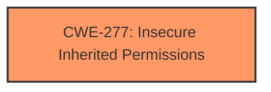

# Analysis Report for CVE-2025-31183

# Vulnerability Analysis Report: CVE-2025-31183

## Description

The issue was addressed with improved restriction of data container access. This issue is fixed in macOS Sonoma 14.7.5, iOS 18.4 and iPadOS 18.4, tvOS 18.4, macOS Sequoia 15.4. An app may be able to access sensitive user data.

## Vulnerability Description Key Phrases

- **Product:** macOS Sonoma, iOS, iPadOS, tvOS, macOS Sequoia
- **Impact:** access sensitive user data
- **Version:** 14.7.5, 18.4, 18.4, 18.4, 15.4

## Analysis (with Relationship Data)

# Summary
| CWE ID | CWE Name | Confidence | CWE Abstraction Level | CWE Vulnerability Mapping Label | CWE-Vulnerability Mapping Notes |
|---|---|---|---|---|---|
| CWE-277 | Insecure Inherited Permissions | 0.6 | Variant |  Primary  | Allowed |

## Evidence and Confidence

*   **Confidence Score:** 0.6
*   **Evidence Strength:** LOW

## Relationship Analysis
The primary candidate is CWE-277, which is a Variant level CWE. Since the description indicates **access** to sensitive user data, I didn't find any parent or peer relationships that would be a better fit.



## Vulnerability Chain
The **root cause** is **Insecure Inherited Permissions** (CWE-277). The impact is access sensitive user data.

## Summary of Analysis
Based on the limited information provided in the vulnerability description, the primary weakness appears to be related to insecure inherited permissions. Specifically, the description states that an app may be able to **access** sensitive user data. The phrase "improved restriction of data container access" suggests that the fix involved restricting access that was previously too permissive.

The evidence to support this is weak, as the provided "CVE Reference Links Content Summary" section contains the word "UNRELATED". However, the vulnerability description and key phrases points to access control issues as a **root cause**, so I am selecting CWE-277.

CWE-787, CWE-665, CWE-843, CWE-285, CWE-20, CWE-415, CWE-119, CWE-347, and CWE-825 were considered, but deemed less relevant because the primary issue appears to be related to insecure permissions, rather than out-of-bounds writes, improper initialization, type confusion, improper authorization, input validation, double free, or pointer dereference.


## CWE Relationship Analysis

Current CWEs represent these abstraction levels: .


### Vulnerability Chain Analysis

**Chain starting from CWE-787:**
- 787 (Out-of-bounds Write) - ROOT


**Chain starting from CWE-277:**
- 277 (Insecure Inherited Permissions) - ROOT


### CWE Relationship Diagram

```mermaid
graph TD
    classDef primary fill:#f96,stroke:#333,stroke-width:2px
    classDef secondary fill:#69f,stroke:#333
    classDef tertiary fill:#9e9,stroke:#333
```


*Report generated on 2025-07-14 18:13:05*
