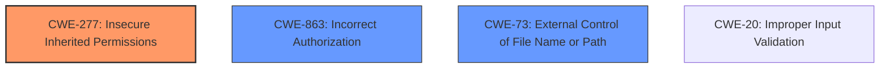

# Analysis for CVE-2025-31189

# Summary
| CWE ID    | CWE Name                                                          | Confidence | CWE Abstraction Level | CWE Vulnerability Mapping Label | CWE-Vulnerability Mapping Notes |
| :--------- | :---------------------------------------------------------------- | :--------- | :-------------------- | :------------------------------ | :------------------------------ |
| CWE-277   | Insecure Inherited Permissions                                    | 0.75       | Variant               | Allowed                         | Primary CWE                     |
| CWE-863   | CWE-863: Incorrect Authorization                                  | 0.65       | Class                 | Allowed-with-Review           | Secondary Candidate             |
| CWE-73    | CWE-73: External Control of File Name or Path                     | 0.60       | Base                  | Allowed                         | Secondary Candidate             |

## Evidence and Confidence

*   **Confidence Score:** 0.70
*   **Evidence Strength:** MEDIUM

## Relationship Analysis
The primary relationship considered was the parent-child relationship. While **file quarantine bypass** could potentially relate to improper input validation (**CWE-20: Improper Input Validation**), the fix involving "additional checks" suggests that permissions or access controls are more directly implicated. **CWE-277: Insecure Inherited Permissions** and **CWE-863: Incorrect Authorization** are related to access control, but **CWE-277: Insecure Inherited Permissions** is the closest fit because of the "sandbox" context, it describes insecure permissions that are inherited by object created by the program. **CWE-73: External Control of File Name or Path** relates to path manipulation.

## Vulnerability Chain
The vulnerability chain starts with **insecure inherited permissions** (**CWE-277: Insecure Inherited Permissions**), potentially leading to **incorrect authorization** (**CWE-863: Incorrect Authorization**), and ultimately resulting in the ability to **break out of the sandbox**. The **file quarantine bypass** acts as a facilitator in this chain.

## Summary of Analysis
The primary decision driver was the "sandbox breakout" impact, combined with the fix being "additional checks". This strongly suggests a problem with how permissions are managed within the sandboxed environment. I'm favoring **CWE-277: Insecure Inherited Permissions** because the vulnerability description explicitly mentions breaking out of the sandbox. This aligns well with the concept of inherited permissions being incorrectly configured, leading to a bypass of the intended security restrictions.

The evidence supporting **CWE-277: Insecure Inherited Permissions** is derived from:
*   "An app may be able to break out of its sandbox" - This indicates a broken security boundary.
*   "A file quarantine bypass was addressed with additional checks" - This implies the initial checks were insufficient to prevent unauthorized access or actions within the sandbox.
*   The retriever results ranked **CWE-277: Insecure Inherited Permissions** as having some relevancy.

I considered **CWE-863: Incorrect Authorization** and **CWE-73: External Control of File Name or Path**, but they don't fully capture the sandbox context. **CWE-20: Improper Input Validation** is too broad, and the "additional checks" fix points towards a permissions-related issue rather than simply validating input.

The selected CWEs are at an optimal level of specificity because they directly relate to the core issue of sandbox security and the mechanisms used to bypass it.

Relevant CWE Information:

# Enhanced Context (25 CWEs)
The following CWEs were identified as potentially relevant to this vulnerability:

## CWE-203: Observable Discrepancy
**Abstraction Level**: Base
**Similarity Score**: 0.69
**Source**: dense

**Description**:
The product behaves differently or sends different responses under different circumstances in a way that is observable to an unauthorized actor, which exposes security-relevant information about the state of the product, such as whether a particular operation was successful or not.

**Mapping Guidance**:
- Usage: Allowed
- Rationale: This CWE entry is at the Base level of abstraction, which is a preferred level of abstraction for mapping to the root causes of vulnerabilities.

## CWE-212: Improper Removal of Sensitive Information Before Storage or Transfer
**Abstraction Level**: Base
**Similarity Score**: 0.69
**Source**: dense

**Description**:
The product stores, transfers, or shares a resource that contains sensitive information, but it does not properly remove that information before the product makes the resource available to unauthorized actors.

**Mapping Guidance**:
- Usage: Allowed
- Rationale: This CWE entry is at the Base level of abstraction, which is a preferred level of abstraction for mapping to the root causes of vulnerabilities.

## CWE-347: Improper Verification of Cryptographic Signature
**Abstraction Level**: Base
**Similarity Score**: 0.69
**Source**: dense

**Description**:
The product does not verify, or incorrectly verifies, the cryptographic signature for data.

**Mapping Guidance**:
- Usage: Allowed
- Rationale: This CWE entry is at the Base level of abstraction, which is a preferred level of abstraction for mapping to the root causes of vulnerabilities.

## CWE-125: Out-of-bounds Read
**Abstraction Level**: Base
**Similarity Score**: 0.68
**Source**: dense

**Description**:
The product reads data past the end, or before the beginning, of the intended buffer.

**Mapping Guidance**:
- Usage: Allowed
- Rationale: This CWE entry is at the Base level of abstraction, which is a preferred level of abstraction for mapping to the root causes of vulnerabilities.

## CWE-277: Insecure Inherited Permissions
**Abstraction Level**: Variant
**Similarity Score**: 0.68
**Source**: dense

**Description**:
A product defines a set of insecure permissions that are inherited by objects that are created by the program.

**Mapping Guidance**:
- Usage: Allowed
- Rationale: This CWE entry is at the Variant level of abstraction, which is a preferred level of abstraction for mapping to the root causes of vulnerabilities.

## CWE-59: Improper Link Resolution Before File Access ('Link Following')
**Abstraction Level**: Base
**Similarity Score**: 0.68
**Source**: dense

**Description**:
The product attempts to access a file based on the filename, but it does not properly prevent that filename from identifying a link or shortcut that resolves to an unintended resource.

**Mapping Guidance**:
- Usage: Allowed
- Rationale: This CWE entry is at the Base level of abstraction, which is a preferred level of abstraction for mapping to the root causes of vulnerabilities.

## CWE-843: Access of Resource Using Incompatible Type ('Type Confusion')
**Abstraction Level**: Base
**Similarity Score**: 0.68
**Source**: dense

**Description**:
The product allocates or initializes a resource such as a pointer, object, or variable using one type, but it later accesses that resource using a type that is incompatible with the original type.

**Mapping Guidance**:
- Usage: Allowed
- Rationale: This CWE entry is at the Base level of abstraction, which is a preferred level of abstraction for mapping to the root causes of vulnerabilities.

## CWE-451: User Interface (UI) Misrepresentation of Critical Information
**Abstraction Level**: Class
**Similarity Score**: 0.68
**Source**: dense

**Description**:
The user interface (UI) does not properly represent critical information to the user, allowing the information - or its source - to be obscured or spoofed. This is often a component in phishing attacks.

**Mapping Guidance**:
- Usage: Allowed-with-Review
- Rationale: This CWE entry is a Class and might have Base-level children that would be more appropriate

## CWE-367: Time-of-check Time-of-use (TOCTOU) Race Condition
**Abstraction Level**: Base
**Similarity Score**: 0.68
**Source**: dense

**Description**:
The product checks the state of a resource before using that resource, but the resource's state can change between the check and the use in a way that invalidates the results of the check. This can cause the product to perform invalid actions when the resource is in an unexpected state.

**Mapping Guidance**:
- Usage: Allowed
- Rationale: This CWE entry is at the Base level of abstraction, which is a preferred level of abstraction for mapping to the root causes of vulnerabilities.

## CWE-755: Improper Handling of Exceptional Conditions
**Abstraction Level**: Class
**Similarity Score**: 0.68
**Source**: dense

**Description**:
The product does not handle or incorrectly handles an exceptional condition.

**Mapping Guidance**:
- Usage