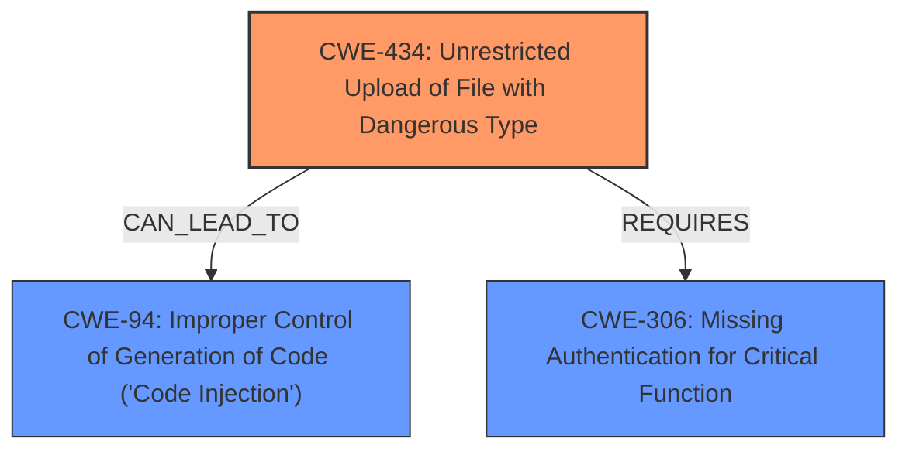

# Analysis Report for CVE-2025-3123

# Vulnerability Analysis Report: CVE-2025-3123

## Description

A vulnerability, which was classified as critical, has been found in WonderCMS 3.5.0. Affected by this issue is the function installUpdateModuleAction of the component Theme Installation/Plugin Installation. The manipulation leads to unrestricted upload. The attack may be launched remotely. The exploit has been disclosed to the public and may be used. The real existence of this vulnerability is still doubted at the moment. The vendor explains, that [t]he philosophy has always been, admin [...] bear responsibility to not install themes/plugins from untrusted sources.

## Vulnerability Description Key Phrases

- **Impact:** unrestricted upload
- **Product:** WonderCMS
- **Version:** 3.5.0
- **Component:** installUpdateModuleAction of the component Theme Installation/Plugin Installation

## Analysis (with Relationship Data)

# Summary
| CWE ID | CWE Name | Confidence | CWE Abstraction Level | CWE Vulnerability Mapping Label | CWE-Vulnerability Mapping Notes |
|---|---|---|---|---|---|
| CWE-434 | Unrestricted Upload of File with Dangerous Type | 1.0 | Base | Allowed | Primary CWE. The product allows the upload or transfer of dangerous file types that are automatically processed within its environment. |
| CWE-94 | Improper Control of Generation of Code ('Code Injection') | 0.7 | Base | Allowed-with-Review | Secondary CWE. The product constructs all or part of the source code for a program, script, or other code artifact, but it does not properly control the code that is generated. |
| CWE-306 | Missing Authentication for Critical Function | 0.6 | Base | Allowed | Secondary CWE. The product does not perform any authentication for functionality that requires a provable user identity or consumes a significant amount of resources. |

## Evidence and Confidence

*   **Confidence Score:** 0.8
*   **Evidence Strength:** HIGH

## Relationship Analysis
The primary CWE is CWE-434, which represents the **unrestricted upload** of a file. This can lead to CWE-94, **Improper Control of Generation of Code ('Code Injection')** if the uploaded file is processed and executed. CWE-306, **Missing Authentication for Critical Function**, could be present as the administrative functionality to upload and install themes/plugins may not require authentication, making the system vulnerable.



## Vulnerability Chain
The vulnerability chain starts with **unrestricted upload** (CWE-434), which is the **root cause**. If an attacker uploads a malicious file, it can lead to code injection (CWE-94), resulting in remote code execution. Lack of authentication on the upload functionality (CWE-306) allows the attacker to directly perform the upload.

## Summary of Analysis
The initial assessment focuses on the **unrestricted upload** of a malicious file, which leads to remote code execution. The evidence for this lies in the "Vulnerability Details" section of the CVE reference, which states that the `installUpdateModuleAction()` function downloads a ZIP file and extracts it without adequate validation. This aligns with CWE-434. The lack of authentication to perform such operation is a contributing factor.

The relationships influenced the selection by highlighting the potential progression from file upload to code injection. CWE-434 is the **root cause** because it directly enables the subsequent weaknesses. CWE-94 stems from this upload and execution, while CWE-306 is a prerequisite.

The selected CWEs are at the optimal level of specificity. CWE-434 is a Base-level weakness that accurately represents the **unrestricted file upload** issue. CWE-94 is a base-level weakness that represents the code injection. CWE-306 is a base-level weakness that represents the **missing authentication** on the critical function.

Relevant CWE Information:

# Enhanced Context (25 CWEs)
The following CWEs were identified as potentially relevant to this vulnerability:

## CWE-434: Unrestricted Upload of File with Dangerous Type
**Abstraction Level**: Base
**Similarity Score**: 0.82
**Source**: dense

**Description**:
The product allows the upload or transfer of dangerous file types that are automatically processed within its environment.

**Mapping Guidance**:
- Usage: Allowed
- Rationale: This CWE entry is at the Base level of abstraction, which is a preferred level of abstraction for mapping to the root causes of vulnerabilities.

## CWE-94: Improper Control of Generation of Code ('Code Injection')
**Abstraction Level**: base
**Similarity Score**: 2.28
**Source**: graph

**Description**:
CWE-94: Improper Control of Generation of Code ('Code Injection')

**Mapping Guidance**:
- Usage: Allowed-with-Review
- Rationale: This entry is frequently misused for vulnerabilities with a technical impact of "code execution," which does not by itself indicate a root cause weakness, since dozens of weaknesses can enable code execution.

## CWE-306: Missing Authentication for Critical Function
**Abstraction Level**: base
**Similarity Score**: 2.33
**Source**: graph

**Description**:
CWE-306: Missing Authentication for Critical Function

**Mapping Guidance**:
- Usage: Allowed
- Rationale: This CWE entry is at the Base level of abstraction, which is a preferred level of abstraction for mapping to the root causes of vulnerabilities.


## CWE Relationship Analysis

Current CWEs represent these abstraction levels: .


### Vulnerability Chain Analysis

**Chain starting from CWE-306:**
- 306 (Missing Authentication for Critical Function) - ROOT


**Chain starting from CWE-94:**
- 94 (Improper Control of Generation of Code ('Code Injection')) - ROOT


### CWE Relationship Diagram

```mermaid
graph TD
    classDef primary fill:#f96,stroke:#333,stroke-width:2px
    classDef secondary fill:#69f,stroke:#333
    classDef tertiary fill:#9e9,stroke:#333
```


*Report generated on 2025-07-14 18:23:15*
