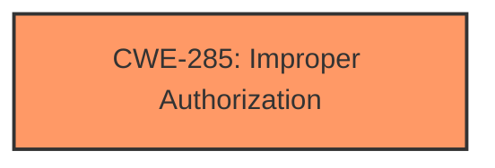

# Enhanced Analysis for CVE-2025-31232

# Summary
| CWE ID | CWE Name | Confidence | CWE Abstraction Level | CWE Vulnerability Mapping Label | CWE-Vulnerability Mapping Notes |
|---|---|---|---|---|---|
| CWE-285 | Improper Authorization | 0.75 | Class | Primary CWE | Discouraged |

## Evidence and Confidence

*   **Confidence Score:** 0.75
*   **Evidence Strength:** MEDIUM

## Relationship Analysis
The primary CWE identified is CWE-285, which is a Class-level CWE. While it's generally preferred to use Base or Variant level CWEs, the provided evidence points towards a general authorization issue, making CWE-285 the most suitable choice at this time. No clear parent-child or chain relationships are explicitly apparent in the provided vulnerability description.



## Vulnerability Chain
The vulnerability chain involves an initial **logic issue** leading to **improper authorization**, which ultimately allows a sandboxed app to access sensitive user data.

## Summary of Analysis
The assessment relies on the provided vulnerability description, which indicates a **logic issue** leading to a sandboxed app being able to access sensitive user data. The provided text lacks specific technical details about the root cause of the logic issue but the result allows unauthorized access to data. The "Retriever Results" suggest several potential CWEs, including CWE-787 (Out-of-bounds Write), CWE-843 (Access of Resource Using Incompatible Type ('Type Confusion')), and CWE-347 (Improper Verification of Cryptographic Signature). However, given the high-level description of a "**logic issue**" and the impact of accessing sensitive user data, CWE-285 (Improper Authorization) is the best fit.

CWE-285 is a Class-level CWE, and the mapping guidance discourages its direct usage when more specific Base or Variant level CWEs are available. However, the current vulnerability description does not provide enough detail to pinpoint a more specific cause. The mitigation, which involves "improved checks," further supports the idea of an authorization problem.

Other CWEs Considered and Rejected:

*   CWE-787 (Out-of-bounds Write), CWE-843 (Access of Resource Using Incompatible Type ('Type Confusion')): These CWEs imply memory corruption or type mismatch issues, which are not explicitly mentioned in the vulnerability description.
*   CWE-347 (Improper Verification of Cryptographic Signature): This CWE relates to cryptographic signature verification, which is not indicated in the vulnerability description.
*   CWE-20 (Improper Input Validation): While input validation issues can lead to authorization problems, the description focuses more on a general "logic issue" rather than specific input validation failures.
*   CWE-665 (Improper Initialization): This CWE relates to initialization issues, which are not explicitly mentioned in the vulnerability description.
*   CWE-415 (Double Free): This CWE relates to memory management and is not indicated in the vulnerability description.

In conclusion, based on the available evidence, CWE-285 (Improper Authorization) is the most appropriate CWE for this vulnerability.


## CWE Relationship Analysis

Current CWEs represent these abstraction levels: .


### Vulnerability Chain Analysis

**Chain starting from CWE-787:**
- 787 (Out-of-bounds Write) - ROOT


**Chain starting from CWE-843:**
- 843 (Access of Resource Using Incompatible Type ('Type Confusion')) - ROOT


### CWE Relationship Diagram

```mermaid
graph TD
    classDef primary fill:#f96,stroke:#333,stroke-width:2px
    classDef secondary fill:#69f,stroke:#333
    classDef tertiary fill:#9e9,stroke:#333
```