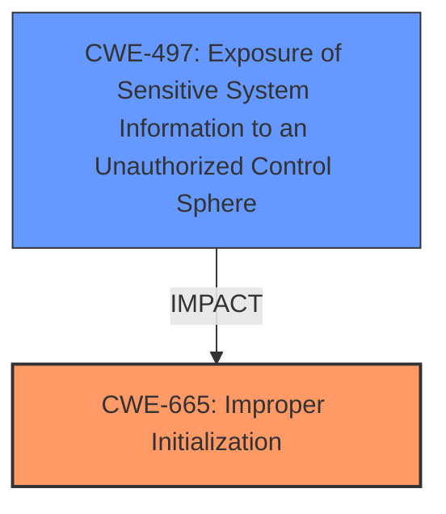

# Enhanced Analysis for CVE-2025-31247

# Summary
| CWE ID | CWE Name | Confidence | CWE Abstraction Level | CWE Vulnerability Mapping Label | CWE-Vulnerability Mapping Notes |
|---|---|---|---|---|---|
| CWE-665 | Improper Initialization | 0.6 | Class | Primary | Discouraged: May have lower-level children that would be more appropriate. Selected since the root cause is a **logic issue** which led to access of protected parts of the file system. |
| CWE-497 | Exposure of Sensitive System Information to an Unauthorized Control Sphere | 0.5 | Base | Secondary | Allowed: At the Base level of abstraction, which is a preferred level of abstraction for mapping to the root causes of vulnerabilities. Selected because the impact is to gain access to protected parts of the file system. |

## Evidence and Confidence

*   **Confidence Score:** 0.55
*   **Evidence Strength:** MEDIUM

## Relationship Analysis
The primary relationship considered was between CWE-665 and potential child CWEs that might represent more specific initialization problems. The relationship between the root cause (**logic issue**) and impact (access to protected parts of the file system) was also a key consideration. While the retriever results suggested several CWEs related to memory management (e.g., CWE-787, CWE-415), these were deemed less relevant given the lack of explicit memory corruption details in the vulnerability description.



## Vulnerability Chain
The vulnerability chain starts with a **logic issue** (potentially due to **Improper Initialization**), which leads to the attacker gaining access to protected parts of the file system (**Exposure of Sensitive System Information**).

## Summary of Analysis
The initial analysis focused on identifying the root cause and impact of the vulnerability. The vulnerability description explicitly mentions a **logic issue** that leads to an attacker gaining access to protected parts of the file system. The retriever results suggested several CWEs, but many were related to memory corruption, which isn't explicitly mentioned.

CWE-665 (Improper Initialization) was selected as the primary CWE because the root cause is a **logic issue** which can be a result of improper initialization. The "CVE Reference Links Content Summary" mentions that the **logic issue** is in "SharedFileList", which could be related to how the list is initialized or managed.

CWE-497 (Exposure of Sensitive System Information to an Unauthorized Control Sphere) was selected as a secondary CWE because the impact is that an attacker may gain access to protected parts of the file system.

The confidence level is medium (0.55) because the provided evidence is somewhat limited. The description of the **logic issue** is vague, making it challenging to pinpoint the exact nature of the weakness. Further information about the specific code or configuration error would be needed to improve the accuracy of the CWE mapping.

Other CWEs Considered:

*   CWE-787 (Out-of-bounds Write): This was considered due to its high score in the retriever results. However, the vulnerability description doesn't provide specific evidence of memory corruption or buffer overflows, so this CWE was not selected.
*   CWE-843 (Access of Resource Using Incompatible Type ('Type Confusion')): Similar to CWE-787, this CWE lacks direct evidence in the vulnerability description.
*   CWE-20 (Improper Input Validation): While this is a common weakness, it's too general for this vulnerability. The description points more towards a **logic issue** rather than a failure to validate input.
*   CWE-825 (Expired Pointer Dereference) and CWE-415 (Double Free): These were also considered but rejected due to the absence of memory-related details in the description.


## CWE Relationship Analysis

Current CWEs represent these abstraction levels: .


### Vulnerability Chain Analysis

**Chain starting from CWE-415:**
- 415 (Double Free) - ROOT


**Chain starting from CWE-787:**
- 787 (Out-of-bounds Write) - ROOT


### CWE Relationship Diagram

```mermaid
graph TD
    classDef primary fill:#f96,stroke:#333,stroke-width:2px
    classDef secondary fill:#69f,stroke:#333
    classDef tertiary fill:#9e9,stroke:#333
```