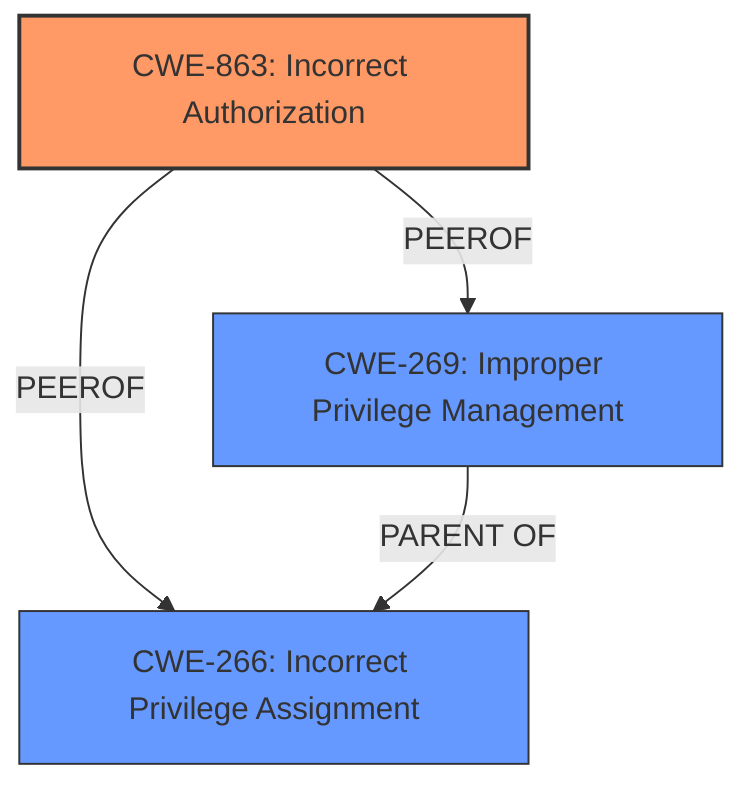

# Raw Analyzer Response for CVE-2025-31284

# Summary
| CWE ID | CWE Name | Confidence | CWE Abstraction Level | CWE Vulnerability Mapping Label | CWE-Vulnerability Mapping Notes |
|---|---|---|---|---|---|
| CWE-863 | Incorrect Authorization | 1 | Class | Primary | Allowed-with-Review |
| CWE-266 | Incorrect Privilege Assignment | 0.8 | Base | Secondary | Allowed |
| CWE-269 | Improper Privilege Management | 0.6 | Class | Secondary | Discouraged |

## Evidence and Confidence

*   **Confidence Score:** 0.8
*   **Evidence Strength:** HIGH

## Relationship Analysis
The primary CWE is CWE-863 (Incorrect Authorization), which is a Class-level CWE. Several other CWEs were considered, including CWE-266 (Incorrect Privilege Assignment) and CWE-269 (Improper Privilege Management). CWE-266 is a Base-level CWE and a more specific potential root cause than the class CWE-863. CWE-269 is a Class level CWE. The relationships between these CWEs are not explicitly defined in terms of direct parent-child relationships, but they all relate to access control and privilege management. The selection of CWE-863 as the primary CWE is based on the evidence indicating an authorization check was in place but incorrectly implemented, allowing privilege escalation. While CWE-266 could be a root cause, there isn't explicit mention of role misconfiguration, so it is a secondary mapping. Similarly, CWE-269 is a higher-level class and is too general.

## Vulnerability Chain
The vulnerability chain starts with **Incorrect Authorization (CWE-863)**, which allows an administrator to create users with the ability to change their account role and escalate privileges. This leads to the impact of privilege escalation.
  - **Root Cause**: CWE-863 - Incorrect Authorization
  - **Weakness**: Broken Access Control
  - **Impact**: Privilege Escalation

## Summary of Analysis
The initial assessment identified **broken access control** as the key phrase, leading to consideration of CWEs related to authorization and privilege management. The retriever results and the guidance on Authentication vs Authorization vs Access Control and Privileges vs Permissions were crucial in refining the selection.

The final decision to prioritize CWE-863 is based on the vulnerability description stating that an administrator could create users who could then change the role of the account and escalate privileges. This implies that an authorization check was present but flawed, aligning with the definition of CWE-863.

The selection of CWE-863 is at the optimal level of specificity because it accurately captures the essence of the vulnerability, where the authorization mechanism is present but implemented incorrectly. While CWE-266 (Incorrect Privilege Assignment) is a possibility, there isn't enough evidence to confirm that the roles were initially misconfigured, so it is marked as secondary.

Relevant CWE Information:
- Vulnerability Description Key Phrases:
  - **rootcause:** **broken access control vulnerability**
  - **impact:** create users who could then change the role of the account, escalate privileges
  - **attacker:** administrator

- CVE Reference Links Content Summary:
  - **Root cause of vulnerability:** Improper Privilege Management (CWE-269) leading to broken access control.
  - **Broken Access Control:** An administrator could create users who could then change their account role and escalate privileges.