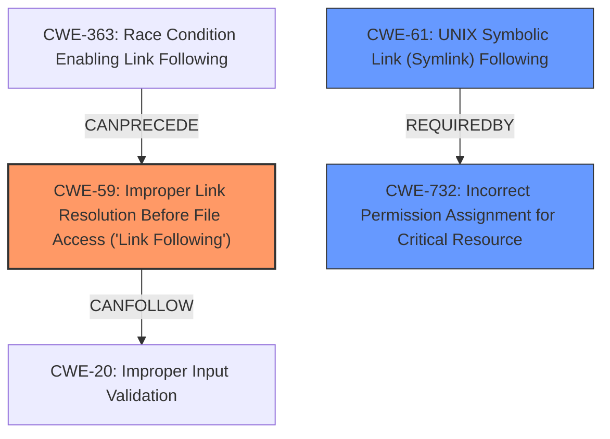

# Analysis Report for CVE-2025-31334

# Vulnerability Analysis Report: CVE-2025-31334

## Description

Issue that bypasses the Mark of the Web security warning function for files when opening a symbolic link that points to an executable file exists in WinRAR versions prior to 7.11. If a symbolic link specially crafted by an attacker is opened on the affected product, arbitrary code may be executed.

## Vulnerability Description Key Phrases

- **Weakness:** bypass the Mark of the Web security warning function for files
- **Impact:** execute arbitrary code
- **Vector:** symbolic link
- **Attacker:** attacker
- **Product:** WinRAR
- **Version:** prior to 7.11

## Analysis (with Relationship Data)

# Summary

| CWE ID | CWE Name | Confidence | CWE Abstraction Level | CWE Vulnerability Mapping Label | CWE-Vulnerability Mapping Notes |
|---|---|---|---|---|---|
| CWE-59 | Improper Link Resolution Before File Access ('Link Following') | 0.9 | Base | Allowed | Primary CWE - Root cause of the vulnerability is **improper link resolution**. |
| CWE-61 | UNIX Symbolic Link (Symlink) Following | 0.7 | Compound | Allowed | Secondary Candidate - Compound weakness involving symbolic links, but not specific to UNIX, and CWE-59 is more precise. |
| CWE-732 | Incorrect Permission Assignment for Critical Resource | 0.6 | Class | Allowed-with-Review | Secondary Candidate - Potentially related as the vulnerability bypasses security warnings which could be related to incorrect permission assignments, but CWE-59 addresses the root cause more directly. |

## Evidence and Confidence

*   **Confidence Score:** 0.8
*   **Evidence Strength:** MEDIUM

## Relationship Analysis
The primary CWE, CWE-59, is a base-level weakness related to improper handling of link resolution. CWE-61 is a compound weakness that encompasses scenarios involving symbolic links, but it's less specific than CWE-59. CWE-732 is a class-level weakness that could be related, as the vulnerability bypasses security warnings, but CWE-59 provides a more direct representation of the root cause. The abstraction level of CWE-59 (Base) makes it the most appropriate choice for mapping the vulnerability.



## Vulnerability Chain
The vulnerability chain starts with the **improper link resolution** (CWE-59). An attacker crafts a malicious symbolic link. When a user opens this link, it bypasses security checks (potentially related to CWE-732) and leads to arbitrary code execution.

## Summary of Analysis
The analysis is primarily based on the provided vulnerability description and the CVE reference link content summary. The description clearly indicates that the vulnerability involves bypassing the "Mark of the Web" security feature when opening a symbolic link. The root cause is the **improper handling of symbolic links**, allowing them to point to executable files without proper security checks.

The retriever results and graph relationships reinforce the selection of CWE-59 as the primary CWE. While other CWEs like CWE-61 (UNIX Symbolic Link Following) and CWE-732 (Incorrect Permission Assignment for Critical Resource) are considered, CWE-59 provides the most accurate and specific representation of the vulnerability's root cause.

The following excerpt from the CVE Reference Links Content Summary supports this decision:

"The vulnerability bypasses the 'Mark of the Web' security warning function for files when opening a symbolic link that points to an executable file."

This statement directly aligns with the description of CWE-59, which focuses on **improper link resolution** leading to unintended resource access.

CWE-59 is at the optimal level of specificity, as it identifies the **improper link resolution** as the root cause without being overly broad or abstract.

Relevant CWE Information:

# Enhanced Context (25 CWEs)

## CWE-59: Improper Link Resolution Before File Access ('Link Following')
**Abstraction Level**: Base
**Similarity Score**: 0.80
**Source**: dense

**Description**:
The product attempts to access a file based on the filename, but it does not properly prevent that filename from identifying a link or shortcut that resolves to an unintended resource.

**Mapping Guidance**:
- Usage: Allowed
- Rationale: This CWE entry is at the Base level of abstraction, which is a preferred level of abstraction for mapping to the root causes of vulnerabilities.

## CWE-61: UNIX Symbolic Link (Symlink) Following
**Abstraction Level**: Compound
**Similarity Score**: 0.79
**Source**: dense

**Description**:
The product, when opening a file or directory, does not sufficiently account for when the file is a symbolic link that resolves to a target outside of the intended control sphere. This could allow an attacker to cause the product to operate on unauthorized files.

**Mapping Guidance**:
- Usage: Allowed
- Rationale: This is a well-known Composite of multiple weaknesses that must all occur simultaneously, although it is attack-oriented in nature.

## CWE-732: Incorrect Permission Assignment for Critical Resource
**Abstraction Level**: class
**Similarity Score**: 2.48
**Source**: graph

**Description**:
CWE-732: Incorrect Permission Assignment for Critical Resource

**Mapping Guidance**:
- Usage: Allowed-with-Review
- Rationale: While the name itself indicates an assignment of permissions for resources, this is often misused for vulnerabilities in which "permissions" are not checked, which is an "authorization" weakness (CWE-285 or descendants) within CWE's model [REF-1287].

**Relationships**:
- PARENTOF -> CWE-766
- REQUIREDBY -> CWE-689
- REQUIREDBY -> CWE-61
- PARENTOF -> CWE-281
- PARENTOF -> CWE-279

### CWEs Considered but Not Used:

*   **CWE-22 Improper Limitation of a Pathname to a Restricted Directory ('Path Traversal') and CWE-23 Relative Path Traversal:** These CWEs relate to path traversal vulnerabilities, but the primary issue here is the **improper handling of symbolic links**, not necessarily traversing directories outside of allowed paths.
*   **CWE-78 Improper Neutralization of Special Elements used in an OS Command ('OS Command Injection'):** While the ultimate impact is arbitrary code execution, the vulnerability's root cause is not related to command injection.
*   **CWE-20 Improper Input Validation:** This is a very broad category, and the specific issue of link resolution is better captured by CWE-59.
*   **CWE-64 Windows Shortcut Following (.LNK):** This is specific to Windows shortcuts, while the description mentions symbolic links, which are a more general concept (although this might be applicable in Windows as well).
*   **CWE-65 Windows Hard Link:** This is related to hard links, while the primary issue is with symbolic links as noted in the description.
*   **CWE-386 Symbolic Name not Mapping to Correct Object:** Although this might be happening, the main weakness is the **improper handling of link resolution**, not that symbolic names are not mapping correctly.


## CWE Relationship Analysis

Current CWEs represent these abstraction levels: .


### Vulnerability Chain Analysis

**Chain starting from CWE-732:**
- 732 (Incorrect Permission Assignment for Critical Resource) - ROOT


**Chain starting from CWE-22:**
- 22 (Improper Limitation of a Pathname to a Restricted Directory ('Path Traversal')) - ROOT


### CWE Relationship Diagram

```mermaid
graph TD
    classDef primary fill:#f96,stroke:#333,stroke-width:2px
    classDef secondary fill:#69f,stroke:#333
    classDef tertiary fill:#9e9,stroke:#333
```


*Report generated on 2025-07-14 18:33:30*
