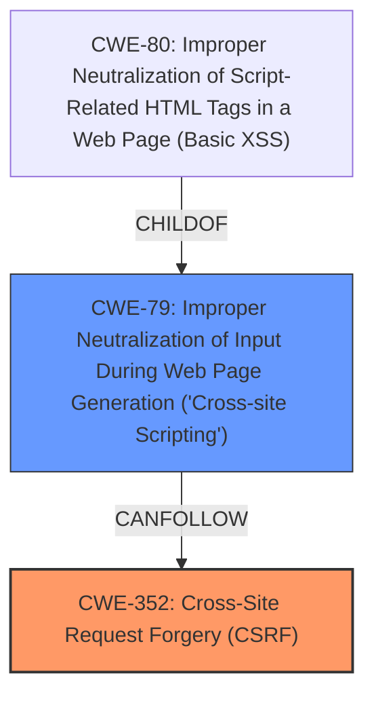

# Analysis Report for CVE-2025-31399

# Vulnerability Analysis Report: CVE-2025-31399

## Description

Cross-Site Request Forgery (CSRF) vulnerability in Chandan Garg CG Scroll To Top allows Stored **XSS**. This issue affects CG Scroll To Top from n/a through 3.5.

## Vulnerability Description Key Phrases

- **Rootcause:** lack of CSRF protection
- **Weakness:** ['Cross-Site Scripting', 'XSS']
- **Product:** Chandan Garg CG Scroll To Top
- **Version:** n/a through 3.5

## Analysis (with Relationship Data)

# Summary
| CWE ID | CWE Name | Confidence | CWE Abstraction Level | CWE Vulnerability Mapping Label | CWE-Vulnerability Mapping Notes |
|---|---|---|---|---|---|
| CWE-352 | Cross-Site Request Forgery (CSRF) | 1.0 | Compound | Allowed | Primary CWE: **lack of CSRF protection** |
| CWE-79 | Improper Neutralization of Input During Web Page Generation ('Cross-site Scripting') | 1.0 | Base | Allowed | Secondary CWE: Stored **XSS** |

## Evidence and Confidence

*   **Confidence Score:** 1.0
*   **Evidence Strength:** HIGH

## Relationship Analysis
The analysis focuses on two primary weaknesses: **lack of CSRF protection** (CWE-352) and Stored **XSS** (CWE-79). CWE-352 is a compound weakness, representing the **failure** to verify the legitimacy of requests. CWE-79 is a base-level weakness that arises from **improper neutralization** of user-controllable input. There is no explicit parent-child relationship between these two, but they can exist in a chain where **lack of CSRF protection** allows an attacker to inject malicious scripts, leading to **XSS**.



## Vulnerability Chain
1.  **Root Cause:** **Lack of CSRF protection** (CWE-352) allows unauthorized requests.
2.  **Weakness:** Improper Neutralization of Input (CWE-79) in the application.
3.  **Impact:** Stored **XSS** vulnerability exploitable due to the ability to inject malicious scripts.

## Summary of Analysis
The primary root cause is the **lack of CSRF protection**, which is evident from the vulnerability description. This allows attackers to inject malicious scripts into the application, leading to a Stored **XSS** vulnerability. The evidence clearly supports mapping the root cause to CWE-352, and the resulting weakness to CWE-79. The retriever scores and mapping guidance both support these selections. The selected CWEs are at the optimal level of specificity, with CWE-352 being a compound weakness and CWE-79 being a base-level weakness.

**CWE-352: Cross-Site Request Forgery (CSRF)** is the primary CWE because the vulnerability description specifically mentions a **lack of CSRF protection**. The description of CWE-352, "The web application does not, or can not, sufficiently verify whether a well-formed, valid, consistent request was intentionally provided by the user who submitted the request," directly aligns with this vulnerability.

**CWE-79: Improper Neutralization of Input During Web Page Generation ('Cross-site Scripting')** is a secondary CWE because the vulnerability leads to Stored **XSS**. The description of CWE-79, "The product does not neutralize or incorrectly neutralizes user-controllable input before it is placed in output that is used as a web page that is served to other users," aligns with this vulnerability because the application **fails** to properly sanitize input, leading to the ability to inject malicious scripts.

CWEs Considered but Not Used:

*   CWE-434: Unrestricted Upload of File with Dangerous Type - This CWE was considered but not used because the vulnerability description does not mention anything about file uploads.
*   CWE-116: Improper Encoding or Escaping of Output - This CWE was considered but not used because while related to **XSS**, CWE-79 is a more direct and specific match for the **improper neutralization** of input.
*   CWE-80: Improper Neutralization of Script-Related HTML Tags in a Web Page (Basic XSS) - While related to **XSS**, CWE-79 is a more general category, and it is preferred because the provided text does not explicitly state that the vulnerability involves script-related HTML tags.
*   CWE-22: Improper Limitation of a Pathname to a Restricted Directory ('Path Traversal') - This CWE was considered but is not related to the **XSS** or **CSRF** vulnerabilities described.
*   CWE-611: Improper Restriction of XML External Entity Reference - This CWE was considered but is not related to the **XSS** or **CSRF** vulnerabilities described.


## CWE Relationship Analysis

Current CWEs represent these abstraction levels: .


### Vulnerability Chain Analysis

**Chain starting from CWE-611:**
- 611 (Improper Restriction of XML External Entity Reference) - ROOT


**Chain starting from CWE-116:**
- 116 (Improper Encoding or Escaping of Output) - ROOT


### CWE Relationship Diagram

```mermaid
graph TD
    classDef primary fill:#f96,stroke:#333,stroke-width:2px
    classDef secondary fill:#69f,stroke:#333
    classDef tertiary fill:#9e9,stroke:#333
```


*Report generated on 2025-07-14 18:39:26*
