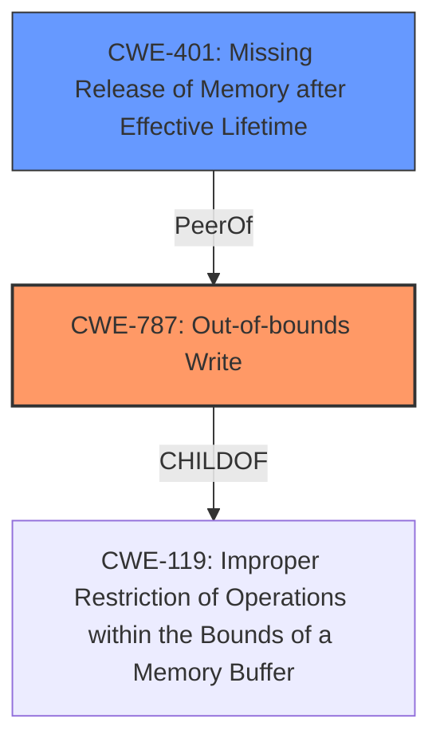

# Analysis Report for CVE-2025-3145

# Vulnerability Analysis Report: CVE-2025-3145

## Description

A vulnerability, which was classified as problematic, has been found in MindSpore 2.5.0. Affected by this issue is the function mindspore.numpy.fft.rfft2. The manipulation leads to **memory corruption**. The attack needs to be approached locally. The exploit has been disclosed to the public and may be used.

## Vulnerability Description Key Phrases

- **Weakness:** memory corruption
- **Product:** MindSpore
- **Version:** 2.5.0
- **Component:** mindspore.numpy.fft.rfft2

## Analysis (with Relationship Data)

# Summary
| CWE ID | CWE Name | Confidence | CWE Abstraction Level | CWE Vulnerability Mapping Label | CWE-Vulnerability Mapping Notes |
|---|---|---|---|---|---|
| CWE-787 | Out-of-bounds Write | 0.9 | Base | Primary | Allowed |
| CWE-401 | Missing Release of Memory after Effective Lifetime | 0.6 | Variant | Secondary | Allowed |

## Evidence and Confidence

*   **Confidence Score:** 0.75
*   **Evidence Strength:** MEDIUM

## Relationship Analysis
The primary CWE is CWE-787 (**Out-of-bounds Write**), which is a base-level CWE. It has hierarchical relationships with CWE-119 (**Improper Restriction of Operations within the Bounds of a Memory Buffer**). CWE-401 (**Missing Release of Memory after Effective Lifetime**) is a variant and a peer of other memory management issues. The selection of CWE-787 is at the optimal level of specificity, as it directly describes the **memory corruption** due to an out-of-bounds write. CWE-401 (**Missing Release of Memory after Effective Lifetime**) can be a consequence of the memory corruption.



## Vulnerability Chain
The vulnerability chain starts with the **improper handling of input** within the `mindspore.numpy.fft.rfft2` function, leading to an **out-of-bounds write** (CWE-787), which in turn results in **memory corruption**. The memory corruption can lead to a **missing release of memory** (CWE-401), and ultimately a denial-of-service.

## Summary of Analysis
The analysis is based on the provided vulnerability description and the CVE reference links content summary. The key evidence is the phrase "**memory corruption**" in the vulnerability description and the segmentation fault described in the CVE reference links, which points to a memory access error. The Retriever results also list CWE-787 (**Out-of-bounds Write**) as the top candidate, which supports this assessment. The graph relationships show that CWE-787 is a child of CWE-119, indicating that it's a specific type of memory boundary violation. CWE-401 (**Missing Release of Memory after Effective Lifetime**) is a variant and a peer of other memory management issues.

The selected CWEs are at the optimal level of specificity because they directly describe the **root cause** (**out-of-bounds write**) and a potential consequence (**missing memory release**).

**CWE Considerations:**

*   **CWE-125 (Out-of-bounds Read):** This was considered but not selected because the primary issue is **memory corruption**, which more strongly suggests an out-of-bounds write rather than a read.
*   **CWE-190 (Integer Overflow or Wraparound):** This was considered because an integer overflow could potentially lead to an out-of-bounds write. However, there is no direct evidence of an integer overflow in the provided description.
*   **CWE-476 (NULL Pointer Dereference):** There is no mention or implication of a NULL pointer dereference so this was not selected.
*   **CWE-79 (Improper Neutralization of Input During Web Page Generation ('Cross-site Scripting')) and CWE-89 (Improper Neutralization of Special Elements used in an SQL Command ('SQL Injection'))**: These are related to injection issues, and are not applicable here.
*   **CWE-1284 (Improper Validation of Specified Quantity in Input)**: Although there is an "axes" parameter that might need to be explicitly specified, there is no further evidence to suggest that this is the weakness root cause.
*   **CWE-401 (Missing Release of Memory after Effective Lifetime)**: This was considered as a potential secondary CWE because memory corruption can lead to memory leaks or other memory management issues. While not the root cause, it's a plausible consequence.
*   **CWE-703 (Improper Check or Handling of Exceptional Conditions) and CWE-755 (Improper Handling of Exceptional Conditions)**: These are too high-level and do not provide enough specificity for the vulnerability.

# Relevant CWE Information:

## CWE-787: Out-of-bounds Write
The product writes data past the end, or before the beginning, of the intended buffer. The manipulation leads to **memory corruption** as per the description. This directly aligns with the vulnerability's description of **memory corruption** caused by manipulating the `mindspore.numpy.fft.rfft2` function. The security implication is a denial-of-service (DoS) due to the segmentation fault.

## CWE-401: Missing Release of Memory after Effective Lifetime
The product does not release memory after it has been used, which can lead to resource exhaustion or other memory-related issues. This is a potential consequence of the memory corruption (CWE-787) caused by the out-of-bounds write. While not the primary cause, it can exacerbate the impact and lead to further instability.


## CWE Relationship Analysis

Current CWEs represent these abstraction levels: .


### Vulnerability Chain Analysis

**Chain starting from CWE-89:**
- 89 (Improper Neutralization of Special Elements used in an SQL Command ('SQL Injection')) - ROOT


**Chain starting from CWE-1284:**
- 1284 (Improper Validation of Specified Quantity in Input) - ROOT


### CWE Relationship Diagram

```mermaid
graph TD
    classDef primary fill:#f96,stroke:#333,stroke-width:2px
    classDef secondary fill:#69f,stroke:#333
    classDef tertiary fill:#9e9,stroke:#333
```


*Report generated on 2025-07-14 18:45:03*
