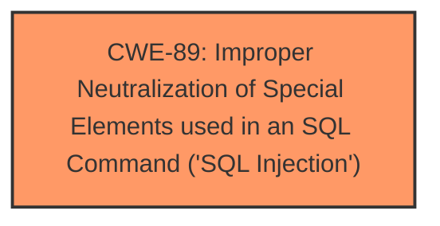

# Analysis for CVE-2025-3146

# Summary

| CWE ID | CWE Name | Confidence | CWE Abstraction Level | CWE Vulnerability Mapping Label | CWE-Vulnerability Mapping Notes |
|---|---|---|---|---|---|
| CWE-89 | Improper Neutralization of Special Elements used in an SQL Command ('SQL Injection') | 1.0 | Base | Allowed | Primary CWE |

## Evidence and Confidence

*   **Confidence Score:** 1.0
*   **Evidence Strength:** HIGH

## Relationship Analysis
The primary relationship identified is that CWE-89 stands alone as the root cause in this case. There are no clear parent-child or chain relationships that are relevant based on the provided information. The focus is specifically on the **improper neutralization** leading to **SQL Injection**.

## Vulnerability Chain
The vulnerability chain consists of a single step:

1.  **Root Cause:** **Improper Neutralization** of input leading to **SQL Injection (CWE-89)**.

There are no subsequent impacts or missing links identified from the description.

## Summary of Analysis
The analysis is based on the vulnerability description indicating an **SQL Injection** vulnerability due to the manipulation of the `viewid` argument in the `/view-pass-detail.php` file of the PHPGurukul Bus Pass Management System 1.0. The key phrase "**sql injection**" directly points to **CWE-89**.

The retriever results also list **CWE-89** as the top candidate with a score of 1.0, reinforcing this choice. The description of **CWE-89** aligns perfectly with the vulnerability, stating that the product constructs an SQL command using externally influenced input without proper neutralization of special elements.

I considered other CWEs such as **CWE-79** (Cross-site Scripting), **CWE-434** (Unrestricted Upload of File with Dangerous Type), and **CWE-74** (Improper Neutralization of Special Elements in Output Used by a Downstream Component ('Injection')), but these were not applicable as the vulnerability is explicitly related to **SQL Injection**. **CWE-74** is a Class-level CWE and is discouraged when more specific Base-level CWEs are available, such as **CWE-89**.

My assessment is based heavily on the explicit mention of "**sql injection**" in the vulnerability description. Given the direct evidence and the retriever results, I am confident in assigning **CWE-89** as the primary and only CWE for this vulnerability.