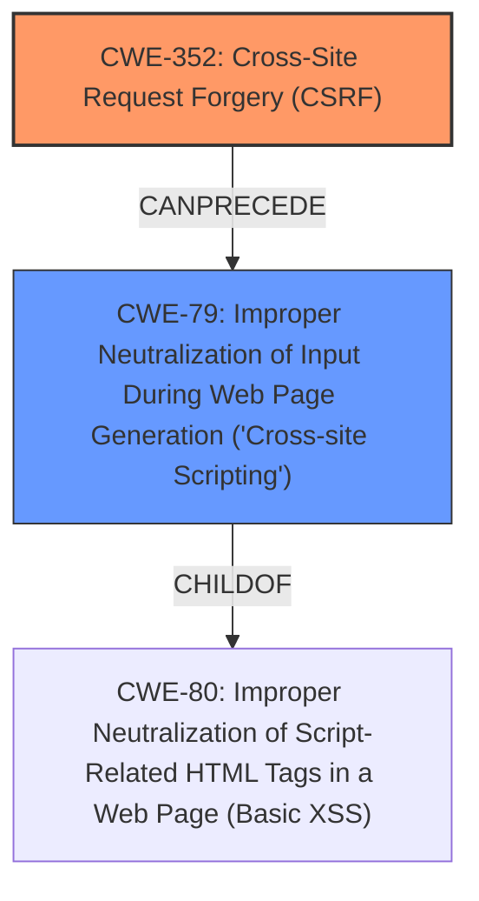

# Raw Analyzer Response for CVE-2025-31460

# Summary
| CWE ID | CWE Name | Confidence | CWE Abstraction Level | CWE Vulnerability Mapping Label | CWE-Vulnerability Mapping Notes |
|---|---|---|---|---|---|
| CWE-352 | Cross-Site Request Forgery (CSRF) | 0.9 | Compound | Primary | Allowed |
| CWE-79 | Improper Neutralization of Input During Web Page Generation ('Cross-site Scripting') | 0.8 | Base | Secondary | Allowed |

## Evidence and Confidence

*   **Confidence Score:** 0.85
*   **Evidence Strength:** HIGH

## Relationship Analysis
The primary weakness is CWE-352, which is a compound weakness. The secondary weakness is CWE-79, which is a base weakness. CWE-352 requires multiple weaknesses to occur simultaneously. The relationship between CWE-352 and CWE-79 is that the **CSRF** vulnerability can lead to **XSS** if the attacker is able to inject malicious code into the application.

## Vulnerability Chain
The vulnerability chain starts with **CSRF** (CWE-352), which allows an attacker to trick a user into performing actions they did not intend to. If the application does not properly neutralize user-controllable input, this can lead to Stored **XSS** (CWE-79). The root cause is the **lack of CSRF protection**, leading to the **XSS** vulnerability.
  - CWE-352 (Cross-Site Request Forgery) - Root Cause
  - CWE-79 (Improper Neutralization of Input During Web Page Generation ('Cross-site Scripting')) - Impact

## Summary of Analysis
The vulnerability description clearly states the presence of both **CSRF** and Stored **XSS**. The analysis instructions specify to identify the most appropriate CWEs for each keyphrase and consider how they relate to each other.

The description states: "Cross-Site Request Forgery (**CSRF**) vulnerability in danielmuldernl OmniLeads Scripts and Tags Manager allows Stored **XSS**."

Based on the provided information, the primary CWE is CWE-352 (Cross-Site Request Forgery), as it's the initial vulnerability. The secondary CWE is CWE-79 (Improper Neutralization of Input During Web Page Generation ('Cross-site Scripting')), as the **CSRF** vulnerability allows for Stored **XSS**.

CWE-80 was considered, but CWE-79 is a better fit as it describes the broader issue of improper neutralization, while CWE-80 is more specific to script-related HTML tags.

The selected CWEs are at the optimal level of specificity. CWE-352 is a compound weakness that accurately represents the **CSRF** vulnerability, and CWE-79 is a base weakness that accurately represents the **XSS** vulnerability.