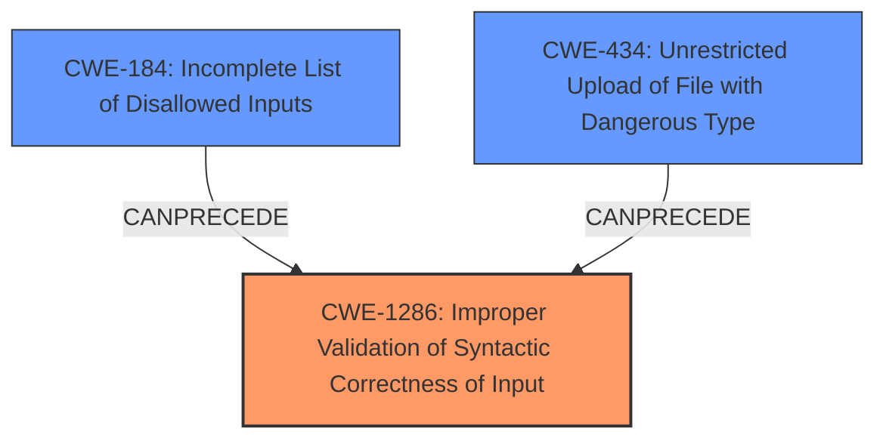

# Enhanced Analysis for CVE-2025-31477

# Summary
| CWE ID | CWE Name | Confidence | CWE Abstraction Level | CWE Vulnerability Mapping Label | CWE-Vulnerability Mapping Notes |
|---|---|---|---|---|---|
| CWE-1286 | Improper Validation of Syntactic Correctness of Input | 0.9 | Base | Allowed | Primary CWE |
| CWE-434 | Unrestricted Upload of File with Dangerous Type | 0.4 | Base | Allowed | Secondary Candidate |
| CWE-184 | Incomplete List of Disallowed Inputs | 0.4 | Base | Allowed | Secondary Candidate |

## Evidence and Confidence

*   **Confidence Score:** 0.7
*   **Evidence Strength:** MEDIUM

## Relationship Analysis
The primary CWE is CWE-1286, representing the **improper validation**. CWE-184 and CWE-434 were also considered because the **improper validation** could lead to an incomplete list of disallowed inputs or the ability to upload dangerous file types. However, the initial **improper validation** is the core issue, making CWE-1286 the primary weakness.



## Vulnerability Chain
The vulnerability chain starts with the **improper validation of the allowed protocols** (CWE-1286), leading to the potential use of dangerous protocols and ultimately resulting in remote code execution.

CWE-1286 (Improper Validation) -> Use of Dangerous Protocols -> Remote Code Execution

## Summary of Analysis
The analysis is based on the provided evidence, particularly the vulnerability description and the CVE reference links summary. The root cause is clearly identified as the **improper validation of the allowed protocols**. This leads to a vulnerability where dangerous protocols can be used, potentially resulting in remote code execution. The selection of CWE-1286 is based on its direct relevance to the root cause and its base level of abstraction, which is preferred for mapping vulnerabilities.

The vulnerability description clearly states the **improper validation** is the core issue: "This default restriction was not functional due to **improper validation of the allowed protocols**, allowing for potentially dangerous protocols like file//, smb//, or nfs// and others to be opened by the system registered protocol handler."

The selection of CWE-1286 is at the appropriate level of specificity because it directly addresses the root cause - the **improper validation**. While other CWEs like CWE-184 and CWE-434 might be related, they are consequences of the **improper validation**, not the root cause itself.

Relevant CWE Information:

**CWE-1286: Improper Validation of Syntactic Correctness of Input**

*   How the vulnerability's details match the CWE's characteristics: The vulnerability involves **improper validation** of protocols, which aligns with CWE-1286's description of a product receiving input that is expected to be well-formed but failing to validate its syntax correctly.
*   The security implications and potential impact: The impact includes remote code execution due to the ability to use dangerous protocols.
*   Any parent-child relationships or chain patterns that influenced your mapping: The primary relationship is that **improper validation** leads to the exploitation of dangerous protocols.
*   Whether the weakness is primary or secondary in the vulnerability: This is the primary weakness, as it is the root cause of the vulnerability.
*   How the official MITRE mapping guidance influenced your decision: The MITRE mapping guidance recommends using base-level CWEs, and CWE-1286 is a base-level CWE that directly addresses the root cause.

**CWE-434: Unrestricted Upload of File with Dangerous Type**

*   How the vulnerability's details match the CWE's characteristics: The vulnerability allows for potentially dangerous protocols like `file://`, `smb://`, or `nfs://` to be opened. This could lead to the upload of files with dangerous types, which aligns with CWE-434.
*   The security implications and potential impact: The impact includes remote code execution due to the ability to execute dangerous file types.
*   Any parent-child relationships or chain patterns that influenced your mapping: The primary relationship is that **improper validation** (CWE-1286) can lead to the ability to upload files with dangerous types (CWE-434).
*   Whether the weakness is primary or secondary in the vulnerability: This is a secondary weakness, as it is a potential consequence of the **improper validation**.
*   How the official MITRE mapping guidance influenced your decision: The MITRE mapping guidance recommends using base-level CWEs, and CWE-434 is a base-level CWE.

**CWE-184: Incomplete List of Disallowed Inputs**

*   How the vulnerability's details match the CWE's characteristics: The vulnerability involves an **improper validation** which can be viewed as an incomplete list of disallowed protocols.
*   The security implications and potential impact: The impact includes remote code execution due to the ability to use dangerous protocols.
*   Any parent-child relationships or chain patterns that influenced your mapping: The primary relationship is that the **improper validation** can be viewed as an incomplete list of disallowed inputs, which then leads to the execution of dangerous protocols.
*   Whether the weakness is primary or secondary in the vulnerability: This is a secondary weakness, as it is a consequence of the **improper validation**.
*   How the official MITRE mapping guidance influenced your decision: The MITRE mapping guidance recommends using base-level CWEs, and CWE-184 is a base-level CWE.

**CWEs Considered but Not Used:**

*   CWE-79 (Improper Neutralization of Input During Web Page Generation ('Cross-site Scripting')): While user input is involved, the primary issue is not related to web page generation or XSS. The vulnerability lies in the **improper validation** of protocols.
*   CWE-22 (Improper Limitation of a Pathname to a Restricted Directory ('Path Traversal')): Although the vulnerability involves file paths, it's not directly related to path traversal. The core issue is the **improper validation** of protocols, not the restriction of pathnames.
*   CWE-78 (Improper Neutralization of Special Elements used in an OS Command ('OS Command Injection')): The vulnerability does not directly involve OS command injection. While remote code execution is a potential impact, the root cause is the **improper validation** of protocols.
*   CWE-863 (Incorrect Authorization) and CWE-862 (Missing Authorization): While authorization issues might be present, the core problem is the **improper validation** of input rather than a missing or incorrect authorization check.


## CWE Relationship Analysis

Current CWEs represent these abstraction levels: .


### Vulnerability Chain Analysis

**Chain starting from CWE-863:**
- 863 (Incorrect Authorization) - ROOT


**Chain starting from CWE-862:**
- 862 (Missing Authorization) - ROOT


### CWE Relationship Diagram

```mermaid
graph TD
    classDef primary fill:#f96,stroke:#333,stroke-width:2px
    classDef secondary fill:#69f,stroke:#333
    classDef tertiary fill:#9e9,stroke:#333
```