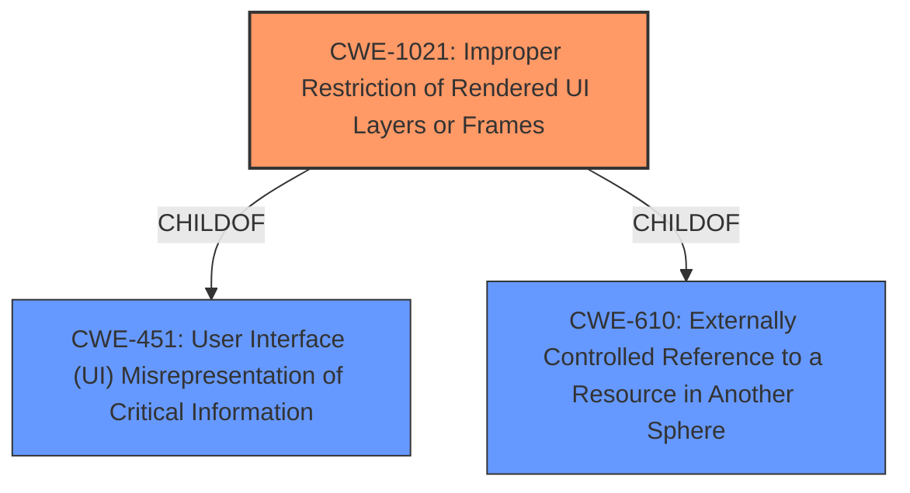

# Raw Analyzer Response for CVE-2025-31488

# Summary
| CWE ID | CWE Name | Confidence | CWE Abstraction Level | CWE Vulnerability Mapping Label | CWE-Vulnerability Mapping Notes |
|---|---|---|---|---|---|
| CWE-1021 | Improper Restriction of Rendered UI Layers or Frames | 0.75 | Base | Allowed | Primary CWE |
| CWE-610 | Externally Controlled Reference to a Resource in Another Sphere | 0.6 | Class | Discouraged | Secondary Candidate |

## Evidence and Confidence

*   **Confidence Score:** 0.7
*   **Evidence Strength:** MEDIUM

## Relationship Analysis
The primary CWE is CWE-1021, which is a base-level CWE and a child of CWE-451 and CWE-610. This indicates a hierarchical relationship where CWE-1021 is a more specific instance of a broader class. The choice of CWE-1021 is influenced by its direct relevance to the vulnerability description, which involves improper restriction of rendered UI layers or frames.

## Vulnerability Chain
The vulnerability chain starts with the user using a malicious homepage provided by a third party. This homepage uses controls (like WebBrowser) which causes WPF to load the page in Internet Explorer (IE) in the background. The **improper restriction** allows the attacker to access specified webpages without the user's knowledge, leading to potential compromise.

## Summary of Analysis
The initial assessment focused on identifying the root cause of the vulnerability described in CVE-2025-31488. The description highlights that Plain Craft Launcher (PCL) allows users to use third-party homepages, and when these homepages use controls like WebBrowser, WPF uses Internet Explorer to load the specified webpage. If the user uses a **malicious homepage**, the attacker can use IE in the background to access the specified webpage without the user's knowledge.

The retriever results suggested several CWEs, including CWE-94 (Improper Control of Generation of Code ('Code Injection')), CWE-522 (Insufficiently Protected Credentials), and CWE-1021 (Improper Restriction of Rendered UI Layers or Frames).

CWE-1021 (Improper Restriction of Rendered UI Layers or Frames) was chosen as the primary CWE because it directly addresses the **vulnerability** where a malicious homepage is able to leverage IE in the background without proper restrictions, allowing the attacker to access specified webpages. The evidence supporting this includes the vulnerability description stating that "If the user uses a **malicious homepage**, the attacker can use IE background to access the specified webpage without knowing it."

CWE-610 (Externally Controlled Reference to a Resource in Another Sphere) was considered as a secondary CWE because the homepage is externally controlled and references a resource (IE) outside the intended control sphere. However, it was not chosen as primary because CWE-1021 more accurately describes the **improper restriction** aspect of the vulnerability.

The selection of CWE-1021 is at the optimal level of specificity because it directly aligns with the base-level description of **improperly restricting** the rendered UI layers or frames, allowing a malicious actor to gain unauthorized access.

Relevant CWE Information:

# Enhanced Context (25 CWEs)
The following CWEs were identified as potentially relevant to this vulnerability:

## CWE-1021: Improper Restriction of Rendered UI Layers or Frames
**Abstraction Level**: base
**Similarity Score**: 2.47
**Source**: graph

**Description**:
CWE-1021: Improper Restriction of Rendered UI Layers or Frames

**Mapping Guidance**:
- Usage: Allowed
- Rationale: This CWE entry is at the Base level of abstraction, which is a preferred level of abstraction for mapping to the root causes of vulnerabilities.

**Relationships**:
- CHILDOF -> CWE-451
- CHILDOF -> CWE-610
- CHILDOF -> CWE-441
- PARENTOF -> CWE-1021
- PARENTOF -> CWE-1021