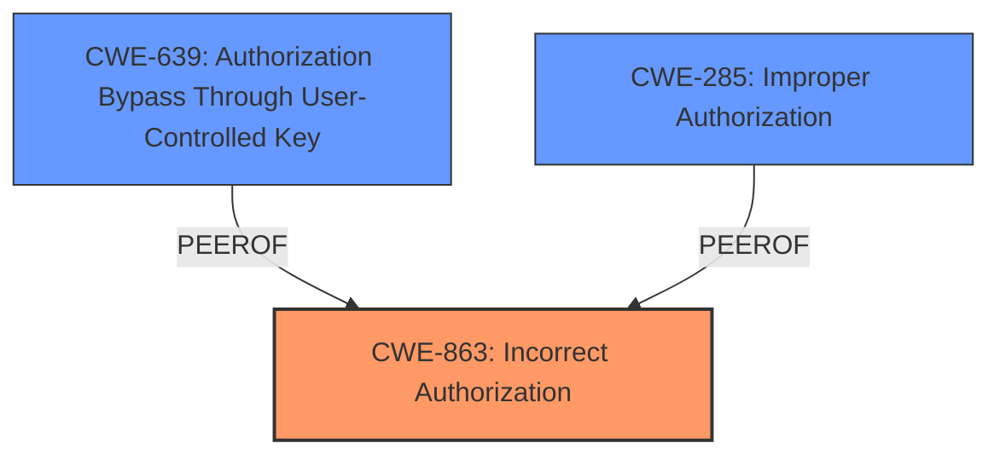

# Analysis Report for CVE-2025-31494

# Vulnerability Analysis Report: CVE-2025-31494

## Description

AutoGPT is a platform that allows users to create, deploy, and manage continuous artificial intelligence agents that automate complex workflows. The AutoGPT Platforms WebSocket API transmitted node execution updates to subscribers based on the graph_id+graph_version. Additionally, there was no check prohibiting users from subscribing with another users graph_id+graph_version. As a result, node execution updates from one users graph execution could be received by another user within the same instance. This vulnerability does not occur between different instances or between users and non-users of the platform. Single-user instances are not affected. In private instances with a user white-list, the impact is limited by the fact that all potential unintended recipients of these node execution updates must have been admitted by the administrator. This vulnerability is fixed in 0.6.1.

## Vulnerability Description Key Phrases

- **Rootcause:** improper access control
- **Weakness:** no check prohibiting users from subscribing with another user's graph_id+graph_version
- **Impact:** node execution updates from one user's graph execution could be received by another user
- **Product:** AutoGPT Platforms WebSocket API

## Analysis (with Relationship Data)

# Summary
| CWE ID | CWE Name | Confidence | CWE Abstraction Level | CWE Vulnerability Mapping Label | CWE-Vulnerability Mapping Notes |
|---|---|---|---|---|---|
| **CWE-863** | **Incorrect Authorization** | 0.9 | Class | Primary | Allowed-with-Review |
| CWE-639 | Authorization Bypass Through User-Controlled Key | 0.7 | Base | Secondary | Allowed |
| CWE-285 | Improper Authorization | 0.6 | Class | Secondary | Discouraged |

## Evidence and Confidence

*   **Confidence Score:** 0.9
*   **Evidence Strength:** HIGH

## Relationship Analysis
The primary CWE selected is CWE-863, Incorrect Authorization, because the vulnerability lies in the improper authorization checks when subscribing to node execution updates. CWE-863 is a class-level CWE, and while it would be preferable to have a base-level CWE, there are no base-level children of CWE-863 that perfectly fit. The advisory notes that the fix was to add the `user_id` to the WebSocket event subscription key. CWE-639, Authorization Bypass Through User-Controlled Key, is related because the `graph_id` and `graph_version` acted as keys that bypassed proper authorization checks. CWE-285, Improper Authorization, is a more general classification that could apply, but CWE-863 is more specific.



## Vulnerability Chain
The vulnerability chain starts with the **improper access control** due to the **lack of checks prohibiting users from subscribing with another user's graph_id+graph_version**. This leads to the impact where node execution updates from one user's graph execution could be received by another user. The root cause is the **incorrect authorization** (CWE-863) which allowed the bypass.

## Summary of Analysis
The primary CWE is CWE-863, Incorrect Authorization, because the application performs an authorization check (subscribing to updates) but does it incorrectly. The evidence for this is in the "Vulnerability Description Key Phrases" with the phrase "**rootcause:** **improper access control**" and "**weakness:** **no check prohibiting users from subscribing with another user's graph_id+graph_version**". The fix confirms this, because the `user_id` was added to the subscription key. This is also supported by the CVE Reference Links Content Summary which lists "**CWE-284:** Improper Access Control - Allowing subscriptions based solely on `graph_id` and `graph_version` without user context." While the CVE summary indicates CWE-284, and this is very closely related to CWE-863, the weakness is not just a missing authorization, but an incorrect one.

CWE-285 was considered, because it is a parent of CWE-863, but CWE-863 is more specific and accurate.

CWE-306 was not considered, because the users were authenticated and the issue was with authorization after authentication.

CWE-201, Insertion of Sensitive Information Into Sent Data, was not considered because the core issue wasn't the insertion of sensitive data, but the improper authorization that allowed users to receive data they shouldn't have.

# Enhanced Context (25 CWEs)
The following CWEs were identified as potentially relevant to this vulnerability:

## CWE-212: Improper Removal of Sensitive Information Before Storage or Transfer
**Abstraction Level**: Base
**Similarity Score**: 0.76
**Source**: dense

**Description**:
The product stores, transfers, or shares a resource that contains sensitive information, but it does not properly remove that information before the product makes the resource available to unauthorized actors.

**Mapping Guidance**:
- Usage: Allowed
- Rationale: This CWE entry is at the Base level of abstraction, which is a preferred level of abstraction for mapping to the root causes of vulnerabilities.


## CWE-668: Exposure of Resource to Wrong Sphere
**Abstraction Level**: Class
**Similarity Score**: 0.75
**Source**: dense

**Description**:
The product exposes a resource to the wrong control sphere, providing unintended actors with inappropriate access to the resource.

**Mapping Guidance**:
- Usage: Discouraged
- Rationale: CWE-668 is high-level and is often misused as a catch-all when lower-level CWE IDs might be applicable. It is sometimes used for low-information vulnerability reports [REF-1287]. It is a level-1 Class (i.e., a child of a Pillar). It is not useful for trend analysis.


## CWE-639: Authorization Bypass Through User-Controlled Key
**Abstraction Level**: Base
**Similarity Score**: 0.75
**Source**: dense

**Description**:
The system's authorization functionality does not prevent one user from gaining access to another user's data or record by modifying the key value identifying the data.

**Mapping Guidance**:
- Usage: Allowed
- Rationale: This CWE entry is at the Base level of abstraction, which is a preferred level of abstraction for mapping to the root causes of vulnerabilities.


## CWE-345: Insufficient Verification of Data Authenticity
**Abstraction Level**: Class
**Similarity Score**: 0.75
**Source**: dense

**Description**:
The product does not sufficiently verify the origin or authenticity of data, in a way that causes it to accept invalid data.

**Mapping Guidance**:
- Usage: Discouraged
- Rationale: This CWE entry is a level-1 Class (i.e., a child of a Pillar). It might have lower-level children that would be more appropriate


## CWE-1390: Weak Authentication
**Abstraction Level**: Class
**Similarity Score**: 0.75
**Source**: dense

**Description**:
The product uses an authentication mechanism to restrict access to specific users or identities, but the mechanism does not sufficiently prove that the claimed identity is correct.

**Mapping Guidance**:
- Usage: Allowed-with-Review
- Rationale: This CWE entry is a Class and might have Base-level children that would be more appropriate


## CWE-303: Incorrect Implementation of Authentication Algorithm
**Abstraction Level**: Base
**Similarity Score**: 0.75
**Source**: dense

**Description**:
The requirements for the product dictate the use of an established authentication algorithm, but the implementation of the algorithm is incorrect.

**Mapping Guidance**:
- Usage: Allowed
- Rationale: This CWE entry is at the Base level of abstraction, which is a preferred level of abstraction for mapping to the root causes of vulnerabilities.


## CWE-1286: Improper Validation of Syntactic Correctness of Input
**Abstraction Level**: Base
**Similarity Score**: 0.75
**Source**: dense

**Description**:
The product receives input that is expected to be well-formed - i.e., to comply with a certain syntax - but it does not validate or incorrectly validates that the input complies with the syntax.

**Mapping Guidance**:
- Usage: Allowed
- Rationale: This CWE entry is at the Base level of abstraction, which is a preferred level of abstraction for mapping to the root causes of vulnerabilities.


## CWE-74: Improper Neutralization of Special Elements in Output Used by a Downstream Component ('Injection')
**Abstraction Level**: Class
**Similarity Score**: 0.75
**Source**: dense

**Description**:
The product constructs all or part of a command, data structure, or record using externally-influenced input from an upstream component, but it does not neutralize or incorrectly neutralizes special elements that could modify how it is parsed or interpreted when it is sent to a downstream component.

**Mapping Guidance**:
- Usage: Discouraged
- Rationale: CWE-74 is high-level and often misused when lower-level weaknesses are more appropriate.


## CWE-267: Privilege Defined With Unsafe Actions
**Abstraction Level**: Base
**Similarity Score**: 0.74
**Source**: dense

**Description**:
A particular privilege, role, capability, or right can be used to perform unsafe actions that were not intended, even when it is assigned to the correct entity.

**Mapping Guidance**:
- Usage: Allowed
- Rationale: This CWE entry is at the Base level of abstraction, which is a preferred level of abstraction for mapping to the root causes of vulnerabilities.


## CWE-209: Generation of Error Message Containing Sensitive Information
**Abstraction Level**: Base
**Similarity Score**: 0.74
**Source**: dense

**Description**:
The product generates an error message that includes sensitive information about its environment, users, or associated


## CWE Relationship Analysis

Current CWEs represent these abstraction levels: .


### Vulnerability Chain Analysis

**Chain starting from CWE-1390:**
- 1390 (Weak Authentication) - ROOT


**Chain starting from CWE-863:**
- 863 (Incorrect Authorization) - ROOT


### CWE Relationship Diagram

```mermaid
graph TD
    classDef primary fill:#f96,stroke:#333,stroke-width:2px
    classDef secondary fill:#69f,stroke:#333
    classDef tertiary fill:#9e9,stroke:#333
```


*Report generated on 2025-07-14 18:51:47*
