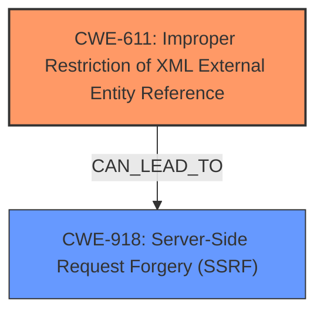

# Enhanced Analysis for CVE-2025-31497

# Summary
| CWE ID  | CWE Name | Confidence | CWE Abstraction Level | CWE Vulnerability Mapping Label | CWE-Vulnerability Mapping Notes |
|-----------------|--------------------------------------------------------------------------------------------------------------------|--------------------|---------------------------|------------------------------------|-----------------------------------------------------------------------------------------------|
| CWE-611 | Improper Restriction of XML External Entity Reference | 1 | Base | Allowed | Primary CWE |
| CWE-918 | Server-Side Request Forgery (SSRF) | 0.7 | Base | Allowed | Secondary Candidate |

## Evidence and Confidence

*   **Confidence Score:** 0.85
*   **Evidence Strength:** HIGH

## Relationship Analysis
The primary relationship influencing the CWE selection is the direct match of the vulnerability description to **CWE-611** (Improper Restriction of XML External Entity Reference), indicating that the service **fails to disable external entity processing** when parsing XML files. **CWE-918** (Server-Side Request Forgery (SSRF)) is considered a secondary candidate because the XXE vulnerability could potentially be leveraged to perform SSRF attacks, depending on the server configuration. Both are Base level CWEs.



## Vulnerability Chain
The vulnerability chain begins with the **failure to disable external entity processing** in the XML parser (**CWE-611**). This allows an attacker to inject malicious XML containing external entity references. The processing of these external entities can then lead to the reading of arbitrary files from the server's filesystem and, potentially, to Server-Side Request Forgery (**CWE-918**).
  - The chain consists of **CWE-611** (root cause) potentially leading to **CWE-918** (impact).

## Summary of Analysis
The analysis is based on the provided vulnerability description and the CVE reference link content summary, both of which highlight the **failure to disable external entity processing** as the root cause of the XXE vulnerability. The vulnerability description states: "The service processes XML files during the conversion process but **fails to disable external entity processing**, allowing an attacker to read arbitrary files from the servers filesystem." This aligns directly with the description of **CWE-611**. The possibility of SSRF is also mentioned, making **CWE-918** a secondary consideration.

The decision to prioritize **CWE-611** is based on the direct evidence of the **improper restriction of XML external entity references**, which is the core weakness. While SSRF is a potential consequence, it depends on specific server configurations and is not the primary, immediate result of the vulnerability. Therefore, **CWE-611** is the more accurate and specific classification.

Relevant CWE Information:

# Enhanced Context (25 CWEs)
The following CWEs were identified as potentially relevant to this vulnerability:

## CWE-611: Improper Restriction of XML External Entity Reference
**Abstraction Level**: Base
**Similarity Score**: 0.79
**Source**: dense

**Description**:
The product processes an XML document that can contain XML entities with URIs that resolve to documents outside of the intended sphere of control, causing the product to embed incorrect documents into its output.

**Mapping Guidance**:
- Usage: Allowed
- Rationale: This CWE entry is at the Base level of abstraction, which is a preferred level of abstraction for mapping to the root causes of vulnerabilities.

## CWE-776: Improper Restriction of Recursive Entity References in DTDs ('XML Entity Expansion')
**Abstraction Level**: Base
**Similarity Score**: 1084.44
**Source**: sparse

**Description**:
The product uses XML documents and allows their structure to be defined with a Document Type Definition (DTD), but it does not properly control the number of recursive definitions of entities.

**Mapping Guidance**:
- Usage: Allowed
- Rationale: This CWE entry is at the Base level of abstraction, which is a preferred level of abstraction for mapping to the root causes of vulnerabilities.

## CWE-918: Server-Side Request Forgery (SSRF)
**Abstraction Level**: Base
**Similarity Score**: 0.71
**Source**: dense

**Description**:
The web server receives a URL or similar request from an upstream component and retrieves the contents of this URL, but it does not sufficiently ensure that the request is being sent to the expected destination.

**Mapping Guidance**:
- Usage: Allowed
- Rationale: This CWE entry is at the Base level of abstraction, which is a preferred level of abstraction for mapping to the root causes of vulnerabilities.

### Other CWEs Considered and Rejected:
*   CWE-776: Improper Restriction of Recursive Entity References in DTDs ('XML Entity Expansion') - While related to XML vulnerabilities, this is more specific to recursive entity definitions, not the general issue of external entity processing.
*   CWE-79, CWE-917, CWE-1286, CWE-212, CWE-80, CWE-74, CWE-923, CWE-138, CWE-941, CWE-184, CWE-322, CWE-306, CWE-94, CWE-434, CWE-78, CWE-116: These were considered less relevant as they address different types of weaknesses.


## CWE Relationship Analysis

Current CWEs represent these abstraction levels: .


### Vulnerability Chain Analysis

**Chain starting from CWE-611:**
- 611 (Improper Restriction of XML External Entity Reference) - ROOT


**Chain starting from CWE-94:**
- 94 (Improper Control of Generation of Code ('Code Injection')) - ROOT


### CWE Relationship Diagram

```mermaid
graph TD
    classDef primary fill:#f96,stroke:#333,stroke-width:2px
    classDef secondary fill:#69f,stroke:#333
    classDef tertiary fill:#9e9,stroke:#333
```